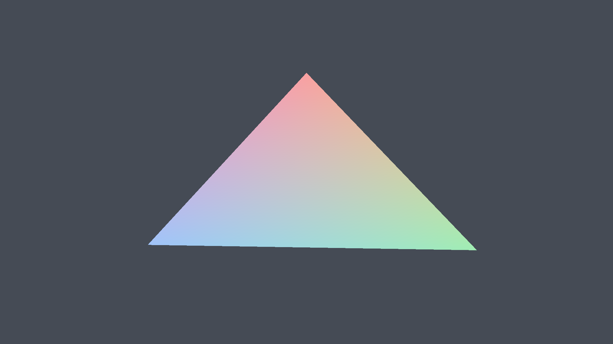
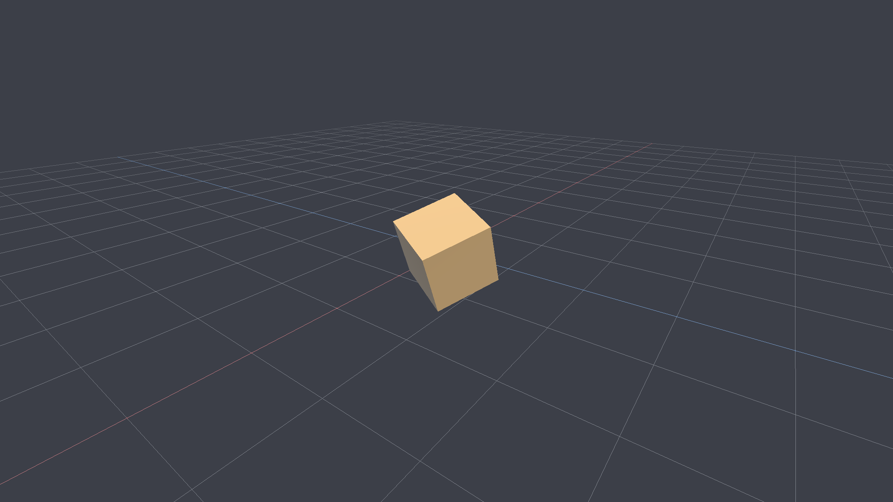
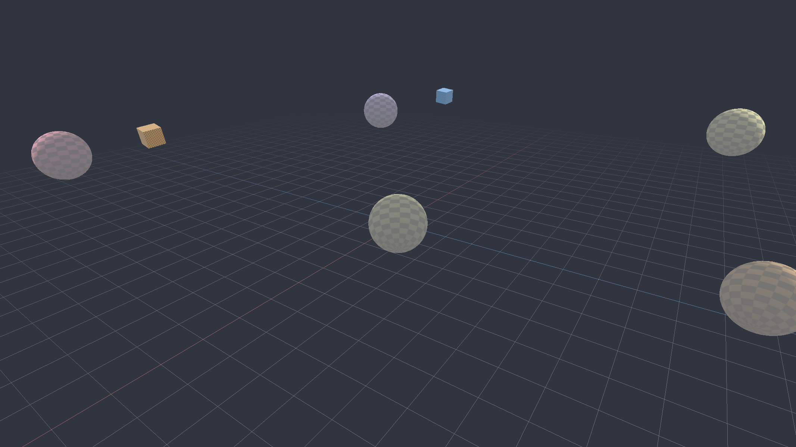

# Ore — C++20 + Vulkan 1.3 游戏开发框架

Ore 是一个紧凑、可读、依赖极少的现代 C++ 游戏开发框架：底层直接使用 **Vulkan 1.3**
（dynamic rendering / synchronization2 / timeline semaphore），上层提供窗口与输入、GPU 内存
分配器、描述符与管线封装、网格与相机、ECS 场景、帧循环与 headless 离屏渲染 + 截图。

目标不是再做一个"教程级 Vulkan 封装"，而是一套**可以直接开项目**的最小完整栈：
每一层都有明确的所有权与生命周期规则、可测试的纯逻辑、以及在 CI 里能真跑的验证手段。

| 三角形 | 自转立方体 + 网格 + 飞行相机 | ECS 场景（纹理 / 层级 / 轨道相机） |
|---|---|---|
|  |  |  |

> 上面三张图不是美术资源，而是本仓库示例在 **无显示器环境** 里用
> `--headless --screenshot` 真实渲染出来的 PNG（见 `docs/images/`）。

---

## 目录

- [特性](#特性)
- [环境要求](#环境要求)
- [构建与运行](#构建与运行)
- [30 行写完一个应用](#30-行写完一个应用)
- [工程结构](#工程结构)
- [核心概念](#核心概念)
- [示例](#示例)
- [测试与验证](#测试与验证)
- [在自己的项目中使用](#在自己的项目中使用)
- [扩展指南](#扩展指南)
- [已知边界与后续路线](#已知边界与后续路线)
- [许可](#许可)

---

## 特性

**平台与窗口**
- GLFW 窗口（X11 / Wayland / Win32 / Cocoa），窗口尺寸变化、DPI 缩放、光标模式、标题
- 输入状态（按下 / 本帧按下 / 本帧抬起、鼠标增量、滚轮、文本输入）+ 可命名绑定的 `InputMap`
- 无显示器环境自动降级：`--headless` 走离屏渲染，不创建窗口也不需要 surface

**渲染后端（自己实现的 RHI，无第三方 Vulkan 封装）**
- `Instance` / `Device`：Vulkan 1.3 特性链、队列族选择（graphics / compute / transfer / present）、
  可选 validation layer + debug utils（对象命名、命令缓冲标签）
- `GpuAllocator`：按内存类型分块 + 块内 best-fit 空闲链表次分配、线性/非线性内存分离
  （遵守 `bufferImageGranularity`）、持久映射、统计与 `trim()`
- `Buffer` / `Texture` / `Sampler`：RAII、描述符信息、设备地址、mipmap 生成、staging 上传
- `CommandPool` / `CommandBuffer`：动态渲染（`vkCmdBeginRendering`）、viewport/scissor/绑定/绘制、
  同步 2 的 barrier、调试标签、一次性立即提交（`ImmediateCommands` + timeline semaphore）
- `DescriptorSetLayout` / `DescriptorPool` / `DescriptorSet`：按 layout 校验类型、写入即时生效、
  尺寸自动推导；配合每帧描述符池
- `GraphicsPipeline` / `ComputePipeline`：构建器式描述、动态 viewport/scissor、
  深度/混合（含预设混合模式）、push constants、动态渲染附件格式
- `RenderTarget` / `Swapchain`：自动跟踪图像 layout 并插入必要 barrier，
  swapchain 重建、out-of-date / suboptimal 处理
- `GraphicsContext`：上述一切的门面 + 上传 / 回读 / 立即提交 + 统一日志与错误处理

**渲染前端**
- `Renderer`：frames-in-flight、每帧命令池与描述符池、per-frame upload ring、
  acquire/submit/present、resize、离屏目标、截图、统计
- `Mesh`：`Vertex`(pos/normal/uv) 布局、cube / plane / sphere / grid / 全屏三角形、
  按需 GPU 上传与一次性绘制调用
- `UploadRing`：每帧分段的动态 uniform/storage 环形缓冲（自动按
  `minUniformBufferOffsetAlignment` 对齐），彻底避免"边写边读"
- `World`（ECS）：实体句柄含 generation、稀疏集组件存储、`each<A,B,...>` 零分配遍历、
  父子层级与 `update_transforms()`、`MeshRenderer`/`CameraComponent`/`Name` 内置组件
- `PerspectiveCamera` + `FlyCameraController` / `OrbitCameraController`（与窗口无关，可单测）
- `Application`：命令行解析、生命周期钩子、固定/可变步长计时、热重载钩子、
  headless + `--screenshot` 截图、退出统计

**工程质量**
- 纯 C++20，无第三方运行时依赖（glm / GLFW / Vulkan loader 除外），
  PNG 编解码、空闲链表分配器、ECS、命令行解析、测试框架全部自带
- 构建期 GLSL → SPIR-V（`ore_add_shaders`，glslc，带增量依赖），可选把 SPIR-V 嵌入可执行文件
- 可选运行期着色器编译（shaderc）+ shader 热重载轮询
- 自带微测试框架 + CTest：核心逻辑单测 + **真实 GPU 端到端渲染并断言像素**（无设备时自动 SKIP）
- CMake 安装 / 导出（`find_package(ore)`）、CMakePresets、clang-format、MIT 许可

---

## 环境要求

| 依赖 | 版本 | 说明 |
|---|---|---|
| 编译器 | GCC 13+ / Clang 16+ / MSVC 19.36+ | 需要 C++20（`std::format`、`std::span`） |
| CMake | 3.24+ | 使用 `CMakePresets.json` v6 |
| Vulkan | loader + headers 1.3+ | `vulkan` / `vulkan-headers`（Arch）/ `libvulkan-dev`（Debian） |
| 驱动 | 支持 Vulkan 1.3 的 GPU | 需要 dynamic rendering + synchronization2 + timeline semaphore |
| GLFW | 3.3+ | `glfw` / `libglfw3-dev` |
| glm | 0.9.9+ | `glm` / `libglm-dev` |
| glslc | Vulkan SDK / shaderc | 构建期编译着色器；缺失时配置阶段直接报错 |
| zlib | 任意 | 可选：PNG 压缩；缺失时 PNG 退化为未压缩块 |
| shaderc | 任意 | 可选：运行期 GLSL 编译 + 热重载 |

Arch 上一行装齐：

```bash
sudo pacman -S base-devel cmake ninja vulkan-loader vulkan-headers vulkan-icd-loader \
               glfw glm shaderc zlib
```

没有独显 / 无显示器环境（CI、容器、远程机器）也能跑：安装任意软件 Vulkan 实现
（SwiftShader、lavapipe / `vulkan-swrast`）即可，示例与测试都会正常渲染。

---

## 构建与运行

```bash
git clone <repo> ore && cd ore

cmake --preset debug          # 或 release / asan / embedded
cmake --build build/debug
ctest --test-dir build/debug --output-on-failure

# 交互式运行（需要显示器）
./build/debug/examples/ore_example_02_cube

# 无显示器：离屏渲染并截图
./build/debug/examples/ore_example_03_scene --headless --size 1280x720 --frames 3 --screenshot scene.png
```

常用命令行参数（所有示例通用，见 `--help`）：

| 参数 | 说明 |
|---|---|
| `--headless` | 不创建窗口，离屏渲染（默认渲染 1 帧） |
| `--frames <N>` | 渲染 N 帧后退出；0 表示直到窗口关闭 |
| `--size <WxH>` | 分辨率（默认 1280x720） |
| `--screenshot <path>` | 把渲染结果写成 PNG（交互模式下取第一帧，`--frames` 时取最后一帧） |
| `--vsync <0\|1>` | 垂直同步 |
| `--validation <0\|1>` | Vulkan 校验层（需要在系统里安装 validation layers） |
| `--device <index>` / `--list-devices` | 选择 / 列出 Vulkan 设备 |
| `--log-level <level>` | `trace\|debug\|info\|warn\|error\|off` |
| `--hot-reload <0\|1>` | 监听着色器文件改动（配合 `watch_shader()`） |
| `--dump-gpu-memory` | 退出时打印 GPU 分配器统计 |
| `--shader-dir <path>` | 指定 `.spv` 搜索目录 |

一键验证脚本（配置 + 构建 + 全部测试 + 三张截图，自动探测软件 Vulkan 驱动）：

```bash
./scripts/verify.sh                 # 默认 debug
./scripts/verify.sh release
```

---

## 30 行写完一个应用

```cpp
#include <ore/ore.h>
using namespace ore;

class MyGame final : public Application {
protected:
    void on_start() override {
        rhi::GraphicsContext& ctx = context();
        mesh_ = Mesh::cube(ctx, 1.0f);
        // 着色器由 ore_add_shaders() 在构建期编译，shader_path() 负责运行时定位
        vert_ = rhi::ShaderModule::load(ctx.device(), shader_path("mesh.vert.spv"));
        frag_ = rhi::ShaderModule::load(ctx.device(), shader_path("mesh.frag.spv"));
        // ... 创建 DescriptorSetLayout / PipelineLayout / GraphicsPipeline
    }

    void on_update(f32 dt) override { angle_ += dt; }

    void on_render(RenderFrame& frame) override {
        VkClearValue clear{};
        clear.color = {{0.05f, 0.06f, 0.08f, 1.0f}};

        renderer().begin_pass(clear);          // 动态渲染开始（自动处理 layout 转换）
        frame.cmd->bind_pipeline(*pipeline_);
        frame.cmd->set_viewport(frame.width, frame.height);
        frame.cmd->set_scissor_full(frame.width, frame.height);
        // ... 绑定描述符、push constants
        mesh_->draw(*frame.cmd);
        renderer().end_pass();
    }

private:
    Scope<Mesh> mesh_;
    Scope<rhi::ShaderModule> vert_, frag_;
    Scope<rhi::GraphicsPipeline> pipeline_;
    f32 angle_ = 0.0f;
};

ORE_APP_MAIN(MyGame)
```

配套的 `CMakeLists.txt`：

```cmake
cmake_minimum_required(VERSION 3.24)
project(my_game LANGUAGES CXX)
find_package(ore REQUIRED)                 # 或 add_subdirectory(ore)

add_executable(my_game main.cpp)
target_link_libraries(my_game PRIVATE ore::ore)
ore_add_shaders(my_game SHADERS shaders/mesh.vert shaders/mesh.frag)
```

---

## 工程结构

```
.
├── CMakeLists.txt              # 顶层：依赖、选项、安装/导出
├── CMakePresets.json           # debug / release / asan / embedded
├── cmake/
│   ├── OreHelpers.cmake        # 警告集、sanitizer、ore_add_example/test
│   ├── OreShaders.cmake        # ore_add_shaders(): GLSL -> SPIR-V（增量 + 可选嵌入）
│   └── EmbedSpirv.cmake        # 生成内嵌 SPIR-V 的 C++ 头
├── include/ore/                # 公共头（可直接安装）
│   ├── core/                   # 类型、日志、断言、计时、文件、图像/PNG、空闲链表、命令行
│   ├── math/                   # glm 别名 + Vulkan 约定矩阵 + 相机与控制器
│   ├── platform/               # 窗口、输入状态、输入映射
│   ├── rhi/                    # Vulkan 后端：实例/设备/分配器/资源/管线/命令/同步/交换链/上下文
│   ├── renderer/               # Mesh、UploadRing、Renderer、ECS World
│   └── app/                    # Application 骨架与主循环
├── src/                        # 与 include 对应的实现
├── shaders/                    # 框架自带 GLSL（mesh/grid/triangle）
├── examples/
│   ├── 01_triangle/            # 最小一帧
│   ├── 02_cube/                # 深度、UBO、ring、动态描述符、飞行相机
│   └── 03_scene/               # ECS、层级、纹理、轨道相机
├── tests/                      # 微测试框架 + 单测 + GPU 端到端测试
├── assets/textures/            # 示例纹理（PNG）
├── docs/                       # 架构说明与本 README 用图
└── scripts/verify.sh           # 一键验证
```

---

## 核心概念

### 帧循环与 frames-in-flight

`Renderer::begin_frame()` 会：等待本 slot 的 fence → 重置命令池/描述符池 → 重置该帧的
`UploadRing` 段 → 获取 swapchain 图像（或使用离屏目标）→ 开始记录命令缓冲。
`end_frame()` 结束记录、提交（`vkQueueSubmit2`）、呈现，并按需记录截图拷贝。
CPU 最多领先 GPU `frames_in_flight` 帧，因此每帧资源必须来自本帧的 ring/描述符池。

### 每帧动态数据：UploadRing

逐对象矩阵、材质参数等每帧变化的数据写入 `UploadRing` 的**本帧段**，配合
`VK_DESCRIPTOR_TYPE_UNIFORM_BUFFER_DYNAMIC` 的 dynamic offset 绑定：

```cpp
const auto slice = frame.ring->allocate(sizeof(ObjectUniforms));   // 自动 256 字节对齐
*static_cast<ObjectUniforms*>(slice.mapped) = object;
const u32 offset = static_cast<u32>(slice.offset);
frame.cmd->bind_descriptor_set(0, scene_set, ConstSpan<u32>(&offset, 1));
```

### 图像布局与同步

`RenderTarget` 记录颜色/深度图当前 layout：`begin()` 转换到 attachment layout，
`end()` 转换到 `final_color_layout`（离屏默认 `SHADER_READ_ONLY`，交换链为 `PRESENT_SRC`）。
需要自定义同步时用 `CommandBuffer::image_barrier()`（同步 2 语义）或
`transition_image()`（内置常见 layout 组合的默认 stage/access 推导）。

### ECS

```cpp
World world;
const Entity sun = world.create();
world.emplace<Transform>(sun).scale = Vec3(2.0f);
world.emplace<MeshRenderer>(sun, MeshRenderer{/*mesh=*/1, /*material=*/0, true});

const Entity planet = world.create();
world.emplace<Transform>(planet).position = Vec3(5, 0, 0);
world.emplace<MeshRenderer>(planet, MeshRenderer{1, 2, true});
world.set_parent(planet, sun);        // 层级：父变换驱动子变换

update_transforms(world);             // 拓扑序刷新 world 矩阵
world.each<Transform, MeshRenderer>([](Entity e, Transform& t, MeshRenderer& m) {
    // 每帧绘制所有可见实体
});
```

实体是 `{index, generation}` 句柄：销毁后槽位复用、generation 自增，旧句柄自动失效而不会
误伤新实体。`each<>()` 走最小的组件池、零堆分配，遍历中增删其它实体是安全的。

---

## 示例

| 示例 | 覆盖内容 | 交互 |
|---|---|---|
| `01_triangle` | 最小管线、push constants、无深度、headless 截图 | 无 |
| `02_cube` | 深度缓冲、场景 UBO + 逐对象动态 UBO、两条管线（网格/线框地面）、1×1 默认纹理、飞行相机 | WASD/方向键移动、右键视角、滚轮调速、Tab 释放鼠标、Esc 退出 |
| `03_scene` | ECS、父子层级、纹理上传与采样、mipmap、PNG 资源加载、轨道相机、13 个实体 | 左键旋转、中键平移、滚轮缩放、Esc 退出 |

三个示例都支持 `--headless --screenshot`，因此可以在没有显示器的机器上产出真实渲染结果。

---

## 测试与验证

```bash
ctest --test-dir build/debug --output-on-failure        # 全部
./build/debug/tests/test_gpu_render                     # 单个
./build/debug/tests/test_scene --filter=each            # 过滤用例
```

| 测试 | 内容 |
|---|---|
| `test_core_block_allocator` | 空闲链表分配器：best-fit、对齐、合并、碎片、不变量校验 |
| `test_core_image` | PNG 编码/解码往返（含 1×1 与奇数尺寸）、非法输入拒绝、文件读写 |
| `test_core_cli` | 命令行解析：`--k=v` / `--k v` / 短选项 / 重复项 / 布尔字面量 / help |
| `test_core_time` | 固定步长累加器、帧计时统计 |
| `test_input_map` | 输入边沿、鼠标增量、动作/轴绑定、重复绑定与解绑 |
| `test_shader_compile` | 运行期编译仓库内全部 GLSL、错误诊断、`#include` 解析、热重载轮询 |
| `test_scene` | ECS：句柄代际回收、稀疏集一致性、`each<>` 组合、层级矩阵、5000 实体压力 |
| `test_camera` | 投影/视图矩阵的 Vulkan 约定、AABB、飞行与轨道相机行为 |
| `test_gpu_smoke` | 设备可用性（无设备时 SKIP） |
| `test_gpu_render` | **离屏渲染并断言像素**：清屏回读、push constant 变色的全屏三角形、缓冲上传往返、纹理上传往返、mip 链、离屏尺寸变更、分配器统计 |
| `test_gpu_swapchain` | **真实交换链的呈现路径**：借助 `VK_EXT_headless_surface` 创建无窗口交换链，验证 acquire → 渲染 → submit → present、呈现图像截图、resize 后重建交换链；驱动不支持该扩展时整组 SKIP |

`test_gpu_render` 全流程走的是真实 Vulkan 设备（独显、核显或 SwiftShader 等软件实现），
因此只要机器上有任意 Vulkan 1.3 实现，就能验证"渲染结果对不对"，而不只是"编译过没过"。

---

## 在自己的项目中使用

**方式一：`add_subdirectory`**（推荐，源码一起管）

```cmake
add_subdirectory(third_party/ore)
target_link_libraries(my_game PRIVATE ore::ore)
ore_add_shaders(my_game SHADERS shaders/mesh.vert shaders/mesh.frag)
```

**方式二：安装后 `find_package`**

```bash
cmake --preset release && cmake --build build/release
cmake --install build/release --prefix ~/.local
```

```cmake
find_package(ore 0.1 REQUIRED)
target_link_libraries(my_game PRIVATE ore::ore)
```

框架选项（`-D` 传入）：`ORE_BUILD_EXAMPLES`、`ORE_BUILD_TESTS`、`ORE_ENABLE_VALIDATION`、
`ORE_ENABLE_SHADERC`、`ORE_ENABLE_HOT_RELOAD`、`ORE_EMBED_SHADERS`、`ORE_WARNINGS_AS_ERRORS`、
`ORE_ENABLE_SANITIZERS`、`ORE_INSTALL`。

---

## 扩展指南

**加一个组件/系统**：组件就是普通 struct（可平凡复制、可移动），在 `on_update()` 里写系统函数，
遍历用 `world.each<A, B>()`，需要层级就配 `Transform` + `set_parent()`。

**加一条管线**：填 `rhi::GraphicsPipelineDesc`（着色器、`VertexLayout`、深度/混合、附件格式、
pipeline layout），用 `rhi::GraphicsPipeline::create()`。注意**颜色/深度附件格式必须与
`RenderTarget` 一致**（格式变了要重建管线）。

**加一种资源加载**：图像走 `context().create_texture(image, /*mipmaps=*/true)`；
模型可以填 `MeshData`（顶点/索引）后 `Mesh::create()`。想接 ASSIMP / tinyobjloader 只需把
第三方数据转成 `MeshData`，其余不用改。

**加一个自定义渲染目标**（阴影贴图、反射探针、后处理）：
`rhi::RenderTarget::create(allocator, desc)` + `renderer().begin_pass(target, clear)` /
`end_pass(target)`，之后把 `target.color_texture()` 绑到描述符里采样即可。

**着色器热重载**：`on_start()` 里 `watch_shader(path)`，实现 `on_shader_reload(changed)`，
用 `recompile_shader(path)`（shaderc）生成新的 `ShaderModule` 并重建管线。

**线程模型**：目前所有 GPU 提交都在主线程。`GpuAllocator`、`CommandPool`、
`Renderer` 都不是线程安全的；要接多线程渲染，按帧/按线程各持有一套池子即可，
`Device` 与 `GpuAllocator` 的创建/销毁仍需外部串行化。

---

## 已知边界与后续路线

有意留白（避免把框架做成半成品引擎）：

- 没有资产管线（glTF/OBJ 解析、材质系统、场景序列化）；`MeshData` + `Image` 是接入点
- 没有多线程渲染、没有 bindless/间接绘制、没有 GPU 时间戳统计
- 没有阴影/后处理/光照模型库，示例用的是一个便于阅读的前向 Lambert + Blinn 高光
- 没有 UI 层（IMGUI）与音频；两者都可以在 `Application` 生命周期内挂接
- `GpuAllocator` 不会整理碎片（可 `trim()` 释放空块），超大资源走独立 `VkDeviceMemory`
- 交换链重建目前是"重建目标 + 重建管线外的所有附属资源"，因此尺寸变化时应用需要
  在 `on_resize()` 中重建依赖尺寸的资源（深度/RT 由框架处理）
- **颜色格式的默认选择**：交换链默认取**非 sRGB** 格式（离屏目标本来就是 UNORM），这样
  "按 sRGB 字节写下的颜色"在窗口里和离屏截图里完全一致；若默认取 `_SRGB` 交换链，同一个
  面板色 (22,26,34) 在窗口里会被重新编码成 (82,89,101)，而截图仍是 (22,26,34)——同场景两条
  路径不一致。需要物理正确的光照/混合（3D 中间调）时，把 `AppConfig::color_format` /
  `Renderer::Desc::color_format` 指成 `_SRGB` 格式即可（见 `src/rhi/swapchain.cpp` 的
  `choose_format` 注释）。
- **窗口模式已在真实硬件上实测**：验证机是 Intel Arc Pro 130T/140T（Arrow Lake-P）核显 +
  Mesa 26.2.3 + Wayland，`ore_example_01/02/03` 与 Tile2D 客户端都能开窗渲染、经真实交换链
  呈现并截图（2133x1200、DPI 缩放 1.67、vsync 开启），`docs/images/` 里的参考截图即来自
  该硬件。若在没有硬件 GPU 的机器上只能退回软件实现（lavapipe / SwiftShader），注意 Electron
  打包的 SwiftShader 的 Wayland WSI 会在 `vkGetPhysicalDeviceSurfaceSupportKHR` 里崩溃
  （最小 C 探针可复现，与框架代码无关）——这类环境下自动化验证走
  **离屏 + `VK_EXT_headless_surface` 交换链**（同样真实执行呈现路径）。
  `AppConfig::allow_headless_fallback`（默认开启）会在窗口上下文创建失败时退化为离屏渲染
  并打印警告，而不是直接退出。

后续可加：compute 管线示例、`VK_EXT_descriptor_buffer`、间接绘制与 GPU 剔除、
glTF 加载、渲染图（render graph）自动屏障、时间戳查询。

---

## 许可

MIT，见 [LICENSE](LICENSE)。
