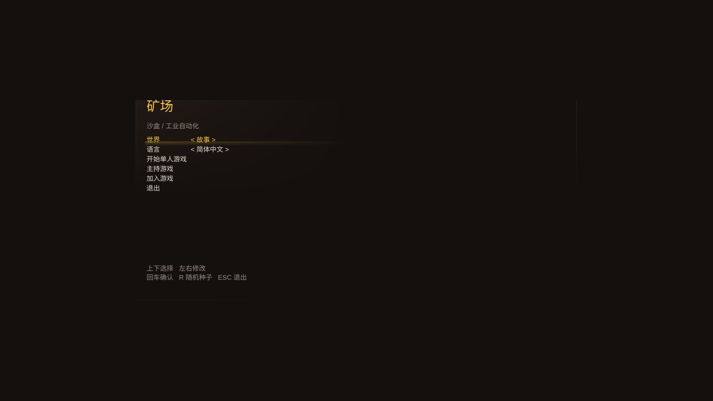
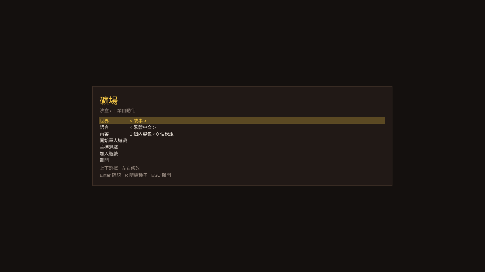
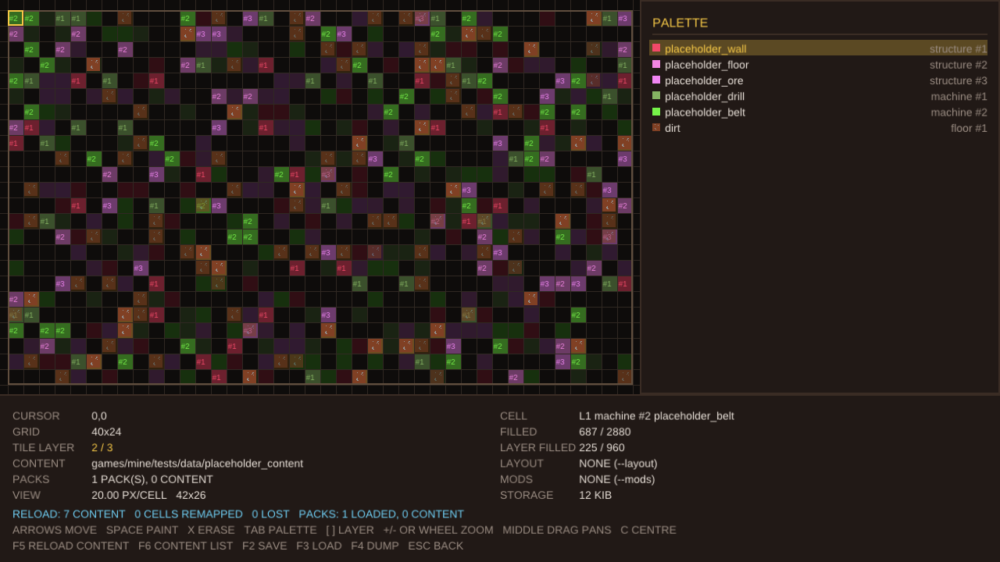
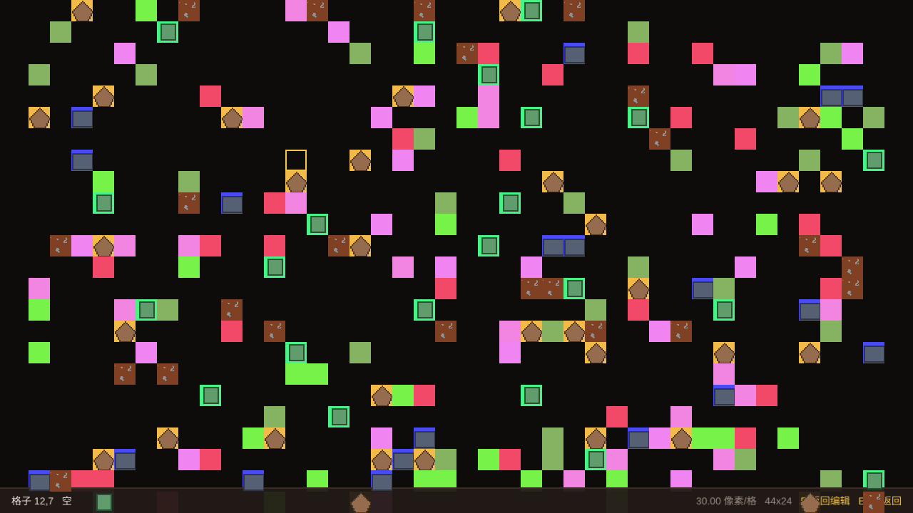

# Tile2D — the 2D framework under the mine game

Tile2D is the layer between the Ore rendering framework and the game: a chunked **tile map** with
multiple layers and layer-aware collision, a **font and text engine** with localisation tables, a
strict **configuration reader**, and a **semi-separated channel** (shared memory for a local client,
KCP over UDP for remote ones, one framing and handshake for both).

It was built to carry the mine game in `games/mine` (`docs/GAME_DESIGN.md`). The side-scrolling demo that once proved the
pieces — a platformer world, its snapshots, prediction and art — is **gone**: it was never the target,
and carrying a platformer-shaped simulation and wire format would have pushed the game's own design in
that direction. What is left is what the game actually uses, and it is all tested.

## What is in the box

| Module | What it does | Tested by |
|---|---|---|
| `t2d/core` | types, logging, deterministic RNG (xoshiro256**), 2D math, the **2D camera** (pan, zoom about an anchor, fit, clamp, world↔screen, the cell range a viewport touches), byte streams with varints, the `.ecfg` reader, the dynamic loader, **where the running program is** (so a game can find what travels with it), the **object reader and code tables** (see below), CLI | `test_ecfg`, `test_module`, `test_camera2d`, `test_executable`, `test_code_table` |
| `t2d/sim` | the tile map (chunked, 1..32 layers, collision with layer masks, RLE serialisation, checksum, ASCII authoring) and the tileset (what a tile id means for physics, where it lives in an atlas) | `test_tilemap` |
| `t2d/text` | the font engine: sfnt/TTC containers, cmaps, TrueType `glyf` **and** CID-keyed CFF outlines, analytic anti-aliased rasterising, UTF-8 layout, language tables | `test_font`, `test_cff`, `test_text` |
| `t2d/net` | the channel: shared-memory rings, KCP over UDP, framing, the session handshake, map chunk transfer | `test_kcp`, `test_protocol` |
| `t2d/render` | one batched quad pipeline for tiles, rectangles and text, a glyph atlas, a tile map renderer, the procedural bitmap font | `test_render_offscreen`, `test_sprite_projection` |
| `games/mine` | the game: session shell, content registry with per-save id tables, the **packed map grid** and the **world** built on it (layers, plots, the refresh and tick passes), the sandbox, the mod host (manifests, load order, the native ABI) — and the **launcher** that runs all of it out of a code table | `test_mine_menu`, `test_registry`, `test_content_loader`, `test_content_grid`, `test_mine_types`, `test_world`, `test_sandbox`, `test_content_pack`, `test_mod_package`, `test_mine_table` |

## Layout

    include/t2d/core      types, log, deterministic RNG, 2D math, the 2D camera, byte streams, .ecfg, CLI
    include/t2d/sim       tile map (chunked, multi-layer, collision), tileset
    include/t2d/text      font engine (TrueType + CFF), rasterising, UTF-8, language tables
    include/t2d/net       ILink, shared-memory link (mmap + lock-free SPSC rings), KCP, UDP, protocol
    include/t2d/render    sprite batch, glyph atlas, text renderer, tile map renderer, bitmap font
    games/mine            the sandbox/industrial-automation game: registry, content packs, mod host, map grid, sandbox
    tools/codetab         the code table toolchain: source -> compiler -> object -> .codetab
    assets/text           the interface strings (ui.ecfg), looked for beside the executable at run time
    engine.api            the published surface: what a code table may ask the engine for
    packs/                the pack template and the guide; a run also loads the packs beside its executable
    tests                 unit tests and the shader fixture the offscreen render test needs

## Build and test

    cmake --preset debug      # also: release, asan, tsan, no-renderer
    cmake --build build/debug
    ctest --test-dir build/debug --output-on-failure

The whole suite is pure CPU work and finishes in about four seconds (25 suites, measured with `ctest` on
the debug preset): the deterministic parts run in milliseconds, and the slowest suite is the CFF
interpreter comparing every glyph of the Noto CJK collections (3.5 s). The `no-renderer` preset builds the tile map, the text engine and the networking
without Vulkan, GLFW or the game — the split that lets a dedicated server exist later.

    tests/test_tilemap            17 cases / 359 checks  chunked storage, tile layers, masks, collision, serialisation, ASCII
    tests/test_camera2d            7 cases /1986 checks  screen/world mapping, zooming about an anchor, fitting a 512² map, bounding the view
    tests/test_ecfg               12 cases / 128 checks  the configuration format, including the shipped example.ecfg
    tests/test_executable          2 cases /  18 checks  the running program's path, and the directory rule that finds what is beside it
    tests/test_font               10 cases / 101 checks  sfnt containers, cmaps, metrics, TrueType outlines
    tests/test_cff                16 cases / 374 checks  CFF Type 2 outlines, against fontTools as an oracle
    tests/test_text                9 cases / 337 checks  UTF-8, language tables, the line box, the shipped interface strings
    tests/test_module              5 cases /  33 checks  loading a library at run time, symbols, unloading
    tests/test_code_table         13 cases / 231 checks  real compiler output packed into a table, two tables merged, a mod replacing what it was loaded by
    tests/test_kcp                11 cases / 213 checks  reliability over a lossy link, 1 MiB transfer, wire format
    tests/test_protocol           15 cases /1265 checks  framing, every payload, truncation, the shared-memory rings
    tests/test_sprite_projection   2 cases /  29 checks  the 2D projection, without a GPU
    tests/test_render_offscreen   10 cases /  71 checks  real rendering with pixel readback, text inside its line box, and a 512² map culled to the view (skips without a device)
    games/mine/tests/test_mine_menu      11 cases / 168 checks  the start screen as a state machine
    games/mine/tests/test_registry       10 cases / 128 checks  content ids and the per-save name -> id table
    games/mine/tests/test_content_loader  6 cases /  36 checks  .ecfg content file -> registry -> save table
    games/mine/tests/test_content_grid    5 cases / 105 checks  four byte cells, layers allocated on first write, O(1) fill counts
    games/mine/tests/test_mine_types     13 cases / 167 checks  plots: identity, footprints, the two kinds, the dice, the definer
    games/mine/tests/test_world          12 cases / 130 checks  a layer built out of content: plots, footprints, the dice, the two passes, the spatial index
    games/mine/tests/test_sandbox        28 cases / 716 checks  the sandbox: map, palette, camera, reload by name, layouts, the playtest pointer
    games/mine/tests/test_content_pack   13 cases / 196 checks  packs: a directory per pack, several files each, headers, order, collisions, art
    games/mine/tests/test_content_search  5 cases /  41 checks  the packs and content directories beside the executable, and a pack and a mod sharing one
    games/mine/tests/test_mod_package     9 cases / 104 checks  mod manifests, dependency order, collisions, a native module
    games/mine/tests/test_content_list    9 cases / 238 checks  the list of sources a load came from, failures included
    games/mine/tests/test_mine_table      3 cases /  17 checks  the game's own registry.cpp packed, merged, run, and overridden by a mod's table

## The tile map

Storage is chunked (32 x 32) and allocated lazily: a 4096 x 4096 map costs one empty vector per chunk
until something is written into that chunk, and chunks belong to a layer, so a layer nothing was
written into costs those headers and nothing else. `allocated_chunks()` says how many chunks really
hold storage — a 512×512×4 map that nobody wrote to reports 0, one written cell reports 1, and filling
a layer with `kEmptyTile` gives them all back (`test_tilemap` asserts exactly that).

* **Layers.** A map holds 1..32 tile layers, each an independent grid of the same size, drawn bottom to
  top. What a layer *means* — ground, ore, structures, logistics — is the game's business; the map only
  numbers them. The constructor takes the layer count and defaults to 1.
* **Layer masks.** Every collision query takes a `LayerMask`: `is_solid`, `is_one_way`, `is_hazard`,
  `overlaps_solid`, `is_on_ground`, `raycast_solid` and `move_aabb`. "Walls and machines block, the ground
  layer does not" is therefore the game's decision, not the map's, and the default (every layer) is
  exactly what a one layer map has always meant. `topmost()` answers "what is on this cell".
* **Collision is exact.** `move_aabb()` moves one axis at a time in sub-steps of at most half a tile,
  snaps the box out of the tiles it hit with single-ulp nudges, and reports what it landed on (solid,
  one-way, ceiling). The invariant "a resolved box never overlaps a solid tile" holds bit for bit, and
  the tests check it against an independent re-implementation of the query.
* **Serialisation** is version 2: magic, flags, size, layer count, tile size, then one RLE run list per
  layer bottom to top. A run never spans two layers, so a layer can be decoded without touching the
  ones around it, and a blob that is truncated, mis-sized, has an impossible layer count or trailing
  bytes is refused rather than half read. The checksum covers the dimensions, the layer count and every
  tile, so two maps that differ only in how many layers they have do not collide.
* **Authoring**: `from_ascii()` builds a one layer map from art, `stamp_ascii()` draws art into one layer of an
  existing map at an offset, and `to_ascii(layer, ...)` dumps one back out. Unknown characters are
  reported with their position and left empty — silently dropping them once cost a demo level its
  entire ground.

## The camera and big maps

The game is a god view (docs/GAME_DESIGN.md §1.11): there is no player character, so the camera *is*
where the player is looking and the pointer is what they act with. Both are framework types, and both
are pure logic, so a picking bug is a test failure in milliseconds rather than something seen on
screen.

* **`t2d::Camera2D`** (`t2d/core/camera2d.h`) owns a viewport, a world position and a zoom in pixels
  per world unit; a tile game uses one world unit per cell, which makes zoom "pixels per cell" and the
  camera's centre a cell coordinate. `screen_of()`/`world_of()` are exact inverses, `zoom_at()` keeps
  the world point under the pointer exactly where it is, `fit()` frames a map (with a margin),
  `clamp_to()` stops a bounded view at the edge of the world and centres a world smaller than the
  viewport, and `visible_cells()` is the half-open cell range a renderer walks — the culling primitive
  a big map needs. It never decides what may be visible: a camera can look past the edge of a map,
  and only the caller knows what to draw there.
* **`mine::ContentGrid`** (`games/mine/include/mine/content_grid.h`) is the map the game is made of:
  32 bits a cell (a 20 bit content id, a 4 bit kind, a "this content is gone" flag), layers allocated
  on first write, and fill counts kept as counters. A 512×512 layer is 1 MiB, a 1024×1024×8 map is
  32 MiB of cells *if every layer is written* — the storage the sandbox used to carry (a name per
  cell) was 37 bytes a cell and a heap allocation for every painted one.
* **Drawing a map that is bigger than the screen** is culling plus, at low zoom, sampling: the
  sandbox walks only `visible_cells()`, and when the visible cells of *all* layers exceed a quad
  budget it draws one quad per block of cells (named by the cell in the middle) instead of one per
  cell. At 0.99 pixels per cell a 512×512 map on a 1280×720 screen is 832×512 visible cells over four
  layers: drawn cell by cell that is 1.7M quads, drawn sampled (one quad per 11×11 cells) it is 14k.

Measured on the real device (Intel Arc Pro 130T/140T, debug build, headless, 1280×720):

| Map | Cells | Storage | Frame |
|---|---|---|---|
| 40×24, 1 layer, scatter | 960 | 3 KiB | ~9 ms |
| 512×512, 4 layers, scatter | 1.05M | 4096 KiB | ~10 ms |
| 1024×1024, 8 layers, scatter | 8.4M | 32768 KiB | ~9 ms |

The frame cost stops following the map size because nothing walks the map: it follows the *screen*.
The framework's own tile path is held to the same rule by
`test_render_offscreen::the_tile_renderer_walks_the_view_and_not_the_map`: a 512×512×4 map and a
128×128×4 map, drawn through the same camera, walk the same 256 cells, the camera's `visible_cells()`
and the renderer's `visible_tiles()` agree cell for cell, and pixels come back lit.
(These are CPU-bound debug numbers with the frame paced to 60 Hz; the ring peak for the 512² case is
682 KiB of the 4 MiB the game asks for.)

## The channel

The framework's other half is the link between a server and its clients. It carries bytes and
sessions, not a game:

| Link | Used for |
|---|---|
| `SharedLink` | two lock-free SPSC rings in one `mmap`: a local client and a server thread in the same process, no sockets |
| `UdpLink` | KCP over a real UDP socket, for a client in another process or on another machine |

Both implement the same `ILink`, so a game's transport choice is one line. On top of them:

* **Framing** is `[u8 type][u16 size][payload]`; a frame whose size does not match, a payload that is
  truncated, and an oversized payload are all refused.
* **The handshake** is `Hello` (protocol version, name, client token) → `Welcome` (assigned player id, tick
  rate, map geometry, echoed token) or `Reject` (with a reason). `PlayerJoined`/`PlayerLeft`, `Ping`/`Pong`,
  `Disconnect` and `ServerStats` complete the vocabulary.
* **Map transfer** chunks the serialised tile map into 8 KiB `MapData` messages right after the handshake,
  so a big map never blocks anything else.
* **KCP** is an ikcp-compatible implementation (24 byte segment header, PUSH/ACK/WASK/WINS) with
  retransmission, fast resend, RTO estimation, congestion control and zero-window probing;
  `test_kcp` drives it over a deliberately lossy, reordering link.

There is deliberately **no input or state message**: how a player moves, what a snapshot contains and
what a command means belong to the game that rides the link. The mine game's own simulation, snapshots
and prediction are M2/M3 work (`docs/GAME_DESIGN.md` §8).

## Text and languages

The engine renders text with its own font engine — no FreeType, no stb_truetype, no new dependency —
and shows it through string tables, so adding a language means adding a table, not touching code.

    ./build/debug/games/mine/mine_game --lang en
    ./build/debug/games/mine/mine_game --lang zh-Hans
    ./build/debug/games/mine/mine_game --lang zh-Hant

* **Both outline formats**, because the fonts a game needs are split that way: Latin text ships as
  TrueType (`glyf`) and the CJK families ship as **CID keyed CFF**. An engine that only reads
  `glyf` cannot draw Chinese at all on a normal Linux system.
* **Coverage is computed analytically**, not by supersampling: the exact area of every pixel an edge
  covers is integrated, so CJK strokes stay crisp instead of banding at a sampling grid.
* **The face follows the language**: Noto Sans CJK carries ten faces, and Simplified and Traditional
  Chinese really do draw some characters differently (矿/礦, 语/語). `Font::face_names()` reads only
  the name tables, so choosing a face costs no outline parsing.
* **Strings are looked up by id** from `assets/text/ui.ecfg`, with an English fallback and the id
  itself as the last resort. A half translated file fails `test_text` instead of shipping.
* **The pen is the top left corner of the line box**, and the box comes from the fonts (`t2d::line_box()`:
  the tallest face's `hhea` ascent and descent, never shorter than `line_spacing × size`). `measure()`
  returns the box `draw()` fills, so a row's background is that rectangle and a label and the value
  beside it share a baseline — in any mix of scripts. Layout is CPU work in `t2d::text`, so a server
  without a GPU can measure a string; `test_text` checks rasterised ink against the box and
  `test_render_offscreen` checks the pixels that come back.
* Simplified and Traditional are separate tables: converting between them properly needs a character
  mapping table (data the designer can supply), not a runtime guess.

Details, limits and how to add a language: [docs/TEXT.md](docs/TEXT.md).

## Configuration files (.ecfg)

Game content and settings are written in `.ecfg` files. The format is defined by
[example.ecfg](../example.ecfg) in the repository root and implemented by `t2d/core/ecfg.h`:

    number1:0                 integers, floats, true/false
    string1:"aaa"             strings are always quoted
    table1::                  "::" opens a table; nesting is indentation
        subtable::
            num1:1
        array1:[1,1,1]        "[...]" arrays may span lines
    text1:<<                  "<< ... >>" is a raw text block, verbatim until a line with only ">>"
    title

    content

    end
    >>

The reader rejects what it cannot fully trust, with a line and column: a line without `:`, a bare
word where a value belongs (`aaa` is not a string - quote it), a duplicate key, an indentation that
matches no level, an unclosed array, string or text block, an unknown escape, an integer that does not
fit. `test_ecfg` covers the format (12 cases / 128 checks, and it parses the shipped
`example.ecfg` byte for byte).

### From a config file to a save

`mine_core` fills the content registry from such a file: the tables are named after the content kinds
and every key inside one is a piece of content. The fields under a name are the designer's to define;
the engine only needs the names, because a save stores numbers plus the name -> id table it was
written with.

    item::
        <name>::
            <the designer's fields>

`test_content_loader` walks the whole path: config file -> registry -> the table a save stores ->
loading it back with a registry whose ids have moved, resolving every reference by name.

## Content packs and mod packages

Content — definitions *and* logic — can live outside the game, in two forms:

| Form | What it is | Code? |
|---|---|---|
| **Content pack** | **a directory**: any number of `.ecfg` content files, their resources, and an optional `pack.ecfg` header that says who it is | no |
| **Mod package** | the same directory, plus a `mod.ecfg` manifest that lists its content files, and an optional shared library | yes |

Most content only needs the first. The load order is fixed — **the game's own files, then packs, then
mods** — and all three fill the same registry, so the game's ids stay stable and everything else appends.

    packs/base_pack/
        pack.ecfg                    # optional: id, name, version, requires
        items.ecfg                   # content tables, as many files as you like
        art/wall.png                 # resources, named relative to the file that declares them

    ./build/debug/games/mine/mine_game --world story --start 1 --packs packs
    ./build/debug/games/mine/mine_game --world sandbox --start 1 --packs packs/base_pack

A pack that has to *run* something is a mod package instead:

    mods/example_native/
        mod.ecfg                 id, name, version, api, requires, content, native, data
        libexample_native.so     a shared library exporting mine_mod_entry()

    ./build/debug/games/mine/mine_game --world sandbox --start 1 \
        --content games/mine/tests/data/placeholder_content --mods mods

* **Pictures are one of the two fields the engine reads.** A content entry says `image:"art/wall.png"`,
  a path relative to the file that declares it; the loader checks the file is there and is a PNG, decodes
  it with Ore's own decoder and gives **every content entry its own texture** (no atlas, any size, the
  batch is cut by picture), which the sandbox and the world view draw instead of a stand-in colour. The
  other field is `random_reverse`. The art *style* is polygonal, the resource is an ordinary image - no
  vector rendering.
* **Data first.** A pack is a **directory**: any number of `.ecfg` files whose tables are content exactly
  as in the game's own files, the art they name, and an optional `pack.ecfg` whose top level keys are
  metadata (id, name, version, requires) — the same shape a mod's `mod.ecfg` has. `--packs <dir>` takes a
  directory: the directory itself when it is a pack, otherwise every pack directly inside it, so one
  directory is a workspace of packs. Files inside a pack load in path order, packs in directory order and
  then by what they require. A loose `.ecfg` file in a workspace is **reported** — a pack is a directory
  now, and a file that is silently not loaded is content that disappeared. Everything lands in the same
  registry the game's own content does, so ids, saves and the name → id table work the same — and a name
  two sources both declare is **reported, never merged**, with the game's own content always keeping its id.
* **A game finds its own content.** Without any argument, a run looks in the `packs` directory **beside
  its executable** — drop a pack or a mod there and the game loads it wherever you start it from — and
  then in the working directory's own `packs`, which is the workspace a designer develops in. One
  directory holds both kinds: a pack directory, and a directory with a `mod.ecfg` in it, which is **not**
  scanned as a pack (its content files belong to the mod host, which loads them in the order its manifest
  gives — otherwise every name in it would be registered twice and reported as a collision). The game's
  **own content follows the same rule**: the `content` directory beside the executable, falling back to
  the source tree when the game is run out of a build directory, which is what keeps "edit the file, press
  F5" working while a copied game still finds itself. Neither default is a promise: a missing one is
  silent, while an explicit `--packs`/`--mods` that is not there is reported. `t2d/core/executable.h` is
  the framework half, `mine/content_search.h` the game's.
* **Code second, and optional.** A native mod is a shared library that exports one symbol. It compiles
  against `mine/mod_api.h` and **links nothing of the game** — nothing but plain data and function
  pointers crosses the line, and the interface grows by appending fields behind a `struct_size` and a
  version number. A module that was built against another ABI, is missing, or whose `on_load` says no is
  reported and skipped while the game keeps running.
* **What it is for.** In the screenshot above `mod_tier_1_drill`…`mod_tier_3_drill` are not written in any
  data file: the native mod generated them from its own parameter (`data:: tiers:3`). Definitions *and*
  logic, outside the binary.
* **Order is a dependency graph.** `requires` is honoured (a missing or cyclic requirement is refused, not
  guessed at), and the order is deterministic, so ids do not move between runs.
* **What loaded is a screen, not a log line.** The start screen's `CONTENT` row, `F6` in the sandbox and
  `--content-list 1` all open the **content list**: one line per source in load order — including the
  ones that did **not** load, which is the line a designer opens it for — with its version, what it
  contributed, a status of `OK` / `PARTIAL` / `FAILED`, and, opened up, every content entry it
  registered with the id a save would store.

  

  

  

Guide, ABI and limits: [docs/MODS.md](docs/MODS.md) (§5 is the list). Loading a library is not a sandbox:
a native mod runs with the game's privileges.

### The game's own content

`games/mine/content/` is what the game itself is made of, and it is the first stage of the load order:
it loads with no arguments at all, and `--content` adds to it rather than replacing it. It holds the
first real content — a **dirt floor** (`floor:: dirt::`, texture `art/floor_dirt.png`) — and the
sandbox paints it: the palette lists `floor #1 dirt`, and a cell painted with it draws that texture.

    games/mine/content/
        floors.ecfg          floor:: dirt::  with image:"art/floor_dirt.png"
        art/floor_dirt.png

Two fields are the engine's to read (`image` and `random_reverse`); everything else in an entry is the
designer's. Both are checked when the content loads: a picture that is not there, or a
`random_reverse:1` that is not a boolean, is reported rather than quietly ignored. Every source names
its art the same way — relative to the file that declares it — and the atlas is sized to the art that
actually ships, so a 256×256 texture is neither refused nor silently scaled.

### Content logic: `mine::types`

Content has two halves. The **definitions** are data — `.ecfg` tables, ids from the registry. The
**logic** is C++, and it lives in `mine::types`: what a thing *is* and *does* once it is part of a
mine. Nothing in that namespace names a resource, a structure or a machine — what exists is what the
designer's data says exists.

The first type is the **plot** (`types/tile.h`): a fixed thing that occupies cells of one layer — a
floor, an ore vein, a machine. It carries the kind and id a save stores (never a name: the registry
answers that, and content that comes back repairs a plot by name), a **rectangle of cells** whose top
left corner is its anchor, so a 2×2 or 3×3 structure is the same thing as a single cell rather than a
special case, and a **rendering facing**: with `random_reverse` set, the map rolls it once when it is
built — half of them come out mirrored left to right — from the layer's own seeded generator, so the
same mine comes out the same way twice, and what a plot *does* is never mirrored.

Plots are a small inheritance tree, because of how often they have to run: `SceneTile` is scenery and
has **no per-frame path at all** (a dirty flag and `refresh()`, so a frame costs what changed, not
what exists); `EntityTile` **is a scene plot** — it is refreshed the same way when the world around
it changes — **plus** a cadence it owns (`period_seconds()`, 0 meaning every tick), handed the frame's
seconds, carrying the remainder and accounting for a long frame once rather than replaying the ticks it
missed. Since a machine *is* scenery, "does this tick?" is not asked at runtime: the layer keeps what
it ticks in its own list, which is where the saving is.

Guide: [docs/TYPES.md](docs/TYPES.md).

## Code tables: code that can replace the code it was loaded by

A shared library loaded at run time cannot change how the program calls *itself*: those calls were bound
when the program was linked. A **code table** moves that link to start-up. The system compiler still does
the compiling; `codetab` packs what it emitted into one file, and the runtime places the tables in memory,
builds one symbol table out of them, and fills in every relocation **after** the merge — so a mod's
definition of a symbol replaces the game's everywhere, including inside the game's own code and inside
its vtables.

    codetab build <source.cpp>... -o <out.codetab> [--id mine --name Mine --version 1.0 --requires engine@1.0]
    codetab pack  <object.o>...   -o <out.codetab>   # a build system that owns its own flags packs, not builds
    codetab dump  <table.codetab>                    # sections, symbols, relocations, metadata
    codetab api   --surface engine.api <table.codetab>...  # what it asks the engine for, and whether it may
    codetab dumphead <table.codetab> [-o <names.h>]  # what it defines, as an index an editor can read

**The game is one of those tables.** `mine_game` is a launcher: it places `mine.codetab` — which travels
beside it — merges every other table it was given (`--table <path>`, then every `packs/*.codetab` in path
order) and calls the entry symbol `mine_game_main`. The engine stays in the executable: the renderer, the
fonts, the network, the file system, and the runtime that does the merging — which is why the launcher
links the framework with `--whole-archive` and exports its own symbols.

    mine-0.1.0/
        mine_game            the launcher: the engine, and the table runtime
        mine.codetab         the game: 986 sections, 3 000 symbols, 9 828 relocations (release)
        engine.api           the published surface, and the version it belongs to
        assets/text/ui.ecfg  the interface strings
        content/  shaders/  packs/

    ./mine_game --headless --frames 2                          # tables: 1 module(s) ... game: Mine, unmodified
    ./mine_game --table mods/demo_mod/mod.codetab ...          # 'mine_game_banner' from 'demo_mod' replaced 'mine'
                                                               #   tables: 2 module(s), 1 override(s) ... Mine, modded

What that buys, measured on real compiler output (`test_code_table`, 13 cases / 231 checks):

* a mod replacing a function the game defined: the game's own call goes to the mod (`use_base()` 11 → **101**),
  and `find_previous()` still reaches the original, so a mod can wrap rather than only replace;
* a mod replacing a **virtual method**: the vtable's entry is a relocation, so the game's virtual call goes
  to the mod too (`machine_output()` 25 → **97**) — no patching, no vtable surgery;
* weak symbols (inline functions, templates, vtables, typeinfo) **coalesce** instead of colliding, which is
  what keeps one C++ program one program — and when a compiler emits the *same* definition as two different
  bodies, as it is allowed to, both are kept and the first is what the symbol means, with the dropped copy's
  relocations going with it;
* a table calling back into the engine: undefined symbols are resolved from the running program — including
  when the call is more than 2 GiB away, which is what the stub beside the call is for;
* a module that cannot be relocated is reported and skipped, never half loaded;
* **a module built for another engine version is refused, and the rule is about the surface it used**:
  `requires` names an id, or `id@version` for the version it was built against; a module that stays inside
  the published surface (`engine.api`) loads across the whole major version and says nothing, one that
  reaches outside it is held to the same version quietly, one minor either way with a warning, further
  refused — and a different major version is refused whatever it used. The check happens before anything
  of the module is placed.

**The published surface** is `engine.api`: 82 symbols, 38 in tier A (`t2d/core`, `t2d/text` — frozen) and
44 in B (`t2d/render`, `t2d/net`, `ore/*` — provided, and allowed to change). `codetab build|pack --api
engine.api` checks a table **before it is written** — the game's own table is packed that way, and a
symbol outside the surface fails the build where its author can still do something about it —
`codetab api --surface engine.api` checks a table that already exists, and the launcher repeats the check
at load time and names every symbol that is outside. Tier C (the game's own internals, the sandbox, the
mod host) is refused: a mod that wants to change behaviour overrides a symbol of the game's table instead,
which is the point of the merge.

Because the game's own code is in its table, `mine::` is answered inside the merge: the release table asks
the host for **82** engine symbols (all inside the surface — the launcher reports 0 outside) and 92 from
the platform (libc, libstdc++), and defines the other 2 826 itself. `test_mine_table` (3 cases / 17
checks) is the same path in miniature: `mine_core`'s **real `registry.cpp`** is compiled into a table —
not linked into the test — merged, and called; the game's class registers its items (ids 1 and 2,
registering twice changes nothing), the table calls back into the program that loaded it, and a mod table
replaces one of the game's functions (`game_probe()` 110 → **112**).

The demo mod is one function in `games/mine/tests/data/tables/mod_banner.cpp`, packed into
`mods/demo_mod/mod.codetab`, and it is what the run above shows: the game's own call to
`mine_game_banner()` lands in the mod, and the merge report says who replaced what.

### Packaging

Two zips come out of a build, and they are for different people:

    cmake --build build/release --target mine_package   # mine-0.1.0-Release.zip   what a player runs
    cmake --build build/debug   --target builddev       # mine-dev-0.1.0-Debug.zip what a mod author compiles against

The **release package** is the launcher, the game's table, the surface, the interface strings, the game's
own content pack, the shaders and the `packs/` template — stripped, because the debug information is 19.8 MiB
of a 1.23 MiB program and belongs to the build tree, where somebody is actually debugging
(`-DMINE_PACKAGE_DEBUG_SYMBOLS=ON` keeps it for the one case that wants it). The **dev package** is what a
mod is written against: the headers (`ore/`, `t2d/`, `mine/`, generated `config.h` files included),
`engine.api`, the game's own table, the `codetab` binary, the pack template and the documents.

`docs/TABLES.md` is the whole design: the file format, the merge rules, what the runtime does step by step,
the surface and the version rule, the honest limits (x86-64 ELF only, no TLS, no exception unwinding yet,
weak definitions cannot be replaced) and what is next.

## The game on top of the framework

`games/mine` is a sandbox/industrial-automation game in progress: a top-down 2D mine of stacked
layers, where every layer generates its own resources and structures and asks the player to deliver
raw materials or products in a specific way before the next layer opens. Its requirements, the
engineering constraints and the list of content the designer still has to supply live in
[docs/GAME_DESIGN.md](docs/GAME_DESIGN.md).

What exists today is the shell and the content debugger, deliberately free of any game content:

    ./build/debug/games/mine/mine_game                      # start screen
    ./build/debug/games/mine/mine_game --world endless --seed 4242 --start 1

* `mine_core` holds the session description, the start screen model, the **content registry** and
  the sandbox model, and depends on nothing but `t2d::core`, so all of it is tested in milliseconds
  without a window or a GPU.
* **Saves store numbers, content is registered by name.** Every save carries the name -> id table it
  was written with, and loading translates the saved ids by name (`ContentRegistry`,
  `ContentTable`, `ContentRemap`). Content the running build no longer has is reported instead of
  being silently remapped onto whichever number took its place - the classic way a save gets
  corrupted. `test_registry` covers it, including that failure spelled out.
* No resource, structure, recipe or machine is hard coded anywhere: those are the designer's data.

### The world

A **layer** of the mine is what the game plays on: its own map, its own content, its own dice. It is
built when it is entered — and only the layer being played is held, so a mine of a hundred layers
costs one layer. What it is built *from* is a **layer description** (`LayerSpec`): the shape of the
map and the content that goes in it. That is what a generator produces, the designer's data in story
mode and a derivation from `(seed, index)` in endless mode, and both produce the same thing — so
nothing downstream knows which mode it is. Until the layer rules exist the generator in force places
nothing, and an empty layer is a layer: it can be entered, walked, queried and drawn.

What a layer holds is **plots** (`mine::types`): fixed things that occupy cells. Both halves are
needed and they answer different questions — the **grid** says which content sits on every cell in
four bytes, which is what a save, a routing query and a cull walk cheaply; the **plots** are the
objects content turns into, and they are what carries a footprint (a 3×3 is one plot, not nine), a
cadence and a way of drawing itself. A plot is found through a **chunk index** (32×32 cells, the same
chunking the framework's `TileMap` uses), so a query, a placement check and a frame cost what is on
screen rather than what the layer holds.

The two passes are the reason there are two kinds of plot: `refresh()` walks every plot and pays
only for the dirty ones, `tick(dt)` walks the plots that run and nothing else. Which plots those are
is decided once, when they are created — never by asking a plot at runtime.

    ./build/debug/games/mine/mine_game --world-view 1                    # into the mine, layer 0
    ./build/debug/games/mine/mine_game --world-view 1 --grid 64x40 --layer-fill scatter --seed 1

`--layer-fill bands|scatter` is the world's debug fill: it names no content, it lays out whatever the
registry holds — a view of the registry, not a rule about the mine, exactly like the sandbox's own
fills. With it, a layer of the game's own dirt floor shows what the plot machinery does: each plot is
drawn over its whole footprint, and half of the ones whose content allows it come out **mirrored**
(`random_reverse`, rolled once when the map is built). `[ ]` walks the mine's layers, `F5` reloads
the content files and rebuilds the layer out of what is now registered.

Guide: [docs/GAME_DESIGN.md](docs/GAME_DESIGN.md) §4 and §8, [docs/TYPES.md](docs/TYPES.md).

### The sandbox

Content is not authored yet, so the game ships a **content debugger** instead of a pretend map: one
map, no demands, no progression, and no content of its own — the palette is whatever the designer's
data registered. The map has tile layers, so ground, ore and structures can be painted and inspected
separately.

    ./build/debug/games/mine/mine_game --world sandbox --start 1
    ./build/debug/games/mine/mine_game --world sandbox --start 1 \
        --content games/mine/tests/data/placeholder_content --tile-layers 3 --fill-layer all

* **The palette is the registry**, printed with the ids the registry handed out (`structure #3`), so a
  designer can see both the names and the numbers a save would store.
* **F5 reloads the content files without restarting**, and every placed cell is re-pointed at its
  content **by name**. Inserting an entry in the middle of a file shifts every id after it; without
  the name table the map would quietly turn one structure into another. Content that disappeared is
  reported and its cells are marked missing — never handed to whatever now holds that number.
* **The layout round trips through the real save path** (ids plus the name → id table), which is how
  the strategy in [docs/GAME_DESIGN.md](docs/GAME_DESIGN.md) §6 got its end to end evidence: 241 cells
  painted under one version of a content file load back as 241 cells under a version that inserted an
  entry in front of them, and as 200 cells plus 41 explicitly missing ones when content is deleted
  (687 → 687 → 575 + 112 across three tile layers). Reloading the file under a painted layer moves
  **123** cell ids in the one layer case and **331** in the three layer one, and loses none of them.
* **No content in the code**: the placeholder names used by the tool's own tests are marked as such in
  `games/mine/tests/data/placeholder_content/`.
* **Press `P` to playtest the layer** (`--playtest 1` starts in it): the same map, the same camera, drawn the way
  the game draws it — every tile layer bottom to top, no dimming, art edge to edge, no grid lines, no labels, no
  panel, no status bar. The input is the game's input (docs/GAME_DESIGN.md §1.11): the camera and the pointer, and
  nothing else. Holding a direction pans, the wheel zooms about the pointer, and the cell under the pointer is
  outlined with one line of HUD naming it. It is not a game mode — nothing simulates, nothing is demanded and a
  click does nothing yet (the action table is content, §7.14) — it is the engine half, and the sandbox's own
  version of the world view (the game's own one is above).
* **Press `F6` for the content list** (the start screen's `CONTENT` row opens the same screen, `--content-list 1`
  starts in it): every source the registry was filled from, one line each, failures included, with the content
  each one registered underneath it.
* **`--input-server <port>` drives the game over a socket.** A window cannot always be typed into — a Wayland
  session decides who owns the keyboard, a nested compositor takes the events first, a headless run has no window
  at all — but the application only ever reads an `InputState`, so the debug server fills that in instead, on
  loopback, through the same calls the window layer makes. One text command per line (`key`, `mouse`, `scroll`,
  `text`, `shot`, `quit`), and `ok` means the frame loop has *applied* it, so a screenshot taken after a reply
  is a screenshot of the result. This is how every screenshot below was taken, including the headless ones.

* **Code tables are merged and run for real.** `test_code_table` (13 cases / 231 checks) reads objects the
  build compiled from `tests/data/tables/`, packs them into tables, merges two tables in memory and calls
  into the result: a mod's definition of a function the game defined takes over the game's own call (11 → 101),
  a mod's definition of a virtual method takes over the game's virtual call (25 → 97), weak vtable/typeinfo
  symbols coalesce, a static constructor runs, `strlen` is answered by the running program, a module
  asking for something nobody defines is reported and refused, and a module built for another engine version
  is refused before it is merged, and a definition a compiler emitted as two different bodies loads with
  every relocation inside the section it patches. One case drives `codetab` itself, so the compiler is in the
  loop.
  `test_mine_table` (3 cases / 17 checks) does the same with **the game's own `registry.cpp`**: it is
  compiled into a table, run, called back into the host, and overridden by a mod table.

Usage, keys and limits: [docs/SANDBOX.md](docs/SANDBOX.md) (§10 is the list and the debug input server).

## Verification status

Everything below was run in this checkout, on this machine, with the commands shown. No result here is
estimated.

| Preset | Result |
|---|---|
| `debug` | 25/25 tests green |
| `release` | 25/25 tests green |
| `asan` (Address + UB sanitizers) | 25/25 tests green |
| `tsan` (ThreadSanitizer) | 25/25 tests green |
| `no-renderer` | 11/11 tests green, no Vulkan, GLFW or game binary |

The two packages are run, not assumed: `mine-0.1.0-Release.zip` and the debug build of the same package
both start from a directory that has nothing but what the zip carries — `tables: 1 module(s) ... 0 error(s)`,
the strings read from `assets/text/ui.ecfg` inside the package, the window, the swapchain, the content
pack — and the demo mod's table changes the game's own answer from `Mine, unmodified` to `Mine, modded`.

Ore itself is a separate tree with its own suite (13/13 in `debug`, `release` and `asan`), which now includes
`test_debug_input`: the debug input server's command parser and a real socket round trip that ends in an
`InputState`.

Hardware: **Intel Arc Pro 130T/140T (Arrow Lake-P), Mesa 26.2.3, Wayland**. The windowed path is
verified by real screenshots, and the offscreen path is what the render test asserts on.
