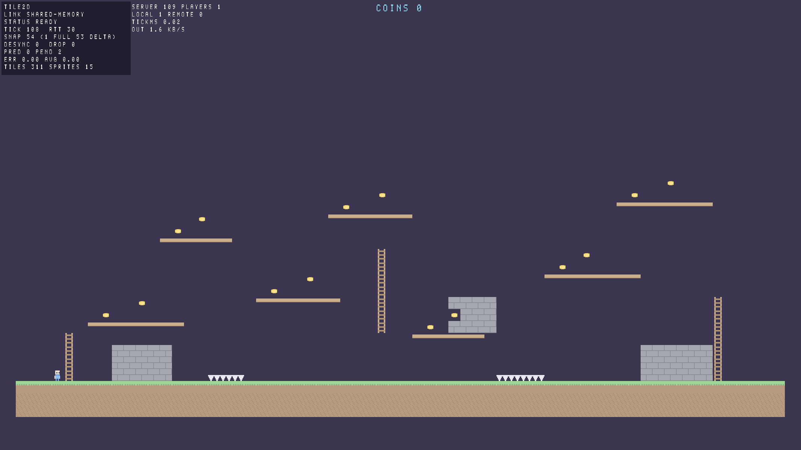
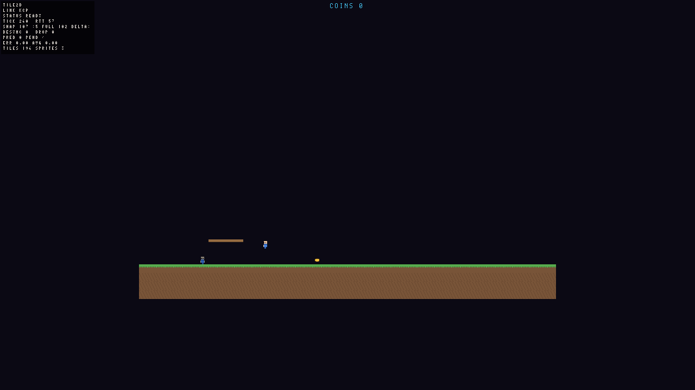

# Tile2D — a 2D tilemap game framework with a semi-separated client/server design

The authoritative simulation lives in a **server thread**. The player's game runs in a **client
thread** that only ever sees snapshots. What sits between them is a link, and the link is the only
thing that changes between single player and online play:

| Mode | Command | Client link | Server |
|---|---|---|---|
| Single player | `--mode single` | shared memory (same process) | server thread, no sockets |
| Host and play | `--mode host --port N` | shared memory (same process) | server thread + UDP listener for remote players |
| Join remote | `--connect host:port` | KCP over UDP | somebody else's process, no local server at all |
| Dedicated | `tile2d_server --port N` | — | server process, **no client thread and no graphics** |

Single player is therefore not a special case: it is the same client, the same protocol and the same
prediction code talking over a different `ILink`. The dedicated server binary links no Vulkan, no
GLFW and no renderer — `ldd` on it shows neither.

*Single player: the client thread rendering the authoritative world it receives over shared memory.
Tiles, sprites and the HUD all come from the same batched quad pipeline.*

*`tile2d_game --mode join` connected to `tile2d_server` over KCP/UDP with a headless bot as the
second player: `LINK KCP`, `SNAP 147 (5 FULL 142 DELTA)`, `DROP 0`, `DESYNC 0`.*

## Architecture

    ┌───────────────────────────── process ──────────────────────────────┐
    │  client thread                        server thread                │
    │  ┌───────────────┐   SharedLink    ┌───────────────────────────┐   │
    │  │ LocalClient   │◄───────────────►│ ServerHost                │   │
    │  │ input         │  two SPSC rings │ World (60 Hz, fixed step) │   │
    │  │ prediction    │  in one mmap    │ snapshots: full + delta   │   │
    │  │ reconciliation│                 │ sessions, history[64]     │   │
    │  │ interpolation │                 └──────────┬────────────────┘   │
    │  └───────┬───────┘                            │ UdpTransport       │
    └──────────┼────────────────────────────────────┼────────────────────┘
               │                                    │ KCP over UDP
        ┌──────▼──────┐                    ┌────────▼────────┐
        │ renderer    │                    │ other players   │
        │ (Ore/Vulkan)│                    │ (bots, clients) │
        └─────────────┘                    └─────────────────┘

* **Fixed timestep, deterministic simulation.** `World` advances one 60 Hz tick at a time; the client
  predicts its own player with exactly the same code (`World::step_player`) and replays
  unacknowledged commands after every authoritative snapshot (reconciliation).
* **The client never simulates anybody else.** Remote players are interpolated 100 ms behind the
  newest snapshot; the local player is drawn straight from the prediction, so it costs no extra
  input latency.
* **Snapshots are full or delta.** A delta is built against the newest tick the receiving client
  acknowledged and carries a per-entity field mask, so unchanged fields cost nothing. Positions
  travel as 1/16 px fixed point, which is what makes the checksum comparison meaningful.
* **Desync detection and recovery.** Every snapshot carries the server's FNV-1a checksum of its own
  quantised state. The client hashes what it reconstructed; on a mismatch it reports the first
  differing field, drops its baselines and asks for a full snapshot.
* **The client keeps a baseline history** (64 states), because an acknowledgement is a round trip
  behind: resolving a delta only against the newest state drops every delta that references an older
  acked tick. Before this change a KCP client needed 32 full snapshots per 100 received; now it
  needs 5, with zero dropped snapshots.
* **Pacing is configurable, simulation is not.** `ServerConfig::tick_rate` changes how fast wall
  clock time is consumed (and clients follow the rate announced in the welcome message); a tick
  always integrates the same amount of movement, which is why the tests can run at 240 Hz and still
  assert on identical tick-by-tick behaviour.

## Layout

    include/t2d/core      types, log, deterministic RNG, 2D math, byte streams, fixed timestep, CLI
    include/t2d/sim       tilemap (chunked, collision), tileset, world (deterministic), snapshots
    include/t2d/net       ILink, shared-memory link (mmap + lock-free SPSC rings), KCP, UDP transport, protocol
    include/t2d/client    prediction/reconciliation, snapshot interpolation, local client
    include/t2d/server    authoritative server host (own thread)
    include/t2d/render    sprite batch + tilemap renderer (built on the Ore rendering framework)
    apps/game             playable client (--mode single|host|join)
    apps/server           dedicated server (no graphics dependency)
    apps/bot              headless client used by the integration tests
    games/mine            the sandbox/industrial-automation game built on this framework
    tests                 unit, content and integration tests

## Build and test

    cmake --preset debug      # also: release, asan, tsan, server-only
    cmake --build build/debug
    ctest --test-dir build/debug --output-on-failure

    games/mine/tests/test_mine_menu  the start screen as a state machine (CPU only)
    tests/test_tilemap            chunked storage, collision, serialisation, hazards, one-way platforms
    tests/test_snapshot           full/delta wire format, delta merge, a 360 tick reconstruction stream
    tests/test_protocol           framing, every message payload, byte stream limits, the shared channel
    tests/test_kcp                reliability over a lossy/reordering link, 1 MiB transfer, ikcp wire format
    tests/test_atlas              built-in tileset, atlases and the shipped level must agree (CPU only)
    tests/test_sprite_projection  the 2D projection, without a GPU
    tests/test_render_offscreen   real rendering with pixel readback (skips without a Vulkan device)
    tests/test_integration_local  server thread + client thread over shared memory, in one process
    test_integration_multiprocess dedicated server + two KCP bots on real UDP sockets

The suite is built to be fast: the deterministic parts run in milliseconds with no threads and no
GPU, and the two threaded integration tests run at `--tick-rate 240` so the same number of simulated
ticks is covered in a quarter of the wall clock time. The whole suite takes about 2.5 s.

### Rendering

    ./build/debug/apps/game/tile2d_game --mode single --frames 300 --screenshot shot.png
    ./build/debug/apps/game/tile2d_game --headless --frames 300 --mode single --screenshot shot.png

`--headless` renders offscreen (no window at all) and `--frames` makes the run reproducible; headless
frames are paced to 60 Hz so the simulation, which advances in wall clock time, actually gets
somewhere. On a machine without a hardware Vulkan device, point the loader at a software
implementation:

    VK_ICD_FILENAMES=/usr/lib/cef/vk_swiftshader_icd.json ./build/debug/apps/game/tile2d_game --headless ...

## The game on top of the framework

`games/mine` is a sandbox/industrial-automation game in progress: a top-down 2D mine of stacked
layers, where every layer generates its own resources and structures and asks the player to deliver
raw materials or products in a specific way before the next layer opens. Its requirements, the
engineering constraints and the list of content the designer still has to supply live in
[docs/GAME_DESIGN.md](docs/GAME_DESIGN.md).

What exists today (M1) is the shell, deliberately free of any game content:

    ./build/debug/games/mine/mine_game                      # start screen
    ./build/debug/games/mine/mine_game --world endless --seed 4242 --start 1

* `mine_core` holds the session description, the start screen model and the **content registry**
  and depends on nothing but `t2d::core`, so the whole thing is tested in milliseconds without a
  window or a GPU (`test_mine_menu`: navigation, seed editing, what each row starts).
* **Saves store numbers, content is registered by name.** Every save carries the name -> id table it
  was written with, and loading translates the saved ids by name (`ContentRegistry`,
  `ContentTable`, `ContentRemap`). Content the running build no longer has is reported instead of
  being silently remapped onto whichever number took its place - the classic way a save gets
  corrupted. `test_registry` covers it, including that failure spelled out.
* `mine_app` is the Ore application shell; `begin_session()` is the single place where the layer
  data, the server thread and the client will be created once content exists.
* No resource, structure, recipe or machine is hard coded anywhere: those are the designer's data.

## Configuration files (.ecfg)

Game content and settings are written in `.ecfg` files. The format is defined by
[example.ecfg](../example.ecfg) in the repository root and implemented by `t2d/core/ecfg.h`:

    number1:0                 integers, floats, true/false
    string1:"aaa"             strings are always quoted
    table1::                  "::" opens a table; nesting is indentation
        subtable::
            num1:1
        array1:[1,1,1]        "[...]" arrays may span lines
    text1:<<                  "<< ... >>" is a raw text block, verbatim until a line with only ">>"
    title

    content

    end
    >>

The reader rejects what it cannot fully trust, with a line and column: a line without `:`, a bare
word where a value belongs (`aaa` is not a string - quote it), a duplicate key, an indentation that
matches no level, an unclosed array, string or text block, an unknown escape, an integer that does not
fit. `test_ecfg` covers the format (12 cases / 128 checks, and it parses the shipped
`example.ecfg` byte for byte).

### From a config file to a save

`mine_core` fills the content registry from such a file: the tables are named after the content kinds
and every key inside one is a piece of content. The fields under a name are the designer's to define;
the engine only needs the names, because a save stores numbers plus the name -> id table it was
written with.

    item::
        <name>::
            <the designer's fields>

`test_content_loader` walks the whole path: config file -> registry -> the table a save stores ->
loading it back with a registry whose ids have moved, resolving every reference by name.

## Protocol

Every message is `[u16 size][u8 type][payload]`. Types: `Hello`, `Welcome`, `Reject`, `Command`,
`Snapshot`, `MapData`, `PlayerJoined`, `PlayerLeft`, `Ping`, `Pong`, `Disconnect`,
`NeedFullSnapshot`, `ServerStats`.

* **Commands** are one byte of button bits plus the tick the client wants them applied on.
* **Snapshots** are `[header][players][removed players][pickups][removed pickups]` where each entity
  is `[id][field mask][fields…]`. The mask is what makes a delta applicable: a delta whose masks do
  not describe every entry is refused instead of merged blindly, and a delta is resolved against the
  tick it names (not against "whatever state arrived last").
* **Levels** are transferred as 8 KiB chunks of the serialised tilemap right after the handshake.
* **KCP** is an ikcp compatible implementation (24 byte segment header, PUSH/ACK/WASK/WINS) with
  retransmission, fast resend, RTO estimation, congestion control and zero-window probing.

## Verification status

Everything below was run in this checkout, on this machine, with the commands shown. No result here
is estimated.

| Preset | Result |
|---|---|
| `debug` | 9/9 tests green (3.0 s) |
| `release` | 9/9 tests green (2.6 s) |
| `asan` (Address + UB sanitizers) | 9/9 tests green (3.0 s) |
| `tsan` (ThreadSanitizer) | 9/9 tests green (4.0 s) |
| `server-only` | 6/6 tests green, `ldd tile2d_server` links no Vulkan/GLFW/X11/Wayland |

Hardware: **Intel Arc Pro 130T/140T (Arrow Lake-P), Mesa 26.2.3, Wayland**. The windowed path is
verified there, not only offscreen: `tile2d_game --mode single` and `--mode join` both open a real
window (2133x1200 at DPI scale 1.67, vsync on, ~165 fps), present through a real swapchain and render
the world correctly - the two screenshots above come from that run. The same suites also pass with a
software ICD.

* ThreadSanitizer found a real data race (`SharedLink::close()` writing the link state while the
  server thread polled `wait_for_data()`); the state is an atomic now. Races inside the Vulkan
  implementation and the loader (SwiftShader's worker threads, for instance) are third party noise
  and are suppressed through `tests/tsan.supp`, so the remaining signal is about Tile2D's threads.
* Rendering is verified by pixel readback on the real GPU and on a software ICD: an opaque quad, a
  coloured atlas cell, a font glyph and the solid "white texel" of the font atlas are each asserted
  on the pixels that come back - the renderer reporting draw calls is not accepted as evidence that
  anything was drawn.
* End to end over real sockets: a dedicated server, two bots and a joining client stay in sync
  (0 desyncs, 0 dropped snapshots) and the joining client renders both players.

## Known gaps

* **Software Vulkan cannot open a window here.** On a machine whose only Vulkan implementation is the
  SwiftShader build Electron ships, `vkGetPhysicalDeviceSurfaceSupportKHR` crashes inside the ICD for
  Wayland surfaces (reproduced with a minimal C probe, unrelated to this framework). Windowed
  verification therefore needs a real driver; the fallback is offscreen rendering, which the tests
  cover.
* **No validation layers are installed**, so the GPU paths are covered by readback and tests rather
  than by `VK_LAYER_KHRONOS_validation`.
* The bot's health check counts "did not reach half of `--ticks`" as a failure, so it reports
  unhealthy when it is deliberately stopped early.
* Snapshot interpolation has no unit test of its own; the remote player's interpolated position is
  never asserted on (it is visible in the join screenshot, which is not a test).
* `ServerHost::players()` exposes per-session data that the server thread mutates. It is safe for the
  current callers (none of them read it while the thread runs) but is not synchronised for arbitrary
  use.
* The renderer draws two batches per frame (tiles, then text) because they use different textures;
  that is one extra draw call, not a design accident.
