# 矿场自动化游戏 —— 需求与工程约束（工作稿）

> **本文档不预设游戏内容。** 资源、结构、需求的具体形式、配方、建筑、剧情、数值全部由设计者
> 提供，本文档只记录：① 已明确的需求；② 由这些需求推导出的工程约束；③ 需要设计者补充的内容清单。
> 模块与可执行文件用 `mine` 作临时名（来自"矿场"），最终命名随游戏定名一起改。

---

## 1. 已确认的需求（设计者原话，权威）

1. 游戏类型：**沙盒 / 工业自动化**。
2. 视角：**平面 2D**，不是横版。
3. 游戏内部存在一个**矿场**。
4. 矿场**有多层**。
5. **每层会生成不同的资源和结构**。
6. **每层会有一个或多个需求**。
7. 需求需要**通过特定方式提交原料或产物**。
8. 需求完成后**进入下一层**。
9. 存在两种模式：
   * **故事模式**：预先设定好的流程。
   * **无尽模式**：程序生成内容。
10. **贴图采用多边形风格**。
11. **没有玩家角色，所有玩家使用上帝视角操作游戏**。

12. **地块**：地图中**占据格子的固定物体**，包括地板、矿物、机器等。为保证之后的玩法，需要支持
    **2×2、3×3、2×3** 之类的大型结构地块。
13. **为了性能，地块分为两类**：
    * **场景地块**（场景、矿物、地板等）：**仅在需要时更新**；
    * **实体地块**（功能地块，例如机器）：**每 tick 或每 xx 秒更新**。

14. **实体地块继承场景地块**；**地块基类带一个布尔属性 `random_reverse`**，为真时在**地图初始化**时
    随机设定自身渲染：有 **50%** 的概率将自己**左右翻转渲染**。

15. **`random_reverse` 由内容作者定义**（写进内容数据），**`mirrored` 无需进入存档**；
    引擎会读的字段因此有两个：`image` 与 `random_reverse`。
16. **新增 `Floor` 类继承 `SceneTile`**，只多一个**地板标记**（告诉其他东西"我是地板"），
    并要有**对应的 `.ecfg` 定义器**（`floor::` 表）。
17. **第一份本体内容：泥地**（`floor:: dirt::`），贴图 `floor_dirt.png`。

18. **美术资源**：泥地的 `random_reverse` 为 **true**；**每个内容一个图片，不使用大图集**；
    命名不限，**官方内容包使用蛇形命名**；尺寸按需要**每 1 格 128 或 256 像素**，可以为其它值。
    （这就是 §7.13 的答案。）

以上十八条是当前唯一的内容性输入。除此之外的一切内容均由设计者后续提供（见 §7）。

---

## 2. 由已确认需求推导出的工程约束

这些是**技术结论**，不涉及具体内容：

* **"层"是一等概念**：层要有独立的地图实例、独立的资源/结构/需求集合，以及"层间推进"的
  状态机（当前层 → 需求全部完成 → 解锁下一层）。
* **"需求"是一等概念**：需求 = 目标（原料或产物）+ 数量 + 提交方式；完成判定必须在服务端权威
  执行，并且状态可被客户端观测（HUD / 终端面板）。
* **内容必须数据驱动**：既然内容由设计者定义，代码里**不能**出现资源枚举、结构枚举、配方表或
  建筑清单。层、资源、结构、需求、配方、建筑都以数据描述，代码只提供加载与执行。
* **内容（定义与逻辑）要能从外部加载**：本体只做核心逻辑，内容以**模组包**形式提供——一个目录、一份
  清单、若干内容文件，外加可选的 **C++ 模块**（共享库 + 版本化的 C ABI）。一个模组坏了只影响它自己：
  报告、跳过、游戏继续跑。见 `docs/MODS.md`。
* **内容必须可观察**：内容由设计者写、且会反复修改，"改一个文件立刻看到结果"必须是工具的一部分，
  而不是每次重启游戏。为此提供**单层沙盒**调试模式（`docs/SANDBOX.md`）：只渲染一层、没有需求与
  推进，面板列出数据注册出的内容与 id，改完文件按 F5 重载，已放置的格子按**名字**重新定位。
* **程序生成**：无尽模式的层内容必须由 `(seed, 层号)` 唯一决定，同种子完全可复现
  （可复现是联机与问题复现的前提）。
* **多边形是美术风格，资源仍是图片**（§1.10）：贴图是"多边形风格"的**图片**（低多边形、平色块、
  硬边），引擎**照常使用图片资源**——位图文件随内容包提供，引擎加载成纹理后按格子绘制。
  引擎**不做矢量多边形渲染**：多边形感来自美术，不来自几何；现有的 `SpriteBatch`（带贴图的四边形）
  就是画它的方式。
  由此定下的工程约束：内容包要能带**图片文件**，内容条目用相对路径引用（`image:"art/wall.png"`），
  引擎负责解析路径、校验文件存在、加载纹理（Ore 已有 PNG 解码：`ore::Image::load_png`）。
  `[已实现]` 加载时解析并校验 `image` 字段（存在性 + PNG），沙盒已经用**真实贴图**画格子与面板色块
  （截图见 `docs/MODS.md`）。**一份内容一张纹理、不进图集**（§1.18）：每份带图的内容单独一张纹理，
  按原样上传，绘制时按内容分组（一个批次绑定一张纹理）。世界渲染在 M2 里走同一条路。
* **没有玩家角色**（§1.11）：不存在"角色"这个实体——没有角色贴图、没有角色碰撞体、没有角色移动。
  输入是**相机与指针**：平移/缩放视角、指向格子、选择并下达动作。多人时每个玩家各有一份视角，
  作用在**同一张图**上（是否协作/竞争仍未定，见下条）。这也意味着"出生点"这类字段不属于握手与地图数据，
  而"玩家位置"不需要进快照——**要同步的是世界状态与各自的视角**。
* **地图是“上百格见方”的量级，相机与指针是唯一输入**（§1.11）：玩法要在几百×几百格的图上跑，
  所以存储、查询与绘制都**不能随地图面积线性变慢**：
  * 存储：框架的 `TileMap` 分块（32×32）惰性分配；游戏自己的地图格 `mine::ContentGrid` **每格 4 字节**
    （内容 id + kind + “内容已消失”标志打包进 32 位），**按层惰性分配**，已放置计数是计数器而不是遍历——
    512×512 一层 1 MiB，1024×1024×8 层全写满 32 MiB。`[已实现]`
  * 查询/绘制：`t2d::Camera2D::visible_cells()` 给出视口覆盖的格子范围，渲染只走这一段；
    缩放很小时按“每 N 格一个四边形”采样绘制（见 `docs/SANDBOX.md` §7）。`[已实现]`
  * 相机：平移、以指针为锚点缩放、复位、边界限制（`clamp_to`：视图停在图边，图小于视口时居中）。`[已实现]`
  * 指针坐标：**平台层就把指针换算成帧缓冲像素**（`ore::PixelScale`：帧缓冲尺寸 / 窗口内容尺寸，
    逐轴），命中测试、绘制与相机锚点因此是同一套坐标；缩放显示器（1.6667 倍的 GNOME/Wayland 会话）
    上不做这一步，指针会整体偏向左上、永远到不了界面右下角。`[已实现]`
  * 每帧动态数据（顶点）从 upload ring 的一段里分配，**段满则整批丢弃**，所以一屏四边形多的界面
    必须把 `AppConfig::upload_segment_size` 调大（mine 用 4 MiB）。`[已实现]`
* **世界是地块的集合，格子是它的索引**（§1.12、§1.13）：一层矿场 = 一张地图格 + 一堆地块 + 一副骰子，
  三者都由 `mine/world.h` 的 `MineLayer` 持有，`MineWorld` 持有"哪一层正在被玩"。**地块与地图格都要有，
  因为它们回答的问题不同**：地图格（`ContentGrid`，每格 4 字节）回答"这一格是哪条内容"——存档、路由查询、
  剔除都走它；地块回答"这是什么东西"——占地（3×3 是一个地块而不是九个格）、节奏、朝向。**只有被进入的那一层在
  内存里**（层数可以很多），而生成器只看得到 `(seed, 层号)`，所以再进来一次拿回的是同一个矿场。
  * **查询与绘制不随地图面积变慢**：地块按 32×32 的块建索引（与框架 `TileMap` 同一套分块），
    一个 3×3 会登记进它碰到的每个块，**一次查询里每个地块只被访问一次**（戳记去重）；绘制、放置检查、
    指针命中的成本因此是"屏幕上有什么"。
  * **代价写在明处**：地块是 C++ 对象（约 56 字节），地图格是 4 字节。**一层里每一格都是一个地块的图，
    存储是打包格子的十倍以上**——设计者的层规则（§7.3、§7.4）决定一层有多少地块，这条数字是给那时候用的。
  * **两条推进路径**（§1.13）：`refresh()` 走过全部地块、只为脏的付钱；`tick(dt)` 只走"会跑的"那些
    （层在创建地块时就分好了列表，不在运行时判类型）。两条路径每帧各一次，做了什么由世界视图的 HUD 报出来。
  * **生成器接口固定为 `(seed, 层号) -> LayerSpec`**：`LayerSpec` = 地图形状 + 要放的内容（kind、名字、
    瓦片层、锚点、占地）。故事模式回设计者的数据，无尽模式由种子推出来，**两者产出同一种结构**，
    下游（渲染、需求、推进）不需要区分模式。**设计者的层规则没到之前，生成器什么都不放**：
  空层也是层——能进、能走、能查、能画。`[已实现]`
* **内容逻辑有它自己的命名空间**（§1.12、§1.13）：定义是数据（`.ecfg` 表 + 注册表），**逻辑是 C++**，
  住在 `mine::types`（`docs/TYPES.md`）。这个命名空间是两半之间的契约：数据说"有什么"，类型说
  "它怎么运转"。**里面不出现任何内容名字**——没有资源、结构、机器、配方被写进代码。
  由此定下的工程约束：
  * **地块（`types/tile.h`）是"占据格子的固定物体"的基类**：地板、矿物、机器都是它。它带
    **kind + id**（与地图格、存档同一套身份：名字永远来自注册表，地块不存名字），
    **占地矩形**（左上角为锚点；`covers`/`cell_count`/`within`/`overlaps`），以及"内容是否还在"
    （内容消失时保留 id 与位置，回来时按名字修好）。**2×2、3×3、2×3 不是特例，而是同一个矩形**，
    所以"一个结构跨格怎么办"在类型层不是分支。
  * **地块分两类，而且是一棵继承树**（§1.14）：`Tile` → `SceneTile` → `EntityTile`。场景地块
    **没有每帧路径**（脏标记 + `refresh()`，调用方只为"改过的东西"付钱）；**实体地块是场景地块**
    （世界变化时同样按需刷新）**再加自己的节奏**（`period_seconds()`：0 = 每 tick；`advance(dt)` 到点才运行）。
    因为实体地块**是**场景地块，"要不要 tick"不能靠运行时判类型：**层在创建时就把要 tick 的地块放进
    自己的列表**，刷新那一遍走过全部地块、只为脏的付钱，tick 那一遍只走机器。这就是省下来的东西。
  * **渲染朝向是地块的属性**（§1.14）：基类带 `random_reverse`（内容数据说"这块内容可以掉头"）与
    `mirrored()`（结果）。**只在地图初始化时掷一次**，用**层自己的 `t2d::Rng`**（种子来自世界 seed）
    决定 50% 左右翻转，之后渲染每帧只读结果；**开关为假的地块不消耗随机数**（改一块内容不会把后面
    地块的骰子整体挪位）；**它只关于渲染**——地块做什么从不被镜像。手工指定用 `set_mirrored()`。
  * **节奏按时间而不是按 tick 计数**：`advance()` 拿到的是这一帧的秒数，余数留下（一秒的周期不漂移）；
    **一帧长于一个周期时只运行一次**，并把**整段时间**交给 `on_update(elapsed)`——地块不能补跑错过的
    tick，否则"矿场产出多少"会取决于帧是怎么掉的；这段时间怎么记账是内容的事。
* **地板是一类内容，也是一个标记**（§1.16）：`ContentKind::Floor`（**追加在类别表末尾**——类别值
  被打进每个地图格与每份存档，插在中间等于给后面的内容重新编号）与 `mine::types::Floor`
  （`SceneTile` 的子类，只多一个 `is_floor()` 标记）。**"是不是地板"是东西的种类，不是数据里的开关**：
  机器放下之前问脚下的格子、寻路迈步之前问前面的格子，都不需要知道任何一块地板的名字。
  沙盒把 `floor` 也算作"占格子"的类别，所以设计者能直接把泥地铺出来看。
* **美术资源一块内容一张图**（§1.18）：引擎**不为内容建图集**——每份带图的内容单独一张纹理，按原样上传
  （尺寸随意，一格通常 128/256 像素；不缩放也不拒绝）。代价写在明处：**一次绘制绑定一张纹理**，所以
  屏幕上出现几种图就是几个批次（沙盒一屏是个位数；M2 的世界渲染按内容分组绘制，瓶颈出现时再谈纹理数组）。
  命名不限，**官方内容用蛇形命名**。
* **引擎会读的字段是两个**（§1.15）：`image`（贴图，路径相对**声明它的那个文件**）与
  `random_reverse`（是否允许地图初始化时左右翻转渲染）。**读不懂就报告**：`random_reverse:1` 是数据错误，
  不是"悄悄当成假"。其余字段全部是设计者的，引擎不看。本体内容（`games/mine/content/`）与内容包、
  模组的内容文件走同一套规则。
* **一张地图要有多个瓦片层**：地面、矿脉、结构、物流这些东西要能**分开描述、分开查询、分开渲染**——
  一层放一样，绘制自下而上叠起来；碰撞查询按"层掩码"（`LayerMask`）走，**哪一层挡路由游戏数据决定**，
  引擎不预设"第 0 层是地面"这种含义。层数上限 32，每层各自分块存储，没写过的层只占块头。
* **俯视语义**：游戏要的是平面俯视、格子对齐、**无重力**，与横版平台跳跃无关；框架里曾经用于验证的
  横版演示（平台跳跃世界、它的快照/预测与美术）已按设计者的判断**删除**——它不是本项目内容，
  留着还会把尚未确定的联机与模拟设计往那个形状上带。游戏自己的俯视模拟层在 M2 里建，
  复用框架的 tilemap、渲染、传输层（`ILink`/共享内存/KCP）与协议框架。
* **联机形态未定**：框架已具备半分离通路（单机=共享内存、联机=KCP、专用服务器无图形），
  游戏层预留接入点，但**是否支持联机、几人、协作还是竞争，由设计者决定**。已确定的部分：既然没有
  玩家角色、所有人都是上帝视角（§1.11），那么"玩家"在数据上是一份**视角 + 选择**，不是地图上的实体。

---

## 3. 视角与操作（工程约束）

* `[M2]` 平面 2D 俯视、格子对齐、正交投影、**无重力**。
* `[M2]` **没有玩家角色**（§1.11）：输入不驱动任何化身，而是驱动**相机与指针**——
  * 相机：平移（方向键 / 拖拽）、缩放（滚轮）、复位；视角是每个玩家自己的一份；
  * 指针：指向格子（悬停即选中）、框选、对选中目标下达动作；
  * 动作表（挖掘、放置、取放、使用设施…）属于内容，由设计者给出清单后实现（§7.14），
    实现上必须支持键位重绑定与动作表可配置。
* `[M2]` 因此**不存在"角色与格子碰撞"这一层**：碰撞只服务于结构、物流与需求判定
  （哪一层挡路由层掩码决定）。`[已实现]` 相机的边界限制：`t2d::Camera2D::clamp_to()`（视图停在图边，
  图小于视口时居中），以及 `fit()` 一帧把整张图框进视口。
* 键位分工（工程建议，非内容）：相机一组键；指针/选择一组键；界面一组键；快捷键栏。
* `[已实现]` **世界视图**（会话界面按 Enter，或 `--world-view 1`）：进入矿场的一层，按游戏的方式画它
  （所有瓦片层自下而上、每个地块画满自己的占地、按 `mirrored` 左右翻转、没有网格线与标签），
  输入只有相机与指针，底部两行 HUD 说出这一层是什么、指针指着哪个地块、以及两条推进路径这一帧做了什么。
  `[ ]` 走进上一层/下一层（只有被进入的那层在内存里，同一 `(seed, 层号)` 再进来是同一个矿场），
  `C` 复位视角，`F5` 重载内容并重建这一层，`F6` 内容列表，`Esc` 回会话界面。
  `--layer-fill bands|scatter` 是**调试填充**：它不点名任何内容，只把注册表里的东西铺出来——
  是"注册表长什么样"的视图，不是矿场的规则（与沙盒的 `--fill` 同一条约定）。
  指针能"做"什么仍然等动作表（§7.14）：现在它只指、只说，不动手。
* 沙盒（`docs/SANDBOX.md`）现在就是这套操作的样子：光标 + 相机 + 指针动作，没有角色；
  它的**试玩**（按 `P`，§9 of `docs/SANDBOX.md`）把这套操作单独拿出来跑一遍——同一层、按游戏的画法画、
  输入只有相机与指针，是 M2 世界视图的第一个使用者。

---

## 4. 分层世界（工程约束）

* `[M2]` 层由**数据描述**，字段至少包含：层号、层名、该层资源集合、该层结构集合、该层需求集合。
  具体字段与含义待设计者确认（§7）。
* `[M2]` 每层一张独立地图实例；进入某层时才生成/加载（层数可以很多）。
* `[M1]` 层里的东西是**地块**（§1.12）：占据格子的固定物体，可以只占一格，也可以占 2×2、3×3、2×3。
  地块属于**某一层**（`Tile::layer()`），重叠判断因此只在同层之间成立——地板与站在它上面的机器
  是两层上的两个地块，不是冲突。类型见 `mine/types/tile.h`，说明见 `docs/TYPES.md`。
* `[M2]` 层间通道：由数据描述（通道类型与解锁条件），当前唯一确认的解锁条件是"本层需求全部完成"。
* `[已实现]` 生成器接口固定为 `generate_layer(seed, index) -> LayerSpec`（`mine/world.h` 的 `LayerGenerator`）：
  * 故事模式：返回设计者提供的数据（预设流程）。
  * 无尽模式：由 `(seed, index)` 确定性生成。
  两者产出同一种数据结构，因此下游代码（渲染、需求、推进）不需要区分模式。
  **设计者的层规则没到之前**，装进世界的是"空层生成器"（什么都不放）与两个**调试生成器**
  （`debug_band_generator` / `debug_scatter_generator`：把注册表里的内容铺出来，不点名任何内容），
  后者只用于"内容还没进层规则时先看看它长什么样"。
* `[已实现]` **只有被进入的那一层在内存里**：`MineWorld::enter(层号)` 现建现用，换层就把上一层放掉；
  生成器只看得到 `(seed, 层号)`，所以**再进来一次拿回的是同一个矿场**（单测里两次生成的文本逐字节相同）。
  层与层之间的通道、解锁条件仍然等设计者（§7）。

---

## 5. 需求与提交（工程约束）

* `[M1]` 需求的数据结构：目标（物品/产物 id）+ 数量 + 提交方式 + 可选修饰（字段待定）。
  id 一律是**数据里的字符串/整数标识**，代码不解释其含义。
* `[M1]` **提交方式由设计者定义**。实现提供"可配置提交渠道"抽象：每种渠道声明
  * 接受哪些物品（过滤器）、
  * 如何接收（手动放入 / 由物流送入 / 由设施产出直接计入）、
  * 计数与扣除规则（累计、是否允许混入其它物品、是否要求连续供给）。
  具体有哪几种渠道、各自的规则，等设计者给出后再落地。
* `[M3]` 完成判定：渠道缓冲区内目标物品数量达到需求数量 → 扣除 → 需求标记完成；
  同一层的需求全部完成 → 解锁下一层。
* `[M3]` 需求状态（未开始 / 进行中 / 已完成 / 失败）必须出现在 HUD 与终端面板上。

---

## 6. 内容注册与存档 id 策略（工程约束）

内容由设计者以数据形式提供，且会随版本变化（增删、换序）。因此：

* **内容按名字注册**，运行时使用**数字 id**：每种 `ContentKind`（item / structure / machine /
  recipe / layer / channel）独立编号，从 1 开始，按注册顺序分配，保持紧凑（可存 varint）。
  kind 列表是工程定义而非内容；设计者引入新类别时扩展它。
* **存档只存数字 id**，并且**每份存档自带一张 name→id 表**（`ContentTable`，含 magic 与版本号）。
  只存数字是错的：版本一变，旧档里的 id 7 会被静默解释成另一个东西。
* **读档时按名字翻译**：`ContentRemap::build(存档表, 当前注册表)` 生成"存档 id → 当前 id"的
  双向映射。当前版本已不存在的内容进入 `missing()` 被**报告**，对应的 id 翻译成 0，
  由调用方决定这份存档还能不能继续（而不是悄悄复用数字）。
* **编码确定性**：同样的注册顺序 ⇒ 逐字节相同的表；不同顺序 ⇒ 不同的表（这正是表必须随存档走
  的原因）。同一份内容数据在客户端与服务端注册出的 id 完全一致，联机才可能对得上。
* **表编码**：magic + version + 逐 kind 的条目（id varint + name 字符串）。解码拒绝错误 magic、
  版本不符、截断、重复 id、重复名字、零 id、空名字、超长名字、尾随字节——读不懂就拒绝，
  绝不猜测。
* `[已实现]` `mine_core/registry.h`：`ContentRegistry`、`ContentTable`、`ContentRemap`；
  单测 `test_registry`（10 用例 / 127 断言，纯 CPU）。
* `[已实现]` **内容数据用 `.ecfg` 文件**（格式见仓库根的 `example.ecfg`，读取器 `t2d/core/ecfg.h`）。
  文件里以 kind 名（item / structure / …）开表，表内每个键就是一个内容名，键下面的字段由设计者
  定义、引擎不解释：
  ```
  item::
      <名称>::
          <设计者的字段>
  ```
  `mine_core/content_loader.h` 负责把名字灌进注册表；非 kind 的表会被**报告**而不是忽略（防拼写
  错误）。单测 `test_content_loader` 走通"配置文件 → 注册表 → 存档表 → 用变化后的注册表重新加载"。

### 内容的交付方式：纯 ecfg 内容包与模组包

内容不必编译进本体，有两种外部形式（`docs/MODS.md`），加载顺序固定为**本体内容 → 内容包 → 模组包**，
三者进同一个注册表，id 按注册顺序分配：

* **纯 ecfg 内容包**：**一个 `.ecfg` 文件就是一个包**，可选一个 `pack::` 头（id / name / version / requires）。
  `--pack <file>` 指定单个文件，`--packs <dir>` 把目录下每个 `*.ecfg` 当作一个包（递归、按路径排序，再按 `requires`
  只移动必须移动的）。没有清单文件、没有目录结构、没有代码。
* **不写参数时游戏自己找**（§1 之外的一条已确认需求）：`packs/` 目录**在可执行文件旁边**，
  把内容包与模组包丢进去就能跑，与启动时的工作目录无关；工作目录下的 `packs/` 是第二顺位（开发工作区）。
  同一个目录里 `*.ecfg` 是内容包、带 `mod.ecfg` 的子目录是模组包，**模组包目录不会被当成内容包扫描**
  （否则同一个名字会被注册两次）。两条都是缺省：目录不存在不报错，显式写出来的路径不存在会报错。
  细节见 `docs/MODS.md` §0。
* **模组包**：目录 + 清单 + 可选共享库，用于需要"跑点什么"的内容。

* 包 = 目录 + `mod.ecfg` 清单 + 若干内容文件 + 可选的共享库。清单里出现未知的键、缺 id、依赖缺失或
  成环、内容文件语法错、原生库缺失/ABI 不符/`on_load` 拒绝——一律**报告并跳过该包**。
* 三者进入**同一个注册表**，**本体内容先注册**：本体的 id 因此保持稳定，内容包与模组只能往后追加。
  同名内容**报冲突而不合并**（谁先注册谁保留，冲突记进报告）；内容包重定义本体内容时，本体赢。
* 原生模组编译时只需要 `mine/mod_api.h`（及其引用的类型头），**不链接本体的任何库**；跨过 ABI 的只有
  纯数据与函数指针，接口按"只追加 + `struct_size` + 版本号"的方式演进。
* `[已实现]` 单测 `test_module`（5 用例 / 33 断言）、`test_mod_package`（9 用例 / 102 断言）与
  `test_content_pack`（11 用例 / 155 断言，覆盖包头错误、重复 id、依赖缺失与成环、语法错、重定义本体内容、
  三来源顺序与重载一致性、本体内容自带贴图、引擎字段写错被报告），示例在 `games/mine/tests/{packs,mods}/`。

## 7. 需要设计者提供的内容清单（本清单就是"内容接口"）

按建议顺序给出，我按收到一项落地一项：

| # | 内容 | 我需要什么 | 影响的模块 |
|---|---|---|---|
| 1 | **游戏标题与命名** | 标题、模块/可执行文件最终名 | 全局、开始界面 |
| 2 | **资源与物品表** | 有哪些资源/产物、id 与显示名、哪些属于"原料"哪些属于"产物" | 数据层、背包、需求 |
| 3 | **分层规则** | 每层生成哪些资源（按深度？按层号表？随机？）、储量规则；以及**一张图分几个瓦片层、每层放什么**（引擎支持 1..32 个瓦片层，含义完全由数据决定：哪层是地面、哪层放结构、哪层挡路） | 生成器、地图 |
| 4 | **结构表** | 有哪些结构、每层生成什么、是否阻挡/危险 | 生成器、碰撞、渲染 |
| 5 | **需求的具体形式** | 提交方式有哪几种及各自规则；是否有数量曲线/修饰（限时、纯度…） | 需求系统 |
| 6 | **加工/配方链** | 配方（输入→输出）、耗时、是否需要设施 | 物流与加工 |
| 7 | **自动化要素清单** | 有哪些建筑/设备、物流形式（传送带？管道？机械臂？）、是否需要能源 | 物流系统 |
| 8 | **故事模式流程** | 层数、每层的目标与顺序、是否有剧情文本 | 数据（故事表） |
| 9 | **无尽模式生成规则** | 难度曲线、每层需求数量与数量级、随深度变化的东西 | 生成器 |
| 10 | **数值范围** | 层地图尺寸、数量级、期望的完成时长 | 全局调参 |
| 11 | **联机形态** | 是否支持、人数、协作/竞争、断线处理 | 会话层 |
| 12 | **界面语言** | 是否需要中文界面（当前内置位图字体只有 ASCII 大写，中文需要换字体/字形表） | 界面 |
| 13 | ~~**多边形风格的图片规则**~~ **已确认**（§1.18）：一块内容一张图、不进大图集、尺寸随意（一格 128/256 像素）、官方内容蛇形命名 | **仍待补**：配色表、是否描边/渐变/半透明、动画帧、一个结构跨格怎么办、每个瓦片层用哪些图片 | 渲染、数据 |
| 14 | **指针动作清单** | 没有角色之后，玩家用指针能做哪些动作（选择、框选、放置、取放、下达、取消…），各自的鼠标键/键位，是否需要快捷键栏与"当前工具"概念 | 交互、输入 |

在收到 2/3/4/5 之前，任何层/资源/结构/需求的具体内容都不会被写进代码或数据文件。

---

## 8. 里程碑（工程交付，与内容解耦）

| 里程碑 | 工程内容 | 验收（可执行） |
|---|---|---|
| **M1（本次）** | 本文档 + **开始界面** + 会话壳 | 菜单可键控操作并进入会话界面；菜单逻辑单测全绿；两个界面各有离屏截图 |
| **M2 前置（本次）** | **单层沙盒**（内容调试工具）+ 布局往返 | 空注册表时网格为空且明说；id 整体位移后旧布局仍按名字对上；内容消失被报告而非重映射；纯 CPU 单测 |
| M2 | 俯视模拟层（移动/碰撞）+ 层数据加载 + 单层渲染（内容未定时能加载"空层"跑通） | 俯视移动与碰撞单测；同一 `(seed, 层号)` 两次生成结果一致；能进入某层并渲染出来 |
| M3 | 需求系统 + 提交渠道抽象 + 层推进 + 物流骨架（按设计者给出的清单实现具体要素） | 需求完成判定单测；"提交→完成→解锁下一层"端到端；确定性物流哈希测试 |
| M4 | 接入设计者内容数据（故事表 + 无尽规则）+ 存档 + 联机回归 | 故事流程可通关脚本；存档往返测试；双客户端 KCP 同层同需求状态 |

### M1 交付状态（已落地）

* 本文档：`tile2d/docs/GAME_DESIGN.md`。
* 开始界面：`mine_game`（`tile2d/games/mine`），世界类型 / 种子 / 单机·主持·加入 / 退出，
  键控 + 会话界面回退。
* 纯逻辑：`mine_core`（会话配置 + 菜单模型 + 内容注册表 / 每存档 id 表），无 Ore 依赖。
* 测试：`test_mine_menu`（7 用例 / 47 断言）、`test_registry`（10 用例 / 127 断言），
  毫秒级，已进入 Tile2D 的 ctest 套件。
* 截图（真机 GPU，Intel Arc Pro 130T/140T；离屏渲染，尺寸取窗口标称的 2133×1200）：

  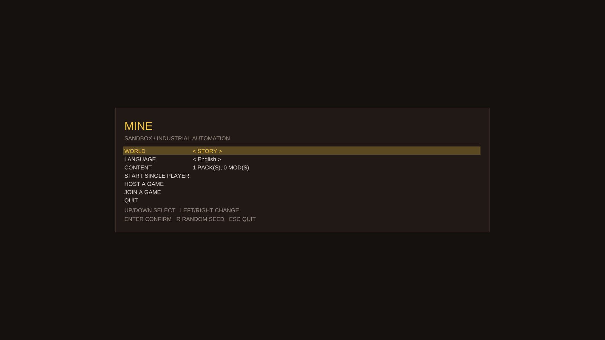

  

* 代码中**没有**任何预设内容：无资源枚举、无结构枚举、无配方、无建筑清单。

### M2 前置交付状态（已落地）：单层沙盒

内容还没到位，但"看不见数据的效果"会拖慢设计者。所以先做**单层沙盒**：只渲染一层、没有需求与推进，
面板列出数据注册出的内容与 id，改完文件按 F5 重载，已放置的格子按名字重新定位。**它不是第三种玩法
模式**，是开发工具（完整说明见 `docs/SANDBOX.md`）。

* 纯逻辑：`mine_core/sandbox.h`（网格 / 内容面板 / 光标 / 相机 / 按名字重载 / 布局序列化 / 文字导出），
  无 Ore 依赖；单测 `test_sandbox`（17 用例 / 483 断言，毫秒级）。
* 界面：`mine_app` 的第三个界面（网格 + 内容面板 + 状态栏），键鼠操作，`--world sandbox`。
* 命令行：`--content`（可重复）、`--grid WxH`、`--fill none|bands|scatter`、`--layout`、
  `--save-layout`、`--dump-layer`。
* 真机验证（同一份布局，数据文件换版本；命令见下，数字都是当前构建跑出来的）：

  | 运行 | 数据文件 | 结果 |
  |---|---|---|
  | A | v1（6 项） | `--fill scatter --seed 1`：散布 **241 格**并存盘 |
  | B | v2（在 structure 表最前面插一项，id 全部 +1） | 读入 A 的布局：**241 格 / 0 缺失**，坐标、kind、名字与 A 完全一致 |
  | C | v3（删掉 `placeholder_ore`） | 读入同一布局：**200 格 / 41 缺失**，缺失格子保留名字、id 为 0，没有一格拿到新数字 |
  | D | 三个瓦片层，v1 散布 **687 格** | 读入 v2 的布局：**687 格 / 0 缺失**；读入 v3 的布局：**575 格 / 112 缺失** |

  改文件再按 F5 的那条路（`SandboxReloadReport`）同样量过：v1 画完之后把文件换成 v2，一层时
  **123 格 id 移动**、三层时 **331 格**，`0 丢失`——"按名字重定位"不是说法，是数字。

  复现（在 `tile2d/` 下）：
  ```
  # A：散布并存盘
  mine_game --world sandbox --start --content games/mine/tests/data/placeholder_content.ecfg \
      --fill scatter --seed 1 --save-layout /tmp/a.bin
  # B / C：用变化后的数据文件读回同一份布局
  mine_game --world sandbox --start --content games/mine/tests/data/placeholder_content_v2.ecfg --layout /tmp/a.bin
  mine_game --world sandbox --start --content games/mine/tests/data/placeholder_content_v3.ecfg --layout /tmp/a.bin
  # D：三个瓦片层
  mine_game --world sandbox --start --content games/mine/tests/data/placeholder_content.ecfg \
      --tile-layers 3 --layer 1 --fill-layer all --fill scatter --seed 1 --save-layout /tmp/layers.bin
  ```

* 顺带修掉一个框架 bug：`SpriteBatch::draw_rect` 用一个 0.001 宽的 uv 区间采样**单个**白色像素，
  线性过滤下四角会采到它的透明邻居，于是每个矩形都是渐变（面板、高亮行、沙盒格子全都受影响；内置位图
  字体图集有整格白色，所以一直没暴露）。现在采样退化为一个点，并新增离屏回归测试。

* 截图（真机）：

  空网格（本体内容照样加载，面板里是游戏自己带的泥地；不填充就什么都不画）：

  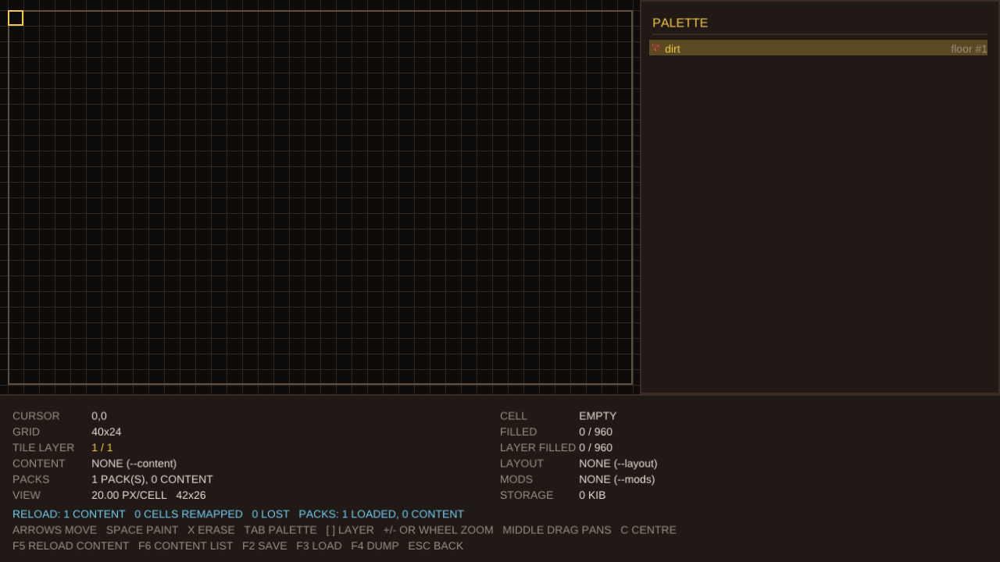

  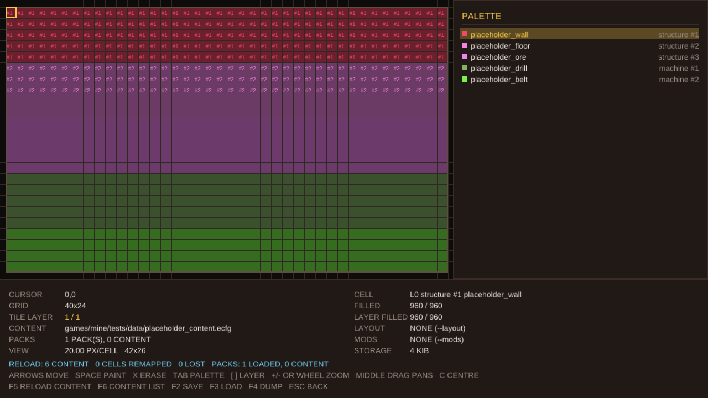

  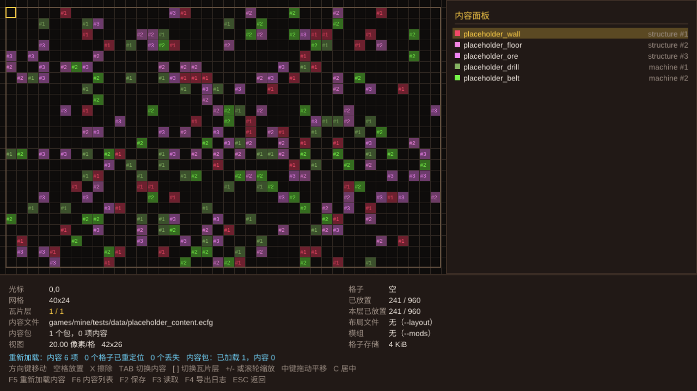

  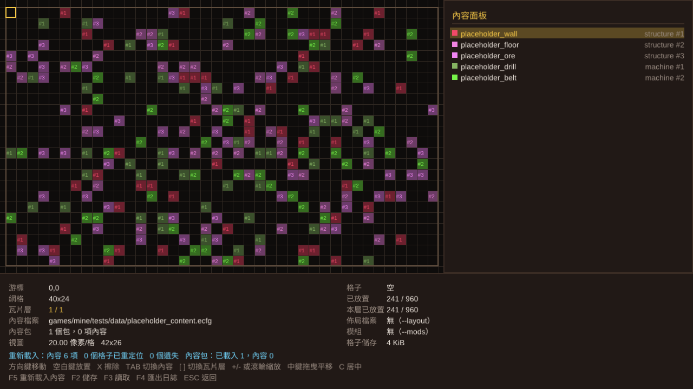

  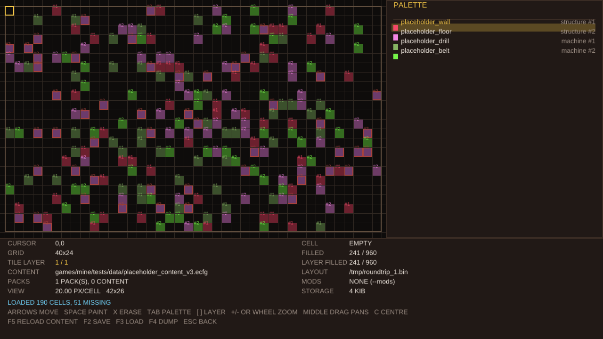

### M2 前置交付状态（二）：大图与相机（已落地）

玩法要在几百格见方的图上跑，而沙盒当时每格存一个名字（37 字节 + 一次堆分配），一屏还要把可见格子
全部按格子画一遍。这一轮把两件事都换成能撑住大图的做法，并且都用真机数字验证：

* **相机进框架**：`t2d/core/camera2d.h`——视口、世界中心、缩放（像素/世界单位，格子游戏即像素/格）、
  `screen_of`/`world_of`（互为精确逆）、`zoom_at`（指针下的世界点不动）、`fit`（带边距框住一张图）、
  `clamp_to`（有界视角）、`visible_cells`（视口覆盖的半开格子范围，即剔除范围）。纯数学，无 GPU、无窗口。
  沙盒的相机整体换成它，行为不变（原有相机测试一条不改地通过），单测 `test_camera2d`（7 用例 / 1986 断言）。
* **地图格打包**：`mine::ContentGrid`——每格 32 位（20 位 id + 4 位 kind + 1 位“内容已消失”），
  按层惰性分配（没写过的层零占用），已放置计数 O(1)。格子不再存名字：名字来自注册表与每份存档自带的
  name→id 表（§6），所以重载仍然是“按名字重定位”，而且**消失的内容保留它的 id 并标记为缺失**，
  内容回来时能被名字修好。单测 `test_content_grid`（5 用例 / 105 断言）。
* **绘制与预算**：沙盒只走 `visible_cells()`；当可见格子数 × 层数超过四边形预算时，按“每 N 格一个四边形”
  采样绘制（`draw_step_for()`，N 由预算开方得出），低缩放下网格线与标签自动关闭。
* **框架修的两处**：退出顺序改为“先 `wait_idle()` 再 `on_shutdown()`”（此前无 `--screenshot` 的无头运行
  100% 触发 `VK_ERROR_DEVICE_LOST`）；`AppConfig::upload_segment_size` 让应用能给每帧动态数据留够空间
  （ring 段给不出空间时 sprite batch 会整批丢弃，屏幕全空）。

真机数字（Intel Arc Pro 130T/140T，debug 构建，离屏 1280×720，`--fill scatter --fill-layer all`）：

| 地图 | 格子数 | 存储 | 每帧 | 峰值 RSS |
|---|---|---|---|---|
| 40×24 × 1 层 | 960 | 3 KiB | ~9 ms | 100.5 MB |
| 512×512 × 4 层 | 1.05M | 4096 KiB | ~10 ms | 100.4 MB |
| 1024×1024 × 8 层 | 8.4M | 32768 KiB | ~9 ms | 116.6 MB |

同一组运行在改造前是：512×512×4 用 134.5 MB / 2.25 s（20 帧），1024×1024×8 用 414.6 MB / 5.30 s——
存储从 37 字节一格降到 4 字节一格，帧成本从“随地图面积”变成“随屏幕”。

截图（512×512 × 4 层，同一份散布数据）：整图入框（0.99 像素/格，按块采样）与放大到 20 像素/格：

  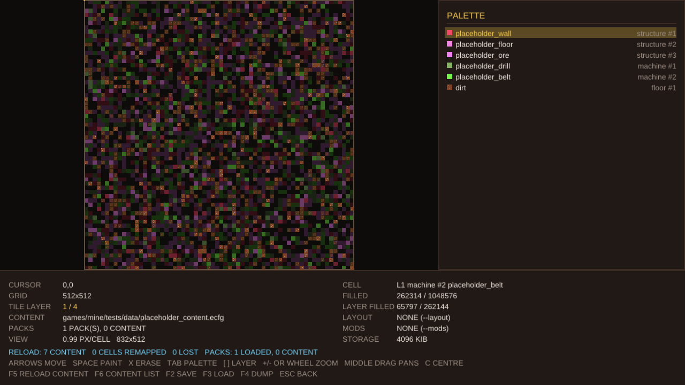

  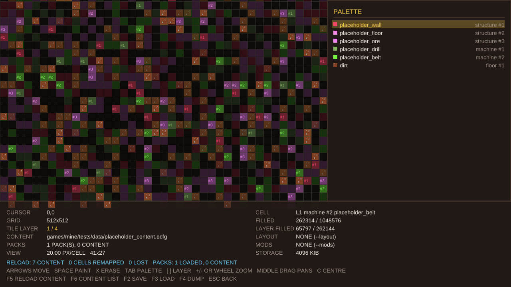

### M2 交付状态（一）：世界（已落地）

里程碑 M2 要的是"进入某层并渲染出来"。这一轮交付的是**世界**：层、地块、两条推进路径、查询，
以及游戏自己的世界视图。**内容仍然由设计者给**——层里放什么（§7.3、§7.4）没到之前，
生成器什么都不放，而"空层"是可用的：能进、能走、能查、能画。

* **纯逻辑**：`mine/world.h`（`MineLayer` / `MineWorld` / `LayerSpec` / `LayerGenerator` /
  两个调试生成器），无 Ore 依赖，专用服务器将来直接用同一份。单测 `test_world`（**12 用例 / 130 断言**，
  毫秒级）：占地的每一格、同层重叠被拒、注册表里没有的内容被拒并说明、内容没有定义时仍然是一个地块、
  **同一 `(seed, 层号)` 两次生成逐字节相同**（`dump_text` 对比）、另一层是另一张图、
  只有"会跑的"进 tick 列表、刷新只为脏的付钱、块索引里跨块的 3×3 只被访问一次、
  掩码碰撞（含图外算挡路）、空层照常工作。
* **引擎会读的字段仍然只有两个**（§1.15）：`image` 与 `random_reverse`。管线本来就会读一遍好把
  写错的字段当场报出来，现在**把读到的定义留下来**（`ContentDefinitions`），建层时直接用——
  于是"这块内容能不能掉头"是从数据来的，不是代码里的开关。
* **界面**：世界视图（会话界面按 **Enter**，或 `--world-view 1`）——进入矿场的一层，按游戏的方式画：
  所有瓦片层自下而上、**每个地块画满自己的占地**（3×3 是一个图元）、`mirrored` 左右翻转、
  没有网格线与标签；输入只有相机与指针；底部两行 HUD 说出这一层、指针指着哪个地块（含占地与是否翻转）、
  以及两条推进路径这一帧做了什么。`[ ]` 换层、`C` 复位、`F5` 重载内容并重建这一层、
  `F6` 内容列表、`Esc` 回会话界面。
* **调试填充**：`--layer-fill bands|scatter` 不点名任何内容，只把注册表里的东西铺出来——
  与沙盒的 `--fill` 同一条约定（"注册表长什么样"的视图，不是矿场的规则）。
  没有它时进的是**空层**，而空层在屏幕上明说自己是空的。

真机数字（Intel Arc Pro 130T/140T，debug 构建，离屏 1280×720）：

| 运行 | 层 | 结果 |
|---|---|---|
| `--world-view 1 --grid 40x24` | 空层 | 0 地块，0 格，屏幕中央写明"这一层没有放置任何内容" |
| `--layer-fill scatter --grid 64x40 --packs games/mine/tests/packs` | 一层 | **661 地块 / 160 运行中 / 88 翻转**，5 个绘制批次（屏幕上有 5 张图） |
| 同上，只有本体内容（泥地），`--view 20,12,48` | 一层 | **666 地块 / 340 翻转**（51%），放大后能直接看出左右翻转的成对地板块 |

截图（真机）：

  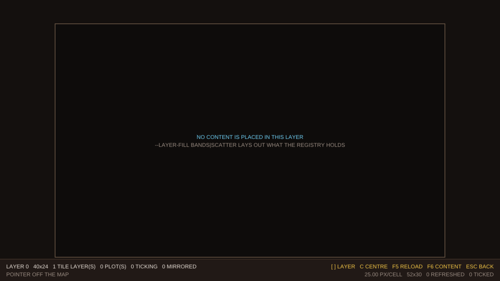

  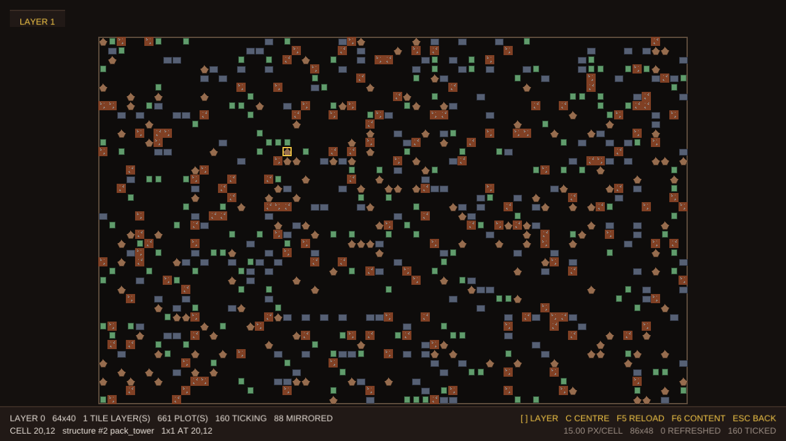

  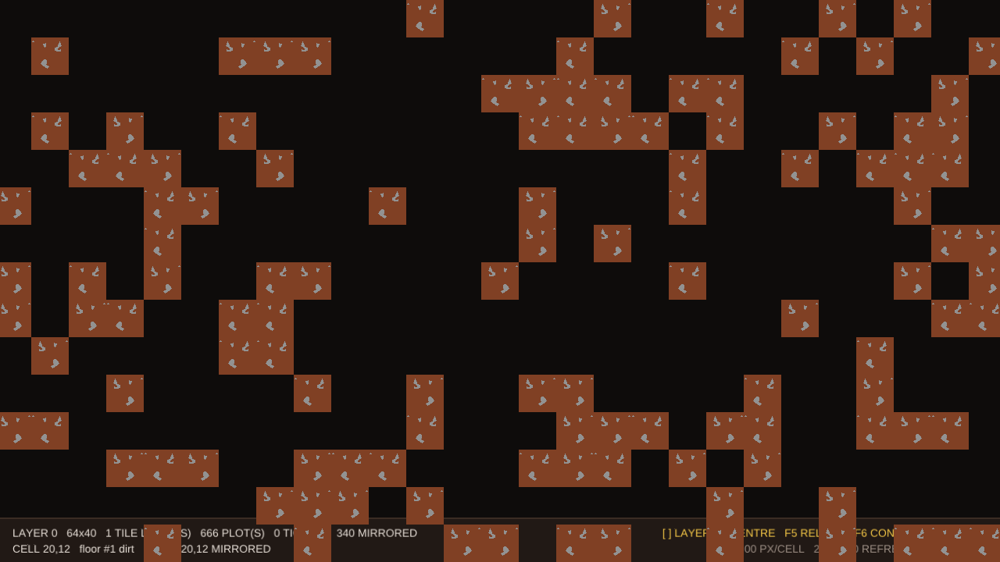

  ![走上一层（[ ]），同一个种子、不同的图](../games/mine/docs/images/world_layer1_en.png)

  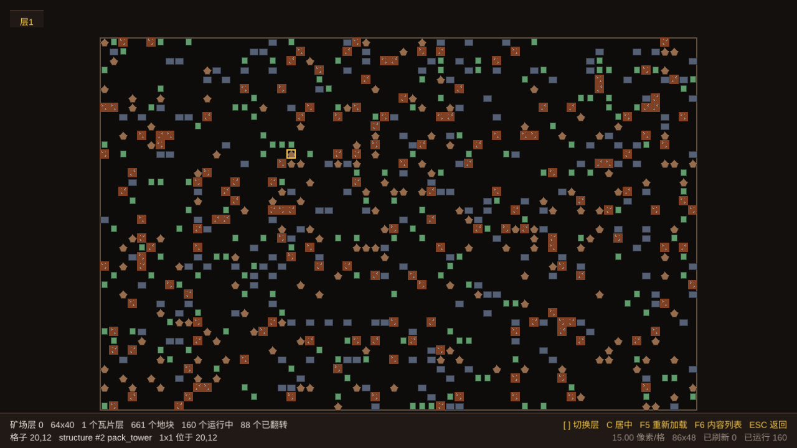

* 顺带修掉一个**真机才能发现的 bug**：F5 重载内容时，`load_content_images()` 会销毁上一批贴图纹理，
  而上一帧可能还在 GPU 上读它——**在用的纹理被销毁 = 设备丢失**。复现（两版都会崩）：
  跑起沙盒 → 换掉磁盘上的内容文件 → 按 F5 → 退出，得到
  `sync.cpp:72: result failed: VK_ERROR_DEVICE_LOST`（退出码 134）。修法是重载前先把 GPU 停下来
  （`renderer().wait_idle()`，只在真的有纹理要换时调用）：同一串命令现在是
  `RELOAD: 8 CONTENT   123 CELLS REMAPPED   0 LOST`，干净退出。重载是少见而刻意的动作（F5），
  一帧的延迟换设备不被打坏，值。

### M1 验收标准（已满足）

1. 本文档存在，且代码中**没有任何预设的游戏内容**（资源/结构/配方/建筑清单均无硬编码）。
2. `mine_game` 启动后显示开始界面，可 ↑/↓ 选择、←/→ 修改、Enter 确认、Esc 退出。
3. 开始界面提供：世界类型（故事 / 无尽）、种子（无尽时可改、可随机）、以及单机 / 主持 / 加入 / 退出。
4. 选择后进入会话界面，显示本次会话的**世界类型、角色、种子**，并明确标注"层内容尚未提供"。
5. 菜单逻辑有纯 CPU 单测（无 GPU、无线程、毫秒级）。
6. 开始界面与会话界面各有 1 张离屏截图作为视觉证据。

---

## 9. 技术映射

**复用 Tile2D（不重复造）**：确定性 tilemap（多层 + 层掩码碰撞 + 序列化）、`Tileset`、`Rng`、
`ByteWriter/Reader`、日志、CLI、`.ecfg` 读取器；传输层 `ILink`（共享内存 SPSC 环 / KCP over UDP）、
消息分帧与握手、地图分块传输；渲染（`SpriteBatch`、字形图集、`TextRenderer`、`TilemapRenderer`）；
测试基建（`t2d_add_test`、离屏回读测试）。

**随横版演示一起删除的**（不是本项目的目标，留着会把设计往横版形状上带）：平台跳跃的 `World`、
它的快照格式与命令位、客户端预测/和解/插值、`ServerHost`/`LocalClient`、三个演示程序
（`tile2d_game`/`tile2d_server`/`tile2d_bot`）、内置平台 tileset 与程序化 tileset 图集、演示关卡与
其截图。传输层本身是内容无关的，全部保留并被 `test_kcp` / `test_protocol` 覆盖；
游戏的模拟、快照与预测在 M2/M3 按那时的内容重建（见 §8）。

**游戏新增**：

* `[已实现]` `mine_core`：会话配置（世界类型 / 角色 / 种子）、开始界面模型、内容注册表与
  每存档 id 表——纯逻辑，无 Ore 依赖。
* `[已实现]` `mine_app`：Ore 应用外壳 + 界面状态机（开始界面 ⇄ 会话界面）+ 绘制。
* `[已实现]` `mine_game`：可执行程序（`--world`、`--seed`、`--host`、`--connect`、`--start`、
  `--headless`、`--frames`、`--screenshot`）。
* `[已实现]` 配置读取器 `t2d/core/ecfg.h`（`.ecfg` 格式，严格报错带行列号）与内容加载器
  `mine_core/content_loader.h`；单测 `test_ecfg`、`test_content_loader`。
* `[已实现]` **字体引擎与多语言**：自研 TrueType/CFF 解析 + 解析式抗锯齿栅格化 + 字形图集 +
  排版（`t2d/text/*`、`t2d/render/{glyph_atlas,text_renderer}`），界面字符串按 id 从
  `assets/text/ui.ecfg` 取，支持 `en / zh-Hans / zh-Hant` 并可运行时切换；中文界面截图见
  `docs/TEXT.md`。单测 `test_font`、`test_cff`、`test_text`。
* `[已实现]` **单层沙盒**：`mine_core/sandbox.h`（网格、内容面板、光标、相机、按名字重载、
  布局序列化、文字导出）+ `mine_app` 的沙盒界面；单测 `test_sandbox`；说明 `docs/SANDBOX.md`。
* `[已实现]` **多层瓦片地图**：`TileMap` 支持 1..32 个瓦片层（构造参数，默认 1，因此所有既有调用
  行为不变）、按层掩码的碰撞/危险/单向/射线查询、`topmost()`、逐层填充与计数、逐层 ASCII 读写与
  盖章（`stamp_ascii`）；序列化格式升到 v2（逐层 RLE，运行不跨层），校验和与层数一起哈希。
  渲染器按层自下而上绘制。单测 `test_tilemap`（16 用例 / 345 断言）
  与离屏像素测试 `test_render_offscreen`（高层覆盖低层、掩码选层）。
* `[已实现]` 沙盒支持瓦片层：`--tile-layers / --layer / --fill-layer`，`[ ]` 切换当前层，非当前层压暗，
  光标处的"格子"报告整叠内容；布局文件（magic `MSB3`）逐层存取。
* `[已实现]` **相机（框架）**：`t2d/core/camera2d.h`——世界↔屏幕映射、以锚点缩放、`fit`、`clamp_to`、
  `visible_cells`（剔除范围）。纯数学、无 GPU；沙盒的相机就是它，单测 `test_camera2d`。
* `[已实现]` **大图存储（游戏）**：`mine/content_grid.h`——每格 32 位的内容引用（id/kind/缺失标志）、
  按层惰性分配、O(1) 已放置计数；沙盒改用它，世界地图将来用它。单测 `test_content_grid`。
* `[已实现]` **大图绘制**：只走 `visible_cells()`，超过四边形预算时按块采样（`draw_step_for`），
  低缩放自动关掉网格线与标签；沙盒状态栏新增 `VIEW`（像素/格、可见格数、丢帧警告）与 `STORAGE` 行。
* `[已实现]` **框架修复**：`Application::run()` 退出顺序改为 `wait_idle()` → `on_shutdown()`（此前无头运行
  必然 `VK_ERROR_DEVICE_LOST`）；`AppConfig::upload_segment_size`（每帧动态数据段大小，默认 1 MiB，mine 用 4 MiB）。
* `[已实现]` **沙盒试玩（playtest）**：`P` 在同一层上切换“编辑 / 试玩”，`--playtest 1` 直接进入。
  试玩按**游戏的方式**画这一层（所有瓦片层自下而上、不压暗、贴图按格子铺满，没有网格线、标签、面板与
  状态栏），按**游戏的方式**操作（只有相机与指针：方向键/WASD 连续平移、滚轮或 `+`/`-` 缩放、中键拖动、
  `C` 复位；指针指着哪一格就在哪一格画框，底部一行 HUD 说出那一格是什么）。切换只换视口、不重置相机，
  所以“看的就是刚才在改的那块”。它**不是玩法**：没有模拟、需求、推进与动作（动作表属 §7.14），也没有
  角色——它验的是引擎这一半，并且是 M2 世界视图的第一个使用者。纯逻辑侧：`SandboxModel::point_at()` /
  `hovered()` / `point_at_cell()` / `set_viewport()`，单测 `test_sandbox`（28 用例 / 716 断言）。
  说明与截图：`docs/SANDBOX.md` §9。
* `[已实现]` **框架修复（文字行盒）**：`t2d::line_box()` + `layout_text()`（`t2d/text/text_layout.cpp`，
  `t2d::text`，**无 GPU 也能排版**）——pen 是第一行行盒的左上角，基线在它下方一个 ascent，
  `measure()` 的盒子就是 `draw()` 填充的盒子；行距是下限（盒子不短于字体自己的行高）。界面行高统一
  走 `line_for(size)`，开始/会话面板按内容定高，高亮条就是行盒本身（见 `docs/TEXT.md`）。
* `[已实现]` **框架修复（指针坐标）**：`ore::PixelScale` + `InputState::add_pointer_event()`——平台层把指针
  从窗口系统的 screen coordinates 换算成帧缓冲像素（逐轴；窗口尺寸为 0 时退化为 1.0），窗口尺寸或帧缓冲
  尺寸变化时重算，因子进启动日志；`Window::pixel_scale()` 供应用自己换算。单测 `test_input_map`（含 2 倍
  与 1.6667 倍缩放、退化尺寸、进入窗口后的首个事件不带增量）。
* `[已实现]` **内容包与模组包**：`mine/content_pack.h`（一个 `.ecfg` = 一个内容包，可选 `pack::` 头；
  目录扫描；依赖排序）与 `ContentPipeline`（本体文件 → 内容包 → 模组包，同一个注册表、同一份报告）；
  `t2d/core/module.h`（动态库加载：`dlopen`/`LoadLibrary`、符号解析、
  错误报告、移动语义）与 `mine/mod_package.h`（清单解析、目录扫描、依赖拓扑排序、冲突报告、
  原生模块宿主与 C ABI 实现）；模组 SDK 头 `mine/mod_api.h`（版本化、只追加的 C ABI）；示例包
  `games/mine/tests/mods/*`（一个纯数据、一个原生）；沙盒 `--mods`、F5 连模组一起重载、状态栏 MODS 行。
  单测 `test_module`（5 用例 / 33 断言）、`test_mod_package`（9 用例 / 102 断言）。
* `[已实现]` **第一份本体内容：泥地**（§1.17）：`games/mine/content/floors.ecfg` 用 `floor:: dirt::`
  声明它，贴图 `content/art/floor_dirt.png` 与它放在一起。**本体内容是加载顺序的第一段**，
  不需要任何参数就会加载（`--content` 是在它之后追加）：沙盒打开就列出 `floor #1 dirt`，
  空格键铺到格子上画的就是这张贴图。为此补上的工程：**引擎会读的字段现在有两个**（`image`、
  `random_reverse`，后者读不懂会报告而不是当成假）；**图片对所有来源一视同仁**——本体内容、内容包、
  模组内容文件都按"相对声明它的那个文件"解析、校验、加载（此前只有内容包有这一步）。
* `[已实现]` **内容逻辑层（游戏）**：`mine::types`（`docs/TYPES.md`）——定义是数据、逻辑是 C++，
  这个命名空间是两半之间的契约，里面不出现任何内容名字。第一个类型是**地块基类**
  `types/tile.h`：kind + id（与地图格/存档同一套身份，名字永远问注册表）、**占地矩形**
  （锚点 = 左上角，`covers`/`cell_count`/`within`/`overlaps`，2×2/3×3/2×3 是同一个矩形而不是特例）、
  "内容是否还在"（消失时保留 id 与位置，回来按名字修好）、以及**渲染朝向**（`random_reverse` 开关 +
  `mirrored()` 结果 + `randomise_mirror(rng)`：地图初始化时用层自己的随机数掷一次，50% 左右翻转，
  开关为假的地块不消耗随机数，且它只关于渲染——做什么从不被镜像）。地块是一棵继承树：
  `SceneTile`（场景/矿物/地板：**没有每帧路径**，脏标记 + `refresh()`，调用方只为改过的东西付钱）→
  `EntityTile`（**继承场景地块**，所以世界变化时的按需刷新它一样有；在此之上**自己带节奏**，
  `Floor`（继承场景地块，只多一个 `is_floor()` 标记——见下），
  `period_seconds()` 0 = 每 tick、`advance(dt)` 到点才跑，余数留下、长帧只跑一次并把整段时间交给
  `on_update(elapsed)`）。因为实体地块**是**场景地块，"要不要 tick"由**层在创建时**分列表决定，
  不靠运行时判类型。纯逻辑、无 Ore 依赖，
  另有**定义器**（`types/tile_definition.h`）：把一条内容读成 `TileDefinition`（`image`、
  `random_reverse`），再由 `make_tile` 按类别造出地块（floor → `Floor`、machine → `EntityTile`、
  structure → `SceneTile`），加载时也读一遍这两个字段所以写错当场报告。
  单测 `test_mine_types`（13 用例 / 167 断言：身份与命名、占地的每一格、同层重叠、地图边界、
  内容消失后保留 id、场景地块"没人叫就不跑"、节奏与余数、长帧只跑一次、**机器既是场景地块又有节奏
  且两条路径互不代替**、**翻转掷骰的 50% 与同种子可复现**、通过基类指针的多态与析构）。
  还没有用户：**M2 的模拟是它的第一个使用者**，而"一个机器具体做什么"是设计者的内容（§7.3/§7.4/§7.7）。
* `[已实现]` **内容列表（游戏）**：`mine/content_list.h`——把一次加载摊成一张表：一行一个来源
  （本体文件 / 内容包 / 模组包），按加载顺序，**失败的那些也在表里**（一个解析不了的包同样是一行），
  每行给出它注册的每一条内容与 id、贴图数、`NATIVE` 标记与状态 `OK` / `PARTIAL` / `FAILED`；
  展开一行看它注册了什么，`MESSAGES` 区放这次加载自己、不属于任何一行的问题（某一行的错误不在那里重复）。
  入口：开始界面 `CONTENT` 行、沙盒 `F6`、`--content-list 1`；列表里 `F5` 即重载。
  数据侧由 `ContentPipelineReport::sources` 提供（`ContentPipeline` 逐来源记录，`ModHost` 现在把
  **被拒绝的清单**也记进报告，所以"这个包在这儿、它没加载"看得见）。单测 `test_content_list`
  （9 用例 / 238 断言）。说明与截图：`docs/MODS.md` §5、`docs/SANDBOX.md` §10。
* `[已实现]` **调试输入服务器（框架）**：`ore/debug/input_server.h` + `--input-server <port>`——
  在 127.0.0.1 上开一个 TCP 端口，一行一条命令（`key` / `mouse` / `scroll` / `text` / `shot` / `quit`），
  喂给**窗口层填的同一个 `InputState`**，因此应用分不出真人按键与脚本按键。回复 `ok` 表示**帧循环已经应用**，
  所以"读到 ok 再截图"截到的就是这条命令之后的那一帧；`shot` 让一次运行能截多张；`timeout` 表示这条命令作废。
  窗口不一定敲得进去（Wayland 会话自己决定谁拥有键盘、嵌套合成器先截走事件、无头运行没有窗口），
  而这个服务器绕开的正是这些：脚本化验证不再依赖合成器、焦点与指针位置。配套的两处框架修正：
  无窗口运行时帧循环同样调用 `begin_frame()`（否则一次按下会被读成永远按下），mine 的输入处理器改用
  `Application::input()` 而不是 `window()->input()`（无头运行因此可被驱动）。另外 `--platform wayland|x11|null`
  可以指定窗口系统（GLFW 默认自己挑）。单测 `test_debug_input`（6 用例 / 103 断言，含真实 socket 往返）。
* `[已实现]` **世界（游戏）**：`mine/world.h`——`MineLayer`（地图格 + 地块 + 块索引 + 层自己的骰子）
  与 `MineWorld`（种子、层形状、生成器、**只有被进入的那一层在内存里**）。`place()` 把一条内容变成地块：
  按类别造类（`make_tile`）、掷一次翻转骰子、把占地写进每一格、进块索引，**占地放不下、同层重叠、
  注册表里没有这条内容都当场拒绝并说明**（不半途放下）。两条推进路径 `refresh()`（只为脏的付钱）与
  `tick(dt)`（只走"会跑的"）各一帧一次。查询：`ref_at`（格子）、`plot_at`/`top_plot_at`（占地感知、
  走块索引）、`blocks(掩码, 格)`（掩码挡路由，图外算挡路）、`for_each_plot_in(矩形, 访问者)`
  （跨块的地块只访问一次）。单测 `test_world`（12 用例 / 130 断言）。
* `[已实现]` **定义留下来给建层用**：`ContentDefinitions`（`content_loader.h`）——管线本来就逐文件读
  `tile_definitions` 好把写错的字段当场报出来，现在把它**留下**并合进 `ContentPipelineReport`，
  于是"这块内容能不能掉头"由数据决定，建层不再猜。
* `[已实现]` **世界视图（游戏）**：会话界面 `Enter` 或 `--world-view 1` 进入矿场的一层；
  `--layer-fill bands|scatter` 是调试填充；`[ ]` 换层、`C` 复位、`F5` 重载并重建、
  `F6` 内容列表、`Esc` 回会话界面。绘制走 `draw_layer_images()`：**按不同图片分批**（`docs/MODS.md` §0）、
  每个地块画满自己的占地、`mirrored` 把 uv 的 u 轴反过来。
* `[已实现]` **游戏自己找内容（框架 + 游戏）**：`t2d/core/executable.h`——`executable_path()`（Linux 走
  `/proc/self/exe`、Windows 走模块句柄、macOS 走 `_NSGetExecutablePath`，拿不到就回空串）与
  `parent_directory_of()`（纯字符串规则，可无文件系统测试）；`mine/content_search.h`——
  `packs_beside()` 与 `default_content_directories()`：可执行文件旁边的 `packs/` 第一顺位、
  工作目录下的第二顺位、同一目录只算一次、只有存在的才进列表。单测 `test_executable`（2 用例 / 18 断言）
  与 `test_content_search`（4 用例 / 24 断言，含"一个目录里同时放包和模组、两者都加载且无冲突"）。
  顺带定下一条规则：**带 `mod.ecfg` 的目录不是内容包项目**，`ContentPack::scan_directory` 不再往里递归。
* `[已实现]` **框架修复（重载会丢设备）**：重载内容时替换纹理前先 `renderer().wait_idle()`——
  上一帧可能还在 GPU 上读那张纹理，销毁在用的纹理会 `VK_ERROR_DEVICE_LOST`（`sync.cpp:72`，
  退出码 134）。复现步骤与修后数字见 §8 的 M2 交付状态。
* M2 还差：**层数据/生成规则**（等设计者的 §7.3、§7.4、§7.8、§7.9：每层生成什么、一张图分几个瓦片层、
  每层放什么）、**层间通道与解锁**（§7，当前唯一确认的解锁条件是"本层需求全部完成"）、
  以及模组的 tick/行为钩子（等模拟的形状定了再往 ABI 末尾追加）。
* M3：需求与提交渠道、物流与加工（按设计者清单）。
* M4：内容数据、存档、联机回归。

---

## 10. 非目标（工程边界）

* 不做 3D、体素、复杂光照、大规模粒子。（"多边形风格"指的是 2D 贴图的美术风格，不是 3D 建模。）
* 不做玩家角色/化身：没有角色贴图、角色移动、角色碰撞，也没有"出生点"（§1.11）。
* 不做矢量多边形渲染：贴图是图片资源（PNG），"多边形"是美术风格，不是渲染方式（§1.10）。
* 不预设任何玩法内容（战斗、敌人、经济、成就……）——需要就由设计者提出。
* M1 界面只支持 ASCII 大写（框架内置 5×7 位图字体）；中文界面需换字体，等设计者确认（§7.12）。
* 不做横版动作（重力 / 跳跃 / 单向平台）：框架里曾经的横版演示已删除，游戏是平面俯视无重力。
* 不引入第二套网络栈，联机一律走 Tile2D 的 `ILink`（共享内存 / KCP）与同一套分帧握手。
* 沙盒是开发工具，**不是第三种玩法模式**：它不含内容、不做地形生成、不对布局文件承诺存档兼容
  （见 `docs/SANDBOX.md`）。

---

## 11. 术语

| 术语 | 含义 |
|---|---|
| 层（Layer） | 矿场的一层，一张独立地图实例，带资源/结构/需求描述 |
| 地块（Tile） | 地图中占据格子的**固定物体**（地板、矿物、机器…），可以占 1 格或 2×2、3×3、2×3 等；基类 `mine::types::Tile`（§1.12） |
| 场景地块（SceneTile） | 构成矿场的地块（场景、矿物、地板）：**仅在需要时更新**，没有每帧成本（§1.13） |
| 实体地块（EntityTile） | 功能地块（机器…）：**继承场景地块**，在此之上**每 tick 或每 xx 秒更新**，节奏由地块自己持有（§1.13、§1.14） |
| 渲染翻转（random_reverse） | 地块基类上的开关：为真时地图初始化随机决定是否**左右翻转渲染**（50%），只影响渲染（§1.14）；**由内容作者在数据里写**，`mirrored` 不进存档（§1.15） |
| 地板（Floor） | 其他东西站上去的那一层：`SceneTile` 的子类，只多一个 `is_floor()` 标记；`floor::` 表声明（§1.16） |
| 本体内容 | 游戏自己带的内容，`games/mine/content/`，加载顺序的第一段，无需参数（§1.17） |
| 层描述（LayerSpec） | 层的数据表示：地图形状 + 要放的内容（kind、名字、瓦片层、锚点、占地）；故事模式来自设计者数据，无尽模式由种子生成 |
| 世界（MineWorld） | 一座矿场：种子、层形状、生成器，以及**当前被进入的那一层**（`mine/world.h`）；层数可以很多，内存里只有一层 |
| 层实例（MineLayer） | 一层矿场：地图格（`ContentGrid`）+ 地块（`mine::types`）+ 块索引 + 这一层自己的骰子；两条推进路径都在它身上 |
| 需求（Demand） | 层目标：通过某种提交方式提交指定原料或产物；完成即推进 |
| 提交渠道（Submit channel） | 接收提交的机制（规则由设计者定义，实现提供抽象） |
| 会话（Session） | 一次游戏运行：世界类型 + 角色 + 种子（+ 连接信息） |
| 上帝视角（God view） | 没有化身的操作方式：输入驱动相机与指针，作用在地图上（§1.11） |
| 多边形风格（Polygon style） | 贴图的**美术风格**：低多边形、平色块、硬边；贴图本身仍是图片资源（§1.10） |

---

## 12. 变更记录

| 版本 | 变更 |
|---|---|
| M2.2 | **游戏自己找内容**（设计者新要求）：① `t2d/core/executable.h`——`executable_path()` /
  `executable_directory()` / `parent_directory_of()`，纯字符串的目录规则可脱离文件系统测试；
  ② `mine/content_search.h`——默认内容目录：**可执行文件旁边的 `packs/`** 第一顺位，
  工作目录下的 `packs/` 第二顺位，同一目录只算一次，只有存在的才进列表（缺省不是承诺：不存在不报错）；
  ③ **一个 `packs/` 放两种东西**：`*.ecfg` 是内容包，带 `mod.ecfg` 的子目录是模组包；
  `ContentPack::scan_directory` 不再递归进模组包目录（否则模组的内容文件会被当成包再注册一次，
  报成"已注册、未替换"）；④ `main.cpp` 里包与模组**各自独立**套用默认目录（只写 `--packs` 时模组仍自动找），
  并在启动日志里说明这次看了哪些目录。真机验证：把包与模组放进 `build/debug/games/mine/packs/`，
  **从 `/tmp` 启动**仍然加载（1 包 + 1 模组 + 本体 = 3 项内容，0 错误；内容列表 3 个来源全 OK）。
  单测 `test_executable`（2 用例 / 18 断言）、`test_content_search`（4 用例 / 24 断言）；
  Tile2D 套件 21 → **23 个测试**（no-renderer 9 → 10）全绿；文档 `docs/MODS.md` §0、
  `packs/README.md`、`docs/SANDBOX.md` §2、`tile2d/README.md` 同步 |
| M2.1 | **世界（M2 第一段）**：① **`mine/world.h`**——`MineLayer`（地图格 + 地块 + 32×32 块索引 + 层自己的 `Rng`）与
  `MineWorld`（种子 + 层形状 + `LayerGenerator`，**只有被进入的那一层在内存里**，`enter(层号)` 现建现用，
  同一 `(seed, 层号)` 再进来是同一个矿场）。② **建层**：`place()` 走定义器造地块、**掷一次翻转骰子**、
  把占地写进每一格、进块索引；放不下 / 同层重叠 / 注册表没有这条内容 → **拒绝并说明**，不半途放下。
  ③ **两条推进路径**：`refresh()` 走过全部地块只为脏的付钱、`tick(dt)` 只走"会跑的"（创建时分会列表，
  不在运行时判类型）。④ **查询**：`ref_at` / `plot_at` / `top_plot_at` / `blocks(掩码, 格)` /
  `for_each_plot_in(矩形)`（跨块只访问一次）。⑤ **定义留下来**：`ContentDefinitions` 把管线本来就会读的
  `image`/`random_reverse` 留下并合进报告，建层不再猜。⑥ **世界视图**（会话 `Enter` / `--world-view 1`）：
  按游戏的方式画一层（瓦片层自下而上、地块画满占地、`mirrored` 翻 u 轴、无网格线标签），输入只有相机与指针，
  HUD 报层、地块、占地、翻转与两条路径这一帧做了什么；`[ ]` 换层、`F5` 重载并重建、`F6` 内容列表；
  `--layer-fill bands|scatter` 是调试填充（不点名内容，只铺注册表）。⑦ **修 bug**：重载内容替换纹理前先
  `wait_idle()`——销毁在用的纹理会 `VK_ERROR_DEVICE_LOST`（两版都复现，修后干净退出）。
  单测 `test_world`（12 用例 / 130 断言）；Tile2D 套件 20 → **21 个测试**全绿；文档补 §2/§3/§4/§8/§9/§11
  与 `docs/TYPES.md`、`tile2d/README.md` |
| M1 | 初版。仅记录设计者已确认的九条需求与工程约束；删除此前草稿中自行预设的资源、结构、配方、建筑、剧情与数值内容 |
| M1.18 | **美术资源规则落地**（设计者新增 §1.18，即 §7.13 的答案）：① **一块内容一张图、不进大图集**——
  沙盒的图片通道从"所有贴图打进一张 1024×1024 图集（统一格子、超出即拒绝）"改成**每份内容一张纹理**
  （`context().create_texture`），绘制时**按内容分组**：一个批次绑定一张纹理，所以屏幕上出现几种图就是
  几个批次（实测：只有泥地 2 个 draw call，加上仓库里 4 张内容贴图 5 个；此前恒为 2）。
  顺带修掉一个统计错误：帧计数器原来读的是"最后一个批次"的数字，多批次后必须累加（`ImagePassCost`）。
  ② **尺寸随意**（一格通常 128/256 像素，其它值也行）：不再有"图片大于格子就拒绝"这条路，也不缩放。
  ③ **命名不限，官方内容用蛇形命名**；泥地的 `random_reverse` 置为 **true**（§1.18）。
  `docs/MODS.md` §0 新增"美术资源的规则"，§7.13 标记为已确认 |
| M1.17 | **地板与第一份本体内容**（设计者新增 §1.15–§1.17）：① **`Floor`**（`types/floor.h`）继承
  `SceneTile`，**只多一个 `is_floor()` 标记**（基类默认假）——"是不是地板"是东西的**种类**而不是数据里的
  开关，所以机器问脚下、寻路问前面时不需要知道任何一块地板的名字。② **`ContentKind::Floor`** 追加在类别表
  末尾（类别值进地图格与存档，插中间等于重编号），`floor::` 表就是它的 **`.ecfg` 定义器**；
  沙盒把 `floor` 也算作占格子的类别，所以泥地可以直接铺出来看。③ **引擎会读的字段变成两个**：
  `image` 与 **`random_reverse`**（§1.15：由内容作者定义；`mirrored` 不进存档）；读不懂的字段**报告**
  （`random_reverse:1` 不当成假），本体内容/内容包/模组三处都在加载时读一遍。④ **定义器**
  （`types/tile_definition.h`）：`read_tile_definition`（读引擎字段）→ `tile_definitions`（走一份
  `.ecfg`，只收占格子的类别）→ `make_tile`（按类别造对象：floor→`Floor`、machine→`EntityTile`、
  structure→`SceneTile`），纯逻辑、可测。⑤ **第一份本体内容：泥地**
  （`games/mine/content/floors.ecfg` + `art/floor_dirt.png`）——**本体内容是第一段加载顺序，无需参数**
  （`--content` 在其后追加）。为此补的工程：**图片对所有来源一视同仁**（此前只有内容包解析图片，
  现在本体内容与模组内容文件也按"相对声明它的那个文件"解析、校验、进图集），
  **图集格子按实际贴图尺寸决定**（256×256 不会被拒绝也不会被缩放）。单测：`test_mine_types` 11 → **13 用例
  / 167 断言**（地板标记、定义器读字段与拒绝坏值、`make_tile` 的类别映射），`test_content_pack` 10 → **11
  用例 / 155 断言**（本体内容自带贴图、坏字段被报告），三语言界面与文档同步 |
| M1.16 | **地块继承树 + 渲染翻转**（设计者新增 §1.14）：① `EntityTile` 改为**继承 `SceneTile`**——
  实体地块**是**场景地块（世界变化时的按需刷新、脏标记它一样有），在此之上才加自己的节奏；因此
  "要不要 tick"不能靠运行时判类型，**层在创建时就把要 tick 的地块放进自己的列表**（刷新那一遍走过
  全部地块、只为脏的付钱；tick 那一遍只走机器），这正是省下来的东西。② 地块基类新增 **`random_reverse`**
  开关与 **`mirrored()`** 结果，`randomise_mirror(rng)` 在**地图初始化**时掷一次：为真则 50% 左右翻转渲染，
  掷的是**层自己的 `t2d::Rng`**（种子来自世界 seed，同种子同结果），**开关为假的地块不消耗随机数**
  （改一块内容不会把后面地块的骰子整体挪位），并且**它只关于渲染**——地块做什么从不被镜像；
  手工指定走 `set_mirrored()`。`test_mine_types` 9 → **11 用例 / 126 断言**（新增"机器既是场景地块
  又有节奏、两条路径互不代替"与"翻转掷骰的 50%、同种子可复现、开关为假不动随机数"）。`docs/TYPES.md`
  §3/§4 同步 |
| M1.15 | **内容逻辑层：`mine::types` + 地块基类**（设计者新增 §1.12、§1.13）：① 定义是数据、**逻辑是 C++**，
  后者住进 `mine::types`（`docs/TYPES.md`），这个命名空间是两半之间的契约，**里面不出现任何内容名字**。
  ② **地块基类** `types/tile.h`：占据格子的固定物体（地板、矿物、机器），身份是 kind + id（名字永远问
  注册表，地块不存名字；内容消失时保留 id 与位置、回来按名字修好），**占地是一个格子矩形**——锚点 = 左上角，
  `covers`/`cell_count`/`within`/`overlaps`，于是 **2×2、3×3、2×3 是同一个矩形而不是特例**；
  基类不可直接构造：地块只可能是下面两类之一。③ **两类地块是两个类**：`SceneTile`（场景/矿物/地板，
  **没有每帧路径**：脏标记 + `refresh()`，调用方只为"改过的东西"付钱）与 `EntityTile`（机器等功能地块，
  **自己带节奏**：`period_seconds()` 0 = 每 tick、`advance(dt)` 到点才跑；**按时间不按 tick 计数**，
  余数留下所以一秒的周期不漂移，**长于一个周期的一帧只跑一次**并把整段时间交给 `on_update(elapsed)`——
  地块不能补跑错过的 tick，否则产出会取决于帧是怎么掉的）。纯逻辑、无 Ore 依赖，单测 `test_mine_types`
  9 用例 / 103 断言。还没有用户：M2 的模拟是第一个使用者，"机器具体做什么"是设计者的内容（§7.3/§7.4/§7.7）；
  地块与地图的桥（把 3×3 写进 `ContentGrid`、锚点如何随存档往返）与模拟一起做 |
| M1.14 | **内容列表 + 调试输入服务器**：① **内容列表**（开始界面 `CONTENT` 行 / 沙盒 `F6` / `--content-list 1`）——
一次加载摊成一张表：一行一个来源（本体文件 → 内容包 → 模组包，按加载顺序），**没加载成功的也在表里**，
每行给出 id、版本、注册的内容数与贴图数、`NATIVE` 与状态 `OK`/`PARTIAL`/`FAILED`（`PARTIAL` = 加载了但丢了东西，
例如名字被先注册者占用）；`回车` 展开看它注册的每一条内容与 id，`F5` 当场重载，下方 `MESSAGES` 放这次加载
自己、不属于任何一行的问题（某行自己的错误不重复）。数据侧：`ContentPipelineReport::sources`（`ContentPipeline`
逐来源记录），`ModHost` 把**被拒绝的清单/重复 id** 也记进报告，"这个包在这儿、它没加载"因此看得见；
`mine/content_list.h` 是纯逻辑模型（选择、展开、滚动、消息去重），单测 `test_content_list` 9 用例 / 238 断言。
② **调试输入服务器**（`ore/debug/input_server.h`、`--input-server <port>`）：loopback TCP，一行一条命令
（`key`/`mouse`/`scroll`/`text`/`shot`/`quit`），喂给窗口层填的**同一个 `InputState`**；`ok` = 帧循环已应用
（读到 ok 再截图就是那条命令之后的那一帧），`timeout` = 该命令作废。它解决的是"窗口敲不进去"：Wayland 会话
自己决定键盘归属、嵌套合成器先截走事件、无头运行没有窗口——脚本化验证因此不再依赖合成器、焦点与指针位置，
**无头运行第一次可以被按键驱动**（配套：无窗口时帧循环也 `begin_frame()`，mine 的输入处理器改用
`Application::input()`）。框架另加 `--platform wayland|x11|null` 指定窗口系统。单测 `test_debug_input`
6 用例 / 103 断言（命令解析、错误信息、真实 socket 往返、按住 vs 点一下、双服务器）。三语言界面新增
`content.*` 与 `row.content` 字符串；`docs/MODS.md` §5、`docs/SANDBOX.md` §10、Ore README 同步；
本文档所有截图重出（内容列表三张 + 展开一张 + 真实窗口两张）。③ 顺带修掉：脚本化运行的 `--pointer`
在第一帧就被"没有鼠标"覆盖（无鼠标时指针位置是 (0,0)，居中后的地图那里在图外，于是试玩截图里
指针消失）——现在"指针跟随鼠标"从**真的出现过指针**开始（`mouse_seen_`：指针进入过窗口，或有位移）；
另修掉文档里 18 个指向不存在路径的截图链接（`docs/images/` → `../games/mine/docs/images/`） |
| M1.13 | **沙盒试玩（引擎）**：沙盒新增**试玩**状态——按 `P` 在“编辑 / 试玩”之间切换（`--playtest 1` 直接进入），
同一层、同一份内容、**同一个相机**（切换只换视口，不重置视角）。试玩按**游戏的方式画**：所有瓦片层自下而上、
不压暗、贴图按格子铺满，没有网格线、标签、内容面板与状态栏；按**游戏的方式操作**（§1.11、§3）：输入只有
**相机**与**指针**——方向键/WASD 连续平移（按住，不是一格一跳）、滚轮或 `+`/`-` 缩放、中键拖动、`C` 复位；
指针指着哪一格就在哪一格画框，底部一行 HUD 说出那一格是什么（层号/kind/id/名字，整叠自上而下，与状态栏
共用同一个 `cell_text()`）。**它不是玩法**：没有模拟、没有需求、没有推进、点击不做任何事（动作表属 §7.14），
也没有玩家角色——它验的是引擎这一半，并且是 M2 世界视图的第一个使用者。纯逻辑侧新增 `point_at()`/
`hovered()`/`point_at_cell()`/`set_viewport()`，`test_sandbox` 26 → **28 用例 / 716 断言**（指针在格内/格外/
图外、相机移动后同一屏幕点指向的格子随之改变、指针不是光标、视口变化不移动视角中心）；命令行新增
`--playtest` 与 `--pointer x,y`（脚本化运行没有鼠标，而试玩的截图少了指针就不算试玩）；顺带把“窗口尺寸/帧缓冲
尺寸变化”与“启动时缩放的 framebuffer 还没到”这件事说清楚：`Window` 在缩放因子真的变化时补一条日志
（缩放显示器上启动时那一行是未缩放的），`on_resize` 一律重新入框（首次 resize 正是缩放到达的那一次）。
截图与说明：`docs/SANDBOX.md` §9 |
| M1.12 | **修掉界面高亮与文字不重合（框架）**：排版实现把 pen 当**基线**用（`TextRenderer::draw()` 的文档却写着“pen 是左上角”），
于是每一行都被画在调用者为它预留的盒子**上方一个 ascent**：开始界面选中行的高亮条落在文字下面并压住下一行，
标题跑到面板外，沙盒格子的标签挂在格子顶端之上。修法是让实现与文档一致——**pen 是第一行行盒的左上角**：
新增 `t2d::line_box(fonts, style)`（`ascent` = 最高字面的 hhea ascent，`descent` = 其 descent，
`height` = `max(字号 × line_spacing, ascent + descent)`），`layout_text()` 把基线放在 pen 下方一个 ascent，
`measure()` 返回的盒子就是 `draw()` 填充的盒子。排版整段从 `render/text_renderer.cpp` 拆进 `t2d::text` 的
`text/text_layout.cpp`（无 GPU 也能排版，服务器可用），渲染器只剩“字形 → 图集 → 四边形”。`test_text` 新增
28 断言（同尺寸栅格化后的 ink 必须落在 `[0, height]` 内、换行、行距下限、空字体集），离屏像素测试新增
`text_is_drawn_inside_the_box_its_pen_describes`（旧行为下报 “the ink starts 8 px above the pen”）。界面侧行高
统一由 `line_for(size)` 给出（字体行盒与 1.45×字号取大），开始/会话面板改为**按内容定高**（原固定高度是照着错的
基线调的），高亮条就是行盒本身；沙盒色块改成两遍共用的正方形。三语言截图全部重出（`docs/TEXT.md` 新增 “Where a line sits”） |
| M1.1 | 新增 §6：内容注册与存档 id 策略（注册按名字、存档存数字 id、每存档自带 name→id 表、缺失内容报告而非重映射）；里程碑与术语顺延 |
| M1.2 | 新增 `.ecfg` 配置读取器（格式由仓库根 `example.ecfg` 定义）与内容加载器（配置文件 → 注册表）；§6 与 §9 相应更新 |
| M1.3 | 新增字体引擎（TrueType + CFF 轮廓、解析式抗锯齿、字形图集、UTF-8 排版）与多语言界面（`en / zh-Hans / zh-Hant`，运行时切换，语言决定 CJK 字面）；界面文案全部走字符串表，代码中无硬编码文案 |
| M1.11 | **修掉缩放显示器上的指针偏移（框架）**：窗口系统报告的指针位置是 *screen coordinates*（窗口内容区大小），而绘制与命中测试用的是 *framebuffer pixels*——1.6667 倍缩放的 GNOME/Wayland 会话里是 2133×1200 对 3555×2000，于是指针被当成帧缓冲像素用，界面越往右下偏得越多。修法是在平台边界换算一次：新增 `ore::PixelScale`（逐轴 `帧缓冲尺寸 / 窗口内容尺寸`，窗口尺寸为 0 时退化为 1.0）与 `InputState::add_pointer_event()`（位置与增量都存帧缓冲像素，指针进入窗口后的第一个事件不带增量），`Window` 在窗口尺寸/帧缓冲尺寸变化时重算，并把因子打进启动日志；`Window::pixel_scale()` 供自己读 GLFW 指针的应用使用。单测 `test_input_map` 7 用例 / 66 断言（含 2 倍、1.6667 倍与退化尺寸）。真机验证：scale 2 的嵌套合成器里合成器把指针放在逻辑 (400,300)，引擎报告 (800,600)，沙盒选中并高亮的那一格正好包含该像素 |
| M1.10 | **大图与相机（引擎）**：框架新增 `t2d::Camera2D`（世界↔屏幕、锚点缩放、`fit`/`clamp_to`/`visible_cells`，纯数学，`test_camera2d` 7 用例 / 1986 断言）；游戏新增 `mine::ContentGrid`（每格 4 字节、按层惰性分配、O(1) 计数，`test_content_grid` 5 用例 / 105 断言），沙盒整体改用它，**存储从 37 字节/格降到 4 字节/格**（1024×1024×8 层：414.6 MB → 116.6 MB，5.30 s → 1.23 s）；绘制只走可见格子，超过四边形预算时按块采样（`draw_step_for`），低缩放自动关网格线与标签，状态栏新增 `VIEW`/`STORAGE` 行（含丢帧警告）；沙盒新增 `--view x,y[,zoom]`；修掉两个框架缺陷：退出顺序（`wait_idle()` 必须在 `on_shutdown()` 之前，否则无头运行 100% `VK_ERROR_DEVICE_LOST`）与 `AppConfig::upload_segment_size`（ring 段不足时 sprite batch 整批丢弃、整帧空白）；布局格式 `MSB3`。§2/§3/§8/§9 同步更新，`docs/SANDBOX.md` §7 记录大图与相机的真机数字 |
| M1.9 | **内容包项目 + 两条新需求**：新增 `tile2d/packs/` 内容包工作区（游戏运行时自动加载 `./packs`）与 `packs/template/` 模板包项目；包目录改为**递归**扫描（一个工作区可放多个包项目，跳过 `.` 开头的项），并有测试保证模板永远可加载且**注册 0 项内容**。需求侧记录设计者新确认的两条：**贴图采用多边形风格**（§1.10；经设计者澄清：多边形是**美术风格**，仍然使用**图片资源**——§2 据此定下"内容包带图片文件 + 内容用相对路径引用 + 引擎解析校验"的约束，§7.13 改为问图片规则）与**没有玩家角色、所有玩家上帝视角操作**（§1.11 → §2/§3 改为相机 + 指针，无角色碰撞，玩家位置不进快照）。内容包加载现在会解析并校验 `image` 字段 |
| M1.8 | **纯 ecfg 内容包**：一个 `.ecfg` 文件即一个包（可选 `pack::` 头：id/name/version/requires），`--pack` 与 `--packs`（目录扫描 + 依赖排序），缺省自动加载工作目录下的 `packs/`；新增 `ContentPipeline` 把**本体内容 → 内容包 → 模组包**三个来源装进同一个注册表、同一份报告，游戏本体（会话界面）与沙盒都用它，F5 全部重载；单测 `test_content_pack`（7 用例 / 85 断言） |
| M1.7 | **模组包**：内容（定义与逻辑）从外部包加载——`mod.ecfg` 清单、依赖排序与校验、同名冲突报告而非合并、可选的 C++ 模块（`dlopen` + 版本化 C ABI `mine/mod_api.h`，`on_load`/`on_unload`、按 `struct_size` 只追加地演进）；框架侧 `t2d/core/module.h`；沙盒 `--mods` 与 F5 重载、状态栏 MODS 行；文档 `docs/MODS.md` |
| M1.6 | **删除横版演示**（设计者确认它不是项目内容）：平台跳跃 `World`、快照/命令、客户端预测/和解/插值、`ServerHost`/`LocalClient`、三个演示程序、内置平台 tileset 与程序化 tileset 图集、演示关卡与截图。保留内容无关的传输层（`ILink`/共享内存/KCP/分帧/握手/地图分块）并继续由 `test_kcp`、`test_protocol` 覆盖；`TilemapRenderer` 去掉玩家/拾取物绘制与内置图集依赖（图集网格改由 `Tileset::set_atlas_grid` 声明），`Tileset` 去掉内置 tileset，`TileMap` 去掉内置 ASCII 图例。测试套件 17 → 13（删掉 `test_snapshot`/`test_atlas`/`test_integration_*`），预设 `server-only` 改名 `no-renderer` |
| M1.5 | **多层瓦片地图**：`TileMap` 支持 1..32 层（默认 1，既有调用不变）、层掩码查询、逐层填充/计数/ASCII、序列化 v2、校验和含层数；渲染器按层自下而上；沙盒可分层绘制与编辑（`--tile-layers / --layer / --fill-layer`，`[ ]` 切层，布局 magic `MSB2`）。三层布局的真机往返：699 格 / 438 个 id 位移后仍逐格对上，删掉内容后 140 格在三层上被标为缺失 |
| M1.4 | 新增**单层沙盒**（内容调试工具）：`--world sandbox` 与 `--content / --grid / --fill / --layout / --save-layout / --dump-layer`；F5 按名字重载、F2/F3 布局往返、F4 文字导出；界面三语言。修掉 `SpriteBatch::draw_rect` 的 uv 区间采样 bug（矩形变渐变）并加离屏回归测试。文档 `docs/SANDBOX.md` |
