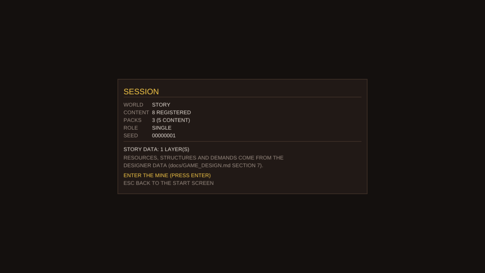
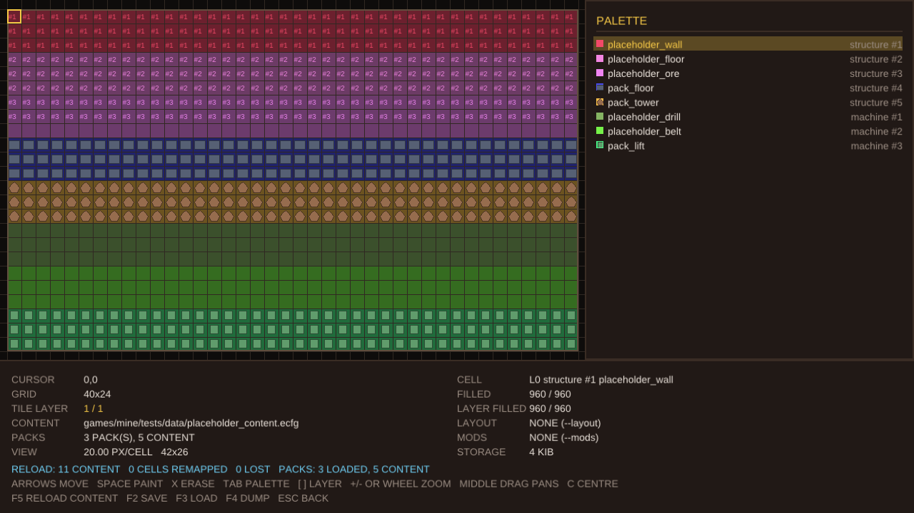
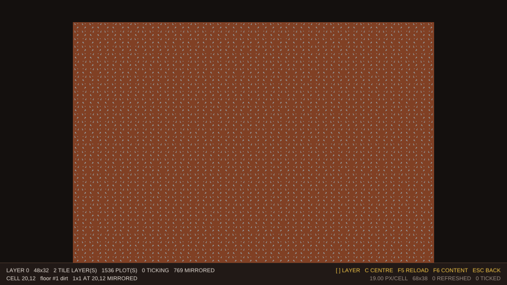
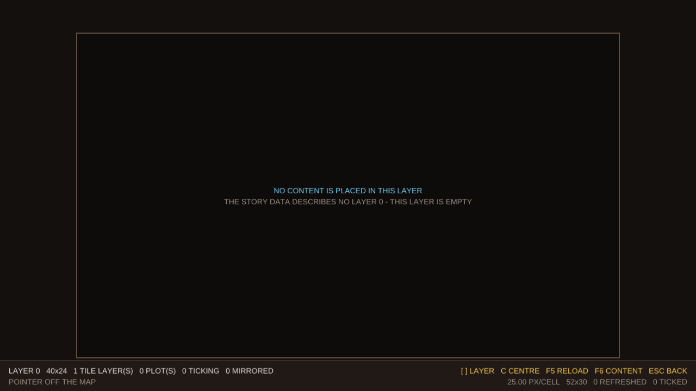
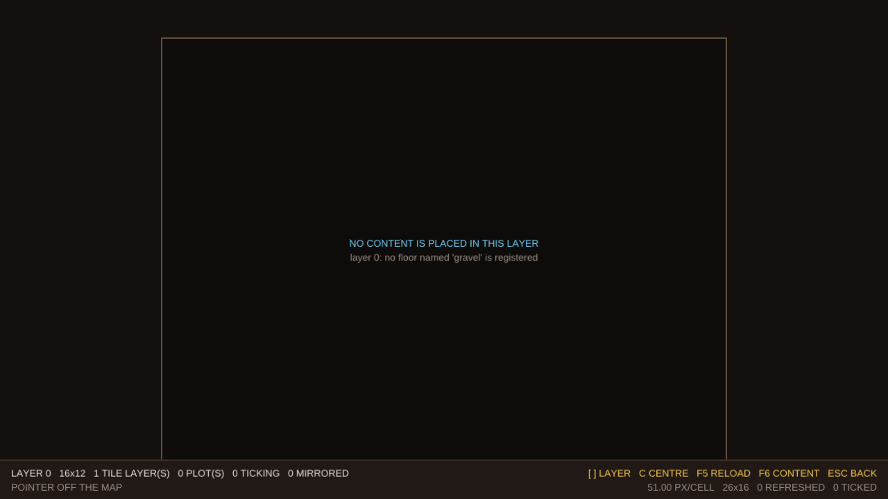
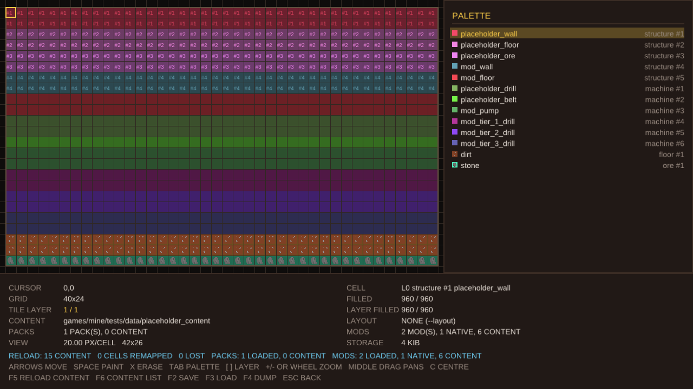
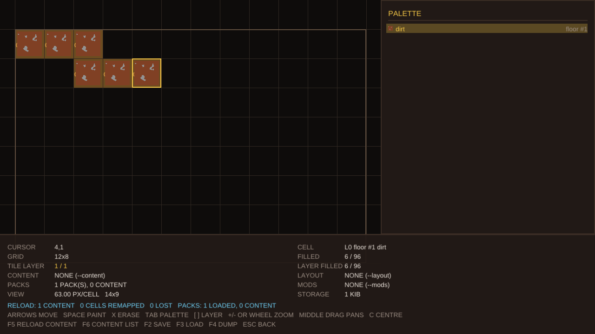
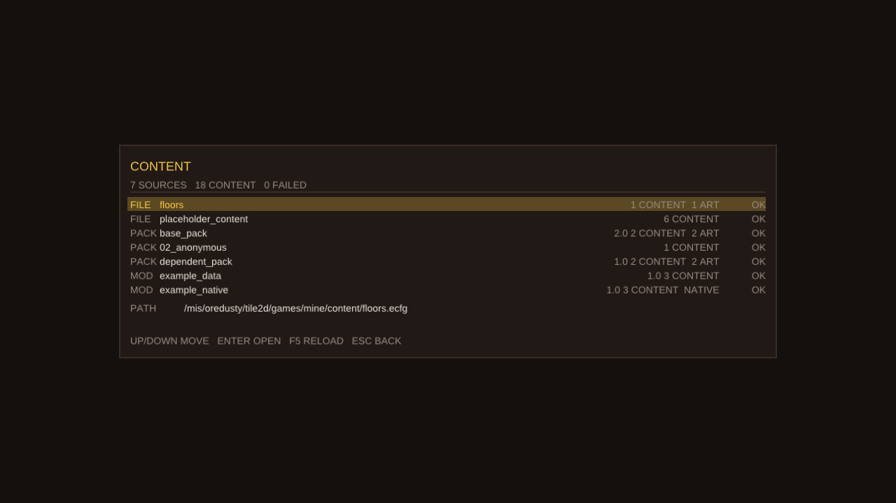
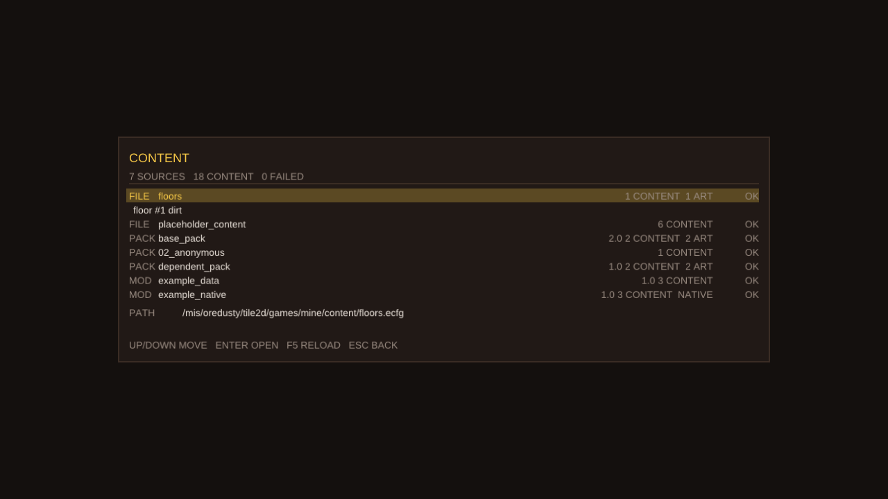
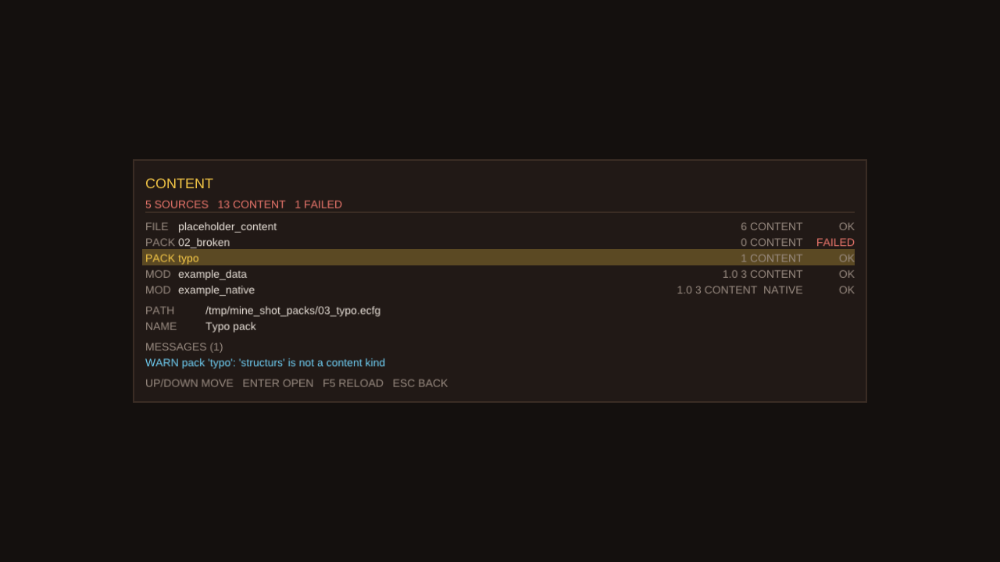

# 外部内容：纯 ecfg 内容包与模组包

本体只做**核心逻辑**（tilemap、渲染、文字、传输、注册表、沙盒）。内容——定义与逻辑——从外部加载，
有三种形式，按需要选（此外，**游戏自己带的内容**放在 `games/mine/content/`，永远是加载顺序的第一段）：

| 形式 | 是什么 | 能带代码吗 |
|---|---|---|
| **内容包**（纯 ecfg） | **一个目录**：若干 `.ecfg` 内容文件 + 它们的资源，可选一个 `pack.ecfg` 说明自己是谁 | 不能 |
| **模组包** | 一个目录 + `mod.ecfg` 清单 + 若干内容文件 + 可选的共享库 | 能（C ABI，见 §3） |
| **代码表模组** | 一个 `.codetab` 文件（编好的 C++），启动时与本体合并 | 能，而且是**同一门 C++**（§3.5、[`TABLES.md`](TABLES.md)） |

大多数内容只需要第一种；需要"跑点什么"（按参数生成内容、将来挂 tick 钩子）时用第二种；需要**改本体自己
的函数或类**时用第三种——`dlopen` 做不到这件事，因为本体内部的调用在链接本体时就绑定好了。

加载顺序固定为：**本体内容 → 内容包 → 模组包**，三者进同一个注册表，id 按注册顺序分配。因此本体的 id
永远稳定，内容包只能在它后面追加，模组包再往后。

## 0. 纯 ecfg 内容包

### 先看这里：游戏自动加载可执行文件旁边的 `packs/`

把包放进**游戏自己所在目录**下的 `packs/`，运行游戏就会加载它——不用写任何参数，也不用管你是从哪个
目录启动的（找的是**可执行文件旁边**，不是当前工作目录旁边）：

    <游戏目录>/
      mine_game                 # 可执行文件
      packs/
        my_pack/                # 一个内容包（目录：内容文件 + 资源）
          pack.ecfg             #   可选：这个包是谁
          items.ecfg            #   内容文件
          art/wall.png          #   资源
        my_mod/                 # 一个模组包（目录 + mod.ecfg）
          mod.ecfg
          content/things.ecfg
      content/                  # 游戏自带的内容包（同样的形态，见下一条）

    cd /tmp && /path/to/mine_game --world sandbox --start 1     # 照样加载上面两个

* **同一个 `packs/` 放两种东西**：一个**包目录**是内容包，带 `mod.ecfg` 的子目录是模组包
  （目录本身是包也行：`packs/` 里直接放 `mod.ecfg`）。
* **模组包目录不会被当成内容包扫描**：它的内容文件由模组宿主按清单里 `content:` 的顺序加载（§2）。
  没有这条规则，同一个名字会被注册两次，第二次会被报成"已注册、未替换"的冲突——所以一个目录里
  同时放包和模组是安全的。
* **工作目录下的 `packs/` 也自动加载**（第二顺位）：`cd tile2d && ./build/debug/games/mine/mine_game`
  会同时看到 `tile2d/packs`（你的工作区）和游戏目录下的 `packs`；两条规则指向同一个目录时只算一次。
* 两条都是**缺省**，只有不写 `--packs` / `--mods` 时才生效：目录不存在**不报错**（没人要求它存在），
  而显式写出来的路径不存在**会**报错。两个开关各自独立——只写 `--packs` 时，模组仍然从默认目录找。
* 启动日志里会有一行说明这次自动看了哪些目录；想知道**加载了什么、从哪儿来**，看开始界面的
  `CONTENT` 行、沙盒的 `F6` 或 `--content-list 1`：每个来源连**路径**一起列出来
  （`docs/SANDBOX.md` §10）。
* 想换个地方（比如把工作区的包和游戏自带的包分开）：`--packs <目录>` / `--mods <目录>` 显式指定，
  它们可重复，且一旦写了就不再套用默认目录。
* **游戏自带的内容也是一个包**（`content/`，同样的目录形态）：它跟着可执行文件走，
  找不到时才回退到源码树（开发时跑构建目录里的游戏）。它是加载顺序的第一段，所以它的 id 不会变——
  `--content <目录>` 可以在它之后再加几个自己的包（同一段）。

### 一个包就是一个**目录**

一个内容包是**多个 `.ecfg` 内容文件 + 它们的资源**，所以它的形态是目录：

    packs/my_pack/
      pack.ecfg               # 可选：这个包是谁（id / name / version / requires）
      items.ecfg              # 内容文件，想放几个放几个，放子目录里也行
      structures.ecfg
      art/wall.png            # 资源：内容条目用相对**声明它的那个文件**的路径引用
      README.md               # 不是 .ecfg 的东西都是你的（说明、草稿、配色表……）

    ./build/debug/games/mine/mine_game --world story --start 1 --packs packs
    ./build/debug/games/mine/mine_game --world sandbox --start 1 --packs packs/my_pack



`pack.ecfg`（可选）里是**顶层键**，和模组的 `mod.ecfg` 同一套：

```
id:"my_pack"                  # 唯一；其它包用这个 id 来 require。不写就是目录名
name:"My pack"                # 可选，给人看的
version:"1.0"                 # 可选
requires:["other_pack"]       # 可选：先加载这些包（字符串或数组）
```

内容文件里的表和本体内容文件的写法完全一样：

```
item::                        # 表名是内容类别，其余的表就是内容
    <name>::
        <设计者的字段>
structure::
    <name>::
```

* `--packs <dir>` 给一个目录：**它本身是一个包就用它，否则它里面的每个包目录都是包**
  （一个"工作区"）。不写 `--packs` 时用默认目录（见本节开头）。
* **模组包目录不会被当成内容包**：带 `mod.ecfg` 的目录是模组宿主的地盘（§2），它的内容文件按清单里
  `content:` 的顺序加载。所以一个 `packs/` 里同时放内容包与模组包是安全的。
* **散落的 `.ecfg` 文件会被报告**，不会被当成包：包是目录。旧写法（一个文件就是一个包）会得到一条
  明确的错误，而不是被静默忽略——静默不加载就是内容悄悄消失。
* 顺序：先按目录名，再按 `requires` 调整——**只移动必须移动的**，所以按 01/02/03 命名的包目录会保持
  你写的顺序；一个包内部的文件按**路径**排序加载。
* 同名内容、重复的包 id、依赖缺失或成环、语法错（带行列号）、`pack.ecfg` 里的未知键、一个内容文件里
  还写着旧的 `pack::` 表——全部**报告**，该包不加载或只加载不冲突的部分（列表上显示 PARTIAL）。
* **引擎只读这几个字段**，其余字段是你的：

  | 字段 | 用在哪 | 含义 |
  |---|---|---|
  | `image:"art/wall.png"` | 任何内容 | 这块内容画出来用的贴图。路径相对**声明它的那个文件**（包、本体内容文件、模组内容文件都一样） |
  | `random_reverse:true` | 任何内容 | 允许地图初始化时把这份内容的若干份**左右翻转渲染**（50%），避免同一份贴图重复成千上万次时全部朝同一边。**由内容作者决定**，不写就是不翻转 |
  | `size::` | `layer::` | 这一层多大：`width` / `height`（1..4096 格）/ `tile_layers`（1..32 个瓦片层）。不写的字段用会话/命令行的尺寸 |
  | `floor::` | `layer::` | 这一层的地板创建器：`layer`（铺在哪个瓦片层，默认 0）与规则，目前一条规则 `full_flash:"<地板名>"`——**把这一层的每个格子都设成这个地板** |

  加载时引擎校验：文件存在、是 PNG（Ore 自带解码器），不存在/不是 PNG 都会报告；`random_reverse` 写成
  非布尔值也会报告（`random_reverse:1` 不会悄悄当成假）。沙盒直接画出**你写的贴图**而不是占位颜色：

  

  ```sh
  # 本体占位内容 + 仓库里的三个测试包（其中两个带 art/*.png），bands 填充：每项内容一条横带
  ./build/debug/games/mine/mine_game --world sandbox --start 1 \
      --content games/mine/tests/data/placeholder_content \
      --packs games/mine/tests/packs --fill bands
  ```

  美术风格是多边形，资源仍是图片：引擎不做矢量多边形渲染（见 `docs/GAME_DESIGN.md` §1.10）。

  **美术资源的规则**（`docs/GAME_DESIGN.md` §1.18，即 §7.13 的答案）：

  * **一块内容一张图**：不切片、不进大图集，也没有图集网格约定。引擎给每份带图的内容**单独建一张
    纹理**，画的时候按内容分组——**屏幕上出现几种图，就是几个批次**（沙盒一屏通常是个位数）。
  * **尺寸随意**：一格通常 **128 或 256 像素**见方，其它值也行；引擎**不缩放、不拒绝**，按原样上传
    （图越大占显存越多，仅此而已）。
  * **命名不限**；**官方内容包用蛇形命名**（`floor_dirt.png`、`ore_copper.png`），一眼看出归属。
* 内容包不能新增 `ContentKind`，也不能跑代码；要这两样就用下面的模组包。类别本身由引擎定义
  （`item` / `structure` / `machine` / `recipe` / `layer` / `channel` / `floor`，
  见 `games/mine/include/mine/registry.h`）：**`floor` 是地板**——其他东西站上去的那一层，
  它也是"地块"的一种（`mine::types::Floor`，见 `docs/TYPES.md`）。

### 故事模式的层：`layer::` 表

**故事模式**（`--world story`）的层就是数据里的一层：`layer::` 下每写一个条目就是一层，
**写的顺序就是矿场的顺序**——第一个是第 0 层，第二个是第 1 层……这也是注册表发号的顺序，
所以第 n 层的内容 id 是 n+1，存档（按名字对）永远指向同一层。

```
layer::
    entrance::                    # 层名：注册表按它认这一层
        size::                    # 这一层多大（三个字段都可以不写）
            width:48
            height:32
            tile_layers:2
        floor::                   # 地板创建器
            layer:0               # 铺在哪个瓦片层（默认 0）
            full_flash:"dirt"     # 一条规则：每个格子都设成这个地板
```

* 条目下**你自己的字段**（`name:`、`resources::`、以后的 `structures::` / `demands::`……）引擎不解释，
  和别的内容条目一样；但 `size::` 与 `floor::` 里的字段**是引擎的**，写错名字会被**指名报告**
  （`size has no field 'widht'`），不会被忽略——被忽略的字段就是一层不是作者以为的那一层。
* **地板名是数据，存在与否是注册表说了算**：名字没注册（或拼错）时，层照建，每个格子被拒一次，
  但**只报一条原因**（`world: 192 placement(s) refused in all, 1 reason(s) listed above`），
  画面上也写着原因——一个格子一条日志不是报告，是噪音。
* **一层一个地板地块**（不是一整张图一个）：这样每格都能单独换，`random_reverse` 也才有意义
  （一张覆盖全图的地块只有一个翻转决定）。实测（解析 → 规则 → 生成器 → 建层，同一台机器）：
  `full_flash` 铺 48×32 = **1536 个地块 / 769 个翻转 / 0.7 ms**；200×200 = 40000 个地块 / 23.6 ms；
  512×512 = 262144 个地块 / 130606 个翻转 / **154.6 ms**。

```sh
# 仓库里的故事测试替身（games/mine/tests/data/story_content）：两层，第一层 48x32
./build/debug/games/mine/mine_game --world story --world-view 1 \
    --packs games/mine/tests/data/story_content
```



数据里没有这一层、或者地板名写错时，画面**说明原因**而不是只显示一张空图：




无尽模式（`--world endless`）仍然由 `(seed, 层号)` 推出来，规则未定（§7.9），所以它进的是空层。

    mods/
      example_data/             # 只有数据的模组：这是大多数模组的样子
        mod.ecfg
        content/structures.ecfg
      example_native/           # 带 C++ 模块的模组：用代码生成内容
        mod.ecfg
        native.cpp -> libexample_native.so

    ./build/debug/games/mine/mine_game --world sandbox --start 1 \
        --content <一个内容包目录> --mods mods

`--mods` 可重复。不写 `--mods` 时用默认目录（与内容包同一批，见 §0 开头），所以模组也可以直接
放进游戏目录下的 `packs/`。模组的内容与本体内容进入**同一个注册表**，id 按注册顺序分配，本体内容先注册。



```sh
# 上图（仓库里的两个示例模组，原生模块在构建目录里）：本体 6 项 + 游戏自带的泥地 1 项 + 模组 6 项
# = 13 项，bands 填充
./build/debug/games/mine/mine_game --world sandbox --start 1 \
    --content games/mine/tests/data/placeholder_content \
    --mods build/debug/games/mine/tests/mods --fill bands
```

上图里 `structure #1..#3`、`machine #1..#2` 是本体内容，`structure #4..#5`、`machine #3..#6` 来自两个模组；
其中 `mod_tier_1_drill`…`mod_tier_3_drill` **不是写在数据里的**，是原生模组按自己的参数生成的。

---

## 1. 模组清单（mod.ecfg）

```
id:"example_native"            # 必填。唯一，只能用字母/数字/_/-/.
name:"Example (native)"        # 可选，给人看的；缺省用 id
version:"1.0"                  # 可选
description:"..."              # 可选
api:1                          # 原生模组必填：它编译时用的模组 API 版本
requires:["example_data"]      # 可选：依赖的模组 id（字符串或数组）
content:["content/a.ecfg"]     # 可选：要注册的内容文件，按顺序
native:"libexample_native.so"  # 可选：相对包目录的动态库
data::                         # 可选：模组自己的参数，本体不解释
    tiers:3
    label:"generated"
```

规则（都是"读不懂就拒绝"，不是猜）：

* 清单里出现**未知的键**会被拒绝——拼错的键就是一个不按作者意图工作的模组。模组自己的参数放
  `data::` 表里，本体只负责解析并通过 `mod_value()/mod_int()` 原样交回。
* `id` 必填且唯一；两个包用同一个 id 会被报告，第二个不加载。
* `requires` 指向不存在的模组 → 报错且**不加载该模组**（缺依赖不能半跑）。
* 依赖成环 → 报错，环上的模组都不加载。
* `native` 必须配 `api`；文件不存在、不是动态库、导不出入口、ABI 版本不符、库自称的 id 与清单不符
  → 报告并跳过，游戏继续跑。
* 内容文件先**全部解析**再注册：第二个文件坏了，这个包一个名字都不会进去。

## 2. 模组包的加载顺序

1. 扫描每个 `--mods` 目录（目录本身是包，或目录下每个子目录是一个包），文件名排序保证确定性。
2. 校验清单、查重、检查依赖。
3. 按依赖**拓扑排序**（同一层内按目录顺序，确定性）。
4. 逐个加载：先数据（注册进注册表），再代码（打开库、校验、`on_load`）。
5. 最后一次性把沙盒里已放置的格子**按名字**重新定位，并重建面板。

名字冲突**不合并**：谁先注册谁保留，后来者被报告为错误，但它的其它内容照常加载。冲突可能来自
本体内容、更早的模组，或同一个模组的更早文件——三种都报。

## 3. 原生模组

原生模组就是一个共享库，导出唯一一个符号：

```c
MINE_MOD_EXPORT const mine::MineModDesc* mine_mod_entry();
```

它编译时只需要头文件（`games/mine/include/mine/mod_api.h` 及其引用的 `t2d/core/types.h`、
`mine/registry.h`），**不链接本体的任何静态库**：模组是独立编译单元，用谁的编译器、哪个标准库都行。

因此跨过这条线的只能是**纯数据与函数指针**：没有 `std::string`、没有异常、没有布局未写明的 C++ 对象。
头文件本身是 C++（模组就是 C++），但它声明的 ABI 是 C。

```c
struct MineModApi {
    u32 abi_version;      // = kModApiVersion
    u32 struct_size;      // 这个结构体多大，见下
    void (*log)(void* self, u32 level, const char* message);
    ContentId (*register_content)(void* self, u32 kind, const char* name);
    ContentId (*find_content)(void* self, u32 kind, const char* name);
    const char* (*content_name)(void* self, u32 kind, ContentId id);
    const char* (*mod_value)(void* self, const char* key);   // 读自己的 data::
    i64 (*mod_int)(void* self, const char* key, i64 fallback);
};

struct MineModDesc {
    u32 abi_version; u32 struct_size;
    const char* id; const char* name; const char* version;
    int  (*on_load)(const MineModApi* api, void* self);   // 0 = 接受
    void (*on_unload)(void* self);
};
```

* `self` 是宿主交给这个模组的上下文。所有"代表这个模组"的操作都带着它，所以宿主没有全局状态，
  也不怕将来同时存在多个宿主。
* `struct_size` 让 API 可以**只追加**地长大：新函数加在末尾，老模组按自己的大小读，永远不会越界。
  只有已有字段改变含义时才动 `kModApiVersion`，那时老模组会被明确拒绝，而不是用错布局调用。
* `on_load` 返回非 0 即拒绝运行，宿主随即关掉这个库、什么都不留。`on_unload` 在库被关闭**之前**调用，
  且保证此时宿主不在任何模组回调里（重载发生在帧之间）。
* 动态库**不是沙箱**：模组以游戏的权限运行，能做游戏能做的一切。ABI 校验管的是兼容性，不是安全。

一个最小原生模组（完整可运行版本见 `games/mine/tests/mods/example_native/native.cpp`）：

```cpp
#include <mine/mod_api.h>
#include <format>

static int on_load(const mine::MineModApi* api, void* self) {
    const i64 tiers = api->mod_int(self, "tiers", 1);          // 自己的 data:: 参数
    for (i64 tier = 1; tier <= tiers; ++tier) {
        const std::string name = std::format("mod_tier_{}_drill", tier);
        if (api->register_content(self, (u32)mine::ContentKind::Machine, name.c_str()) == 0) return 1;
    }
    return 0;
}

static const mine::MineModDesc g_desc{mine::kModApiVersion, sizeof(mine::MineModDesc),
                                      "example_native", "Example (native)", "1.0", &on_load, nullptr};

MINE_MOD_EXPORT const mine::MineModDesc* mine_mod_entry() { return &g_desc; }
```

## 3.5 代码表模组：改本体自己的函数

共享库能注册内容、能跑自己的代码，但改不了本体**内部**的调用。代码表把这次链接推迟到启动时：**本体自己
也是一张表**（`mine.codetab`），`mine_game` 是一个**启动器**——它在内存里把本体表与模组表合并成一张符号表，
再填所有重定位（完整设计见 [`TABLES.md`](TABLES.md)）。

一个代码表模组就是**一个 `.codetab` 文件**，不需要 `mod.ecfg`、不需要目录结构：

    codetab build mod.cpp -o mod.codetab --id my_mod --version 1.0 --requires mine@1.0 --api engine.api

    <游戏目录>/
      mine_game
      mine.codetab              # 本体：整个游戏都在里面
      engine.api                # 引擎公开面
      engine.abi                # 启动器自己是什么 ABI 编的（模组的对照物）
      packs/
        my_mod.codetab          # 放进 packs/ 就会自动合并（按路径排序）

**用 dev 包里的 `codetab` 与头文件编，别的什么都不用管**：工具链会问编译器这次构建的 ABI 是什么，
把头文件按内容哈希，写进表里；加载时与 `engine.abi` 比，指纹相同就完全合并（`-O0` 编的模组和 `-O3` 编的
本体就是一个程序，差异只在日志里说一句），不同就拒绝并指名是哪个事实——另一个 `std::string` ABI、
头文件改了、机器没有这个 CPU 特性。**没有"降级加载"**：类型不同的模块调用本体时算出来的地址就是错的
（[`ABI.md`](ABI.md) §1.5）。

不想放进 `packs/` 就用启动器自己的开关指名：`./mine_game --table mods/demo_mod/mod.codetab`。

* **覆盖**：模组里的强定义顶掉本体的同名符号，**连本体自己的调用与 vtable 条目一起改道**；谁顶掉了谁写在
  启动日志里（`table: 'x' from 'my_mod' replaced 'mine'`）。弱定义（内联函数、模板实例、vtable）不覆盖，
  先到先得——那是 C++ 的 ODR，不是运行时的毛病。
* **改类**：重定义一个**非内联虚函数**就够了，vtable 里的那一项是重定位，合并时自动指向模组。
* **能碰什么由公开面决定**：模组向引擎索取的符号必须落在 `engine.api` 里——构建期 `--api` 就拒绝越界，
  加载期再查一遍并逐个指名。版本规则：清单内跨整个 major 放行，清单外同版本静默、相差一个 minor 警告后仍然
  加载、再远拒绝，major 不同一律拒绝（[`TABLES.md`](TABLES.md) §5.5、[`ENGINE_API.md`](ENGINE_API.md)）。
* **启动时合并，改表要重启**：表一旦放置，函数指针、vtable 指针、静态数据地址就散进了整个程序，热重载会把
  它们全变成悬空指针。`dlopen` 模组的热重载（`F5`）照旧。
* **例子**：`games/mine/tests/data/tables/mod_banner.cpp` → `mods/demo_mod/mod.codetab`：一个函数顶掉本体的
  同名函数，游戏自己的输出从 `Mine, unmodified` 变成 `Mine, modded`，报告里 1 条覆盖。
* **现在的缺口**：表只能放进 `packs/` 或用 `--table` 指名，**内容清单还看不见它**（`mod.ecfg` 没有 `table:`
  键）；数据侧的 `patch::` / `remove::` 也还没做（`TABLES.md` §9）。

## 4. 真机验证

仓库里带两个示例包（`games/mine/tests/mods/`，CMake 把它们组装进构建目录，和真实安装的布局一致），
`test_mod_package` 有 9 个用例 / 104 个断言覆盖它们，真机运行输出：

    mods: 2 of 2 loaded (1 native), 6 content registered, 0 error(s)
    sandbox: RELOAD: +0 -0   0 CELLS REMAPPED   0 LOST   MODS: 2 LOADED, 1 NATIVE, 6 CONTENT

覆盖到的失败路径（每一条都有断言）：清单缺 id、id 含非法字符、未知清单键、原生模组缺 `api`、
`requires` 指向不存在的模组、依赖成环、两个包同 id、两个模组注册同名内容、内容文件语法错（带行列号）、
内容表名拼错（警告而非错误）、原生库缺失、原生库不是库、ABI 版本不符、库自称 id 与清单不符、
`on_load` 返回非 0。以及：重载后 id 完全一致，不清理注册表而重复加载时全部报冲突。

## 4.5 游戏自己带的内容

`games/mine/content/` 是**游戏本体内容包**：它就是一个普通的内容包目录（同样的形态、同样的规则），
不同的是它在加载顺序的第一段，不需要任何命令行参数——而且它跟着**可执行文件**走：游戏目录下的
`content/` 优先，找不到时才回退到源码树（开发时跑构建目录里的游戏，编辑的就是正在跑的那份文件）。
`--content <目录>` 是在它之后**追加**（不是替换，同一段，所以本体 id 仍然不会变）。

现在里面有：

    games/mine/content/
        pack.ecfg             id:"mine" name:"Mine"  —— 这个包是谁
        floors.ecfg           floor:: dirt::  —— 泥地，贴图 art/floor_dirt.png
        art/floor_dirt.png

沙盒里打开就能看到它：内容面板列出 `floor #1 dirt`，空格键把泥地铺到格子上，画的就是这张贴图。



## 5. 内容列表：在游戏里看谁加载了

加载结果不只在日志里。**开始界面**的 `CONTENT` 行（值就是 `1 PACK(S), 0 MOD(S)`）回车打开**内容列表**，
沙盒里按 `F6` 打开同一个列表，`--content-list 1` 直接以它启动。一行一个来源，按加载顺序排：
本体内容包 → 内容包 → 模组包；**没加载成功的也在列表里**——"哪个包没进来"正是打开它的原因。
每一行的路径是**包目录**（本体内容那行显示的是 `games/mine/content`）。



* 每行：`FILE` / `PACK` / `MOD` 徽标、id、版本、贡献的内容数与贴图数（`NATIVE` 标记带代码的模组），
  最右是状态 `OK` / `PARTIAL` / `FAILED`。**PARTIAL = 加载了但丢了东西**（例如某个名字已被先注册者占用）。
* 选中一行，下面给出它的路径；有错误先显示错误，否则显示它 `requires` 的东西或它自己的显示名。
* `回车`/`→` 展开选中的来源，列出**它注册的每一条内容**（`item #1 iron_ore`，就是存档里会写的那个 id）；
  一条内容都没注册的来源不展开（展开了也没东西可看）。`←` 收起。
* 最下面的 `MESSAGES` 是这次加载自己的报告：不属于任何一行的问题（目录不存在、表名拼错）在这里，
  错误与警告分色；某一行自己的错误不会在这里重复一遍。
* 列表里按 `F5` 就是重载：改完文件按一下，列表当场变成新的加载结果——这是设计者最常用的那个循环。





上面这些图不是手点出来的，而是**脚本隔着网络按键**跑出来的（调试输入服务器，见 `docs/SANDBOX.md` §10）：

```sh
./build/debug/games/mine/mine_game --world sandbox --start --content <本体内容.ecfg> \
    --packs games/mine/tests/packs --mods build/debug/games/mine/tests/mods \
    --input-server 7777 --headless --frames 100000 &
printf 'key press F6\nkey press RETURN\nshot /tmp/list.png\nquit\n' | nc 127.0.0.1 7777
```

## 6. 现在还不能做的（边界）

* **不能新增 `ContentKind`**：kind 列表是工程定义（`registry.h`），模组只能在既有 kind 里注册内容。
  设计者需要新类别时，那是本体的一处小改动。
* **没有 tick / 行为钩子**：游戏自己的模拟层还没写（M2），所以现在没有可以挂钩的地方。API 的追加式设计
  就是为它准备的：模拟出现后，`on_tick` 之类的函数加到 `MineModApi` 末尾即可。
* **没有补丁/覆盖机制（内容侧）**：同名内容报冲突而不是覆盖。做"修改别人的内容"需要明确的加载顺序与
  覆盖语义，那是后续的设计。
* **原生模组改不了本体的内部函数**：`dlopen` 进来的库无法改变本体在链接时就绑定好的调用。要改内部函数
  与类，用**代码表**（§3.5、[`TABLES.md`](TABLES.md)）：**整个本体已经在表里**（`mine.codetab`，release
  772 节 / 2485 符号 / 7600 重定位，由 `codetab build` 编），`mine_game` 是启动器，模组表在启动时合并，
  强定义连 vtable 条目一起改道。表里还带一份**构建记录**（`abi=`）：`codetab build` 问编译器这个构建的 ABI 是什么，
  头文件按内容哈希；加载时指纹相同就**完全合并**（`-O0` 的模组与 `-O3` 的本体就是一个程序），
  不同就**拒绝并指名是哪个事实**（另一个 `std::string` ABI、头文件改动、CPU 缺特性）——没有"降级加载"
  （[`ABI.md`](ABI.md) §1.5）。所以模组请用 dev 包里的 `codetab` 与头文件编：指纹天然一致。
  测试：`test_code_table`（31 用例 / 323 断言）、`test_mine_table`（3 用例 / 17 断言）。加载时按 `requires`
  校验版本，并按**公开面**（`engine.api`）判断越界：清单内跨整个 major 放行，清单外同版本静默、相差一个 minor
  警告后仍然加载、再远拒绝，major 不同一律拒绝。
* **代码表模组有一层 ABI 边界**：名字解析只保证"符号找得到"，不保证类型布局、vtable 形状、内联函数体与编译开关
  一致。实测过十二处不一致（表里的 `try`/`catch` 不生效、vtable 槽位漂移段错误、`struct` 多一个字段静默读错、
  内联函数一个进程两种行为……），分析与方案见 [`ABI.md`](ABI.md)。
* **不隔离**：原生模组能崩溃游戏。调试工具、开发期加载，不要加载来路不明的包。
* **单线程**：加载与卸载都在帧之间；一个正在回调里的模组不会被卸载。
